# Pipeline Spec Deep-Review — develop-story & develop-task

## Context

The `/develop-story` and `/develop-task` orchestrators (and the 11 shared `develop-pipeline-*.md` protocol files) have been heavily refactored over the past ~20 PRs (tasks 17–31). User asked for a deep review: find inconsistencies, inaccuracies, gaps, and inefficiencies, then recommend concrete improvements. This document is a **recommendations register**, not an implementation plan — improvements are applied in a follow-up.

---

## Reviewed Surface (actual file layout)

The draft circulating earlier referred to non-existent "READMEs" — the real specs are:

| File | Lines | Role |
|---|---|---|
| `skills/develop-story/SKILL.md` | 253 | Orchestrator spec (loaded into context on invoke) |
| `skills/develop-task/SKILL.md` | 250 | Orchestrator spec |
| `skills/develop-story/README.md` | — | Skill overview and reference (replaces former `diagrams/develop-story.md`) |
| `skills/develop-task/README.md` | — | Skill overview and reference (replaces former `diagrams/develop-task.md`) |
| `shared/resources/develop-pipeline-step-0-resolve-and-prepare.md` | 744 | Phase 0 protocol |
| `shared/resources/develop-pipeline-step-1-create-branch.md` | 210 | Step 1 protocol |
| `shared/resources/develop-pipeline-step-2-review.md` | 140 | Step 2 protocol |
| `shared/resources/develop-pipeline-step-3-develop-loop.md` | 224 | Step 3 protocol (incl. test triage) |
| `shared/resources/develop-pipeline-step-4-create-pr.md` | 136 | Step 4 protocol (single shared file — story/task variants via `#### develop-story`/`#### develop-task` sub-sections) |
| `shared/resources/develop-pipeline-step-5-6-qa-loop.md` | 251 | QA loop |
| `shared/resources/develop-pipeline-step-7-finalise.md` | 210 | Finalise + tracker close |
| `shared/resources/develop-pipeline-step-8-commit.md` | 52 | Final report commit + lock removal |
| `shared/resources/develop-pipeline-pause.md` | 268 | Lock-file schema + PreCompact hook contract |
| `shared/resources/develop-pipeline-resume-contract.md` | 165 | Resume verification + MAX_ITER stall semantics |
| `shared/resources/develop-pipeline-autonomous-defaults.md` | 38 | Shared default-decision table |
| `shared/resources/develop-pipeline-lite-mode.md` | 56 | Lite-mode conditions + behaviour |
| `shared/resources/pipeline-resume-detector-prompt.md` | 161 | Stale-context detector subagent prompt |
| `shared/resources/subagent-summary-artifact.md` | 79 | `.summaries/` JSON convention |
| `skills/develop-{story,task}/scripts/on-precompact.sh` | 140 | PreCompact hook (byte-identical copies) |

Each step's story/task variants are interleaved in the same shared file under labeled sub-sections (e.g. `#### develop-story` / `#### develop-task`), driven by the `TRACKER`, `EPIC_BRANCH`, `Q1_answer`, `Q2_answer` pipeline variables set in Phase 0.

---

## Findings (validated against actual files)

### Critical

**C1. PreCompact hook leaves lock orphaned when `jq` is missing.**
`scripts/on-precompact.sh` checks `command -v jq` (line 34); if missing, it calls `emit_empty` and exits **without removing the lock**. The lock file then blocks the next `/develop-{story,task}` invocation with a collision error (`develop-pipeline-step-1-create-branch.md` lines 19–26). Same risk if the hook is killed/timed-out by Claude Code before reaching the `rm -f "$LOCK"` on line 101.
*Fix*: move `rm -f "$LOCK"` to a `trap '... ; exit 0' EXIT` at the top of the script so it always runs, regardless of which early-exit path is taken. Add a "Hook self-recovery" section to `develop-pipeline-pause.md` documenting the `jq`-missing degraded mode (lock removed, no pause artifacts written, agent gets no signal — resume falls through to post-compaction recovery in `SKILL.md`).

**C2. Step 1a epic-branch create is not idempotent.**
Step 1a Case A (lines 59–67 of `develop-pipeline-step-1-create-branch.md`) runs `git checkout -b {EPIC_BRANCH}` unconditionally when `EPIC_BRANCH_EXISTS=false`. The `EPIC_BRANCH_EXISTS` flag is computed in Phase 0b (lines 215–223 of step-0), well before Step 1's pipeline-lock collision check is even reached. If a hook or partial Phase 0 run leaves stale state — or if the remote was created between Phase 0b and Step 1a — `checkout -b` fails and Step 1a HALTs without writing the lock.
*Fix*: harden Case A with `git rev-parse --verify --quiet "${EPIC_BRANCH}" || git checkout -b "${EPIC_BRANCH}"` and `git ls-remote --exit-code --heads origin "${EPIC_BRANCH}" >/dev/null 2>&1 || git push -u origin "${EPIC_BRANCH}"`. Same pattern as `/create-branch` already uses elsewhere. Document the idempotence guarantee in the Step 1a header.

### Important

**I1. Test-output logs accumulate across runs.**
`develop-pipeline-step-3-develop-loop.md` lines 156–158 specify `rm -f "$TEST_LOG"` only on `TEST_EXIT==0`. On test failure, on HALT, and at end of Step 8, leftover `.claude/state/test-output-*.log` files persist forever. Multi-week-old logs can leak across stories.
*Fix*: at Step 8 lock removal (line 51 of `develop-pipeline-step-8-commit.md`), add `rm -f .claude/state/test-output-*.log` immediately before `rm -f .claude/state/develop-pipeline.lock`. Also delete in the Error Recovery Principles "Remove the lock file before every terminal HALT" rule in each SKILL.md (lines 229 / 226).

**I2. develop-story SKILL.md does not mention test-failure triage.**
Test-failure triage was added in task.29 and wired into the shared `develop-pipeline-step-3-develop-loop.md` (lines 136–158), which both orchestrators load. `skills/develop-task/SKILL.md:147` explicitly summarises this feature in its Step 3 reference line; `skills/develop-story/SKILL.md:150` does not. Story orchestrator readers won't know triage exists from the SKILL.md alone.
*Fix*: extend `skills/develop-story/SKILL.md:150` to match the develop-task wording — append "…and **test-failure triage** (capture test output to `.claude/state/test-output-${ITER}-*.log`, dispatch Explore with `shared/resources/test-failure-triage-prompt.md`, main consumes summary only)."

**I3. QA traceability mapper is story-only — task-side asymmetry.**
`develop-pipeline-step-5-6-qa-loop.md` lines 50–74 dispatch the traceability mapper under `#### develop-story` only. Tasks with Success Criteria tables (common in refactor/infra tasks — see `task.17.develop-task-skill-from-develop-story.md`) get no AC↔code mapping; `/qa-task` falls back to internal mapping. The asymmetry isn't called out in either SKILL.md.
*Fix*: extend the mapper to tasks behind a Phase 0a Agent 3 flag — add `has_success_criteria_table: bool` to the lite-mode detector's JSON output (line 161 of step-0), then in step-5-6 dispatch the mapper for `develop-task` when both `PIPELINE_MODE=standard` and `has_success_criteria_table=true`. The mapper prompt (`qa-traceability-mapper-prompt.md`) already accepts a generic `STORY_FILE`/`STORY_DIR` input — confirm it works for tasks before wiring (read `qa-traceability-mapper-prompt.md` to verify), or parameterise as `DOC_FILE`/`DOC_DIR`. Document in step-5-6.md under a new `#### develop-task` block parallel to the existing story block.

**I4. Tracker mutations use one-shot retry, not exponential backoff.**
GitHub board GraphQL (Phase 0c-reg GitHub path, lines 339–429 of step-0) and Jira transition calls (Phase 0c-reg Jira path, step-1 pre-flight, step-4 PR-opened, step-7 Done transition) each retry **once** on failure. Transient 502s during peak GitHub/Jira load can fail twice in a row and leak through to the Issues Log. Pipeline doesn't HALT (calls are non-blocking), but the audit trail records a false negative.
*Fix*: extract a `tracker_call_with_retry()` shell function into `shared/resources/resolve-platform.sh` (the only file already referenced by every leaf step that calls a tracker) doing 3× exponential backoff (1s, 2s, 4s). Wrap GitHub `gh api graphql` calls and Jira MCP calls (the MCP calls require Skill-level retry, not shell). Keep failures non-blocking. Add a one-line note to `develop-pipeline-autonomous-defaults.md` documenting the retry policy.

### Nice-to-have

**N1. Mermaid theme block duplicated across both diagram files.**
~24 identical lines of `themeVariables` JSON that were formerly in `skills/develop-story/diagrams/develop-story.md` and `skills/develop-task/diagrams/develop-task.md` (both removed). If Mermaid themes are re-introduced in the READMEs, extract to `shared/resources/mermaid-theme.md`.
*Fix*: extract to `shared/resources/mermaid-theme.md` containing only the `%%{init: { ... }}%%` block. Each diagram file includes via `<!-- shared:shared/resources/mermaid-theme.md -->` or similar marker (verify `package_skill.py` includes the file or add bundling support). Lower-friction alternative: leave duplicated and accept the drift risk — diagram files are reference-only, not part of the orchestrator's progressive disclosure loading.

**N2. GitHub auto-Priority vs Jira parity unexplained.**
Phase 0c-reg GitHub path lines 413–426 auto-set Priority to P2 when unset. Jira path (lines 308–330) has no equivalent. Reads as a feature gap rather than a deliberate asymmetry.
*Fix*: add a one-line footnote after the Jira path: "Note: Jira Priority is not auto-set because Jira priority schemes are workflow- and project-specific; auto-setting risks overwriting team conventions."

**N3. PR target derivation differs by skill but isn't called out cross-document.**
Both orchestrators pass `--base {Q2_answer}` to `/create-pr` (step-4 line 16). For `develop-story`, `Q2_answer` is auto-set to `{EPIC_BRANCH}` (step-0 line 514); for `develop-task`, the user picks (step-0 lines 520–521). This is correct behaviour but a new reader of step-4-create-pr.md can't see why story never asks Q2.
*Fix*: add a "PR target by skill" subsection at the top of step-4-create-pr.md cross-referencing Phase 0d's Q2 derivation. Two-line addition.

**N4. Diagram files claim `Explore` is the only subagent — out of date.**
Both `diagrams/develop-*.md` (now removed) previously said "Subagents: Explore for file resolution (Phase 0a) and pre-develop codebase surface map (Phase 3)." The codebase now dispatches 8 Explore agents. If subagent inventory is re-documented in the READMEs, enumerate: file resolution, tracker poller, lite-mode detector, pre-develop surface map, iteration audit, test-failure triage, traceability mapper (story), resume detector.

---

## Findings from the prior draft that did NOT survive validation

The draft circulating before this review included findings that turned out to be based on incorrect premises after reading the actual files. They are listed here so the next reviewer doesn't re-raise them.

| Prior finding | Why it was dropped |
|---|---|
| C1 "Step 4 PR-target asymmetry not in shared protocol" | Step 4 takes `--base {Q2_answer}`; Q2 is set per-skill in Phase 0d. The variable plumbing is correct — there is no asymmetry bug in step-4. |
| C2 "Phase 0a-parallel skip-resolver ordering hazard" | Phase 0a-parallel Agent 2 and Agent 3 prompts (step-0 lines 130–169) explicitly say "for file/dir inputs: locate the file…". Agents self-recover when resolver is skipped. |
| C3 "Resume confirmation conflicts with autonomous-defaults" | `develop-pipeline-autonomous-defaults.md` does not prohibit `AskUserQuestion` in Phase 0; Phase 0d already asks Q1/Q2/Q3 via `AskUserQuestion`. Surfacing the resume-detector output and waiting for confirmation is consistent with that pattern. |
| C4 "Hook failure path undocumented" — restated as actual C1 above with the real defect (jq-missing leaves lock). |
| I1 "Collapse Step 8 into Step 7" | Step 8 has real work (Finished/Final Status/QA Iterations metadata + final report commit + lock removal); Step 7 does not commit the report on the success path. Folding is a high-blast-radius refactor with marginal benefit. |
| I5 "Test-triage fallback has no terminal HALT" | `develop-pipeline-step-3-develop-loop.md` line 105 explicitly HALTs on double-failure: "If the retry also fails, log `Audit JSON parse failure at iteration {ITER} — halting` in Issues Log and HALT." The initial-audit fallback in resume-contract is a separate path that cannot itself fail (grep returns 0 on no match). |
| I7 "Lite-mode trigger conditions buried" | Conditions are listed inline three times: step-0 lines 151–154 (Agent 3 prompt), `develop-pipeline-lite-mode.md` lines 10–16, and the Decisions Log entry on line 55. Three independent occurrences is sufficient. |
| I8 "`Subagent summary ref` column path schema undocumented" | Documented in `subagent-summary-artifact.md` lines 60–62: "populate it with the relative path to the JSON artifact (e.g. `.summaries/step-3-iteration-audit.json`). For steps without subagents, use `—`." |
| I9 "Decisions Log unbounded growth" | Premature optimisation. Implementation reports for completed stories are committed and archived; runaway growth would only matter on pathologically long runs (we have not observed any), and an archive-rotation mechanism adds resume complexity. |
| I11 "Verification checklist references deleted `diagrams/` path" | `diagrams/` directories have since been removed. All doc references updated to point to `skills/develop-*/README.md`. |
| N1 / N2 "Subagent contract table row drift / lock schema undocumented" | No such "subagent contract table" exists in the current SKILL.md or diagrams files. Lock schema is fully documented in `develop-pipeline-pause.md` lines 70–106 with a 12-row field table. |
| N3 "Resume detector pause timestamp" | Detector already reads the lock and surfaces `current_step_in_lock` + `summaries_seen`; adding `paused_at` from lock mtime is cosmetic. |
| N6 "Summary-exempt-steps reasoning not explained" | `pipeline-resume-detector-prompt.md` lines 90–96 list each exempt step with a one-line rationale ("Step 1 (create-branch): no subagent" etc.). Sufficient. |
| N7 "HALT terminal-checklist not standardised" | Each step's HALT block is 2–4 lines and explicitly tailored to that step's artifacts. A shared checklist would be more abstract, not more useful. |
| N8 "Diagram 3 plan-freshness check shown for story only" | Plan freshness check lives in `develop-pipeline-resume-contract.md` lines 95–110 and is referenced by both orchestrators' Step 3 protocol (line 67–69). No story/task asymmetry. |

---

## Dependency Diagram (shape of the recommended changes)

```mermaid
graph TD
    classDef crit fill:#7f1d1d,stroke:#fca5a5,color:#fef2f2
    classDef imp  fill:#92400e,stroke:#fbbf24,color:#fffbeb
    classDef nice fill:#1e3a8a,stroke:#93c5fd,color:#eff6ff

    C1[C1. Hook lock-cleanup trap]:::crit
    C2[C2. Step 1a idempotence guard]:::crit

    I1[I1. Step 8 cleans test-output logs]:::imp
    I2[I2. Story SKILL.md mentions triage]:::imp
    I3[I3. Mapper extension to tasks]:::imp
    I4[I4. Retry/backoff in resolve-platform.sh]:::imp

    N1[N1. Mermaid theme dedupe]:::nice
    N2[N2. Priority parity footnote]:::nice
    N3[N3. PR-target subsection in step-4]:::nice
    N4[N4. Diagrams subagent inventory refresh]:::nice

    C1 --> docs[Update develop-pipeline-pause.md]
    C2 --> docs1[Update develop-pipeline-step-1-create-branch.md]
    I1 --> docs2[Update step-8-commit.md + both SKILL.md]
    I2 --> docs3[Update develop-story SKILL.md only]
    I3 --> docs4[Update step-0 Agent 3 schema + step-5-6 task block + verify qa-traceability-mapper-prompt.md]
    I4 --> docs5[Extract helper into resolve-platform.sh + autonomous-defaults.md note]
    N1 -.->|optional - low value| docs6[Extract shared/resources/mermaid-theme.md]
    N2 --> docs7[Footnote in step-0 Jira section]
    N3 --> docs8[New subsection in step-4-create-pr.md]
    N4 --> docs9[Update External touchpoints in both diagrams files]
```

---

## Recommended Implementation Order

1. **Doc-only wins (≤30 min each, no protocol changes)**: I2, N2, N3, N4. Pure clarification.
2. **Bug fixes (1h each)**: C1 (hook trap), C2 (idempotence guard), I1 (log cleanup). High value, low blast radius.
3. **Feature parity (2–3h)**: I3 (mapper to tasks). Touches step-0 schema, step-5-6 protocol, and requires verifying `qa-traceability-mapper-prompt.md` works for tasks.
4. **Robustness (2h)**: I4 (tracker retry helper). Touches `resolve-platform.sh`.
5. **Optional polish**: N1 (theme dedupe) — only if drift becomes a real problem.

---

## Critical Files To Modify

| Finding | Files |
|---|---|
| C1 | `skills/develop-story/scripts/on-precompact.sh`, `skills/develop-task/scripts/on-precompact.sh` (byte-identical — both must be updated), `shared/resources/develop-pipeline-pause.md` |
| C2 | `shared/resources/develop-pipeline-step-1-create-branch.md` (Step 1a Case A) |
| I1 | `shared/resources/develop-pipeline-step-8-commit.md`, `skills/develop-story/SKILL.md`, `skills/develop-task/SKILL.md` (Error Recovery Principles) |
| I2 | `skills/develop-story/SKILL.md:150` |
| I3 | `shared/resources/develop-pipeline-step-0-resolve-and-prepare.md` (Agent 3 schema), `shared/resources/develop-pipeline-step-5-6-qa-loop.md` (task block), `shared/resources/qa-traceability-mapper-prompt.md` (verify task compatibility) |
| I4 | `shared/resources/resolve-platform.sh` (new helper function), `shared/resources/develop-pipeline-step-0-resolve-and-prepare.md` (0c-reg call sites), `shared/resources/develop-pipeline-step-1-create-branch.md` (pre-flight), `shared/resources/develop-pipeline-step-4-create-pr.md`, `shared/resources/develop-pipeline-step-7-finalise.md`, `shared/resources/develop-pipeline-autonomous-defaults.md` (note) |
| N1 | New: `shared/resources/mermaid-theme.md`. Updated: both `skills/develop-*/README.md` (if Mermaid re-introduced). Possibly: `skills/create-skill/scripts/package_skill.py` (bundling). |
| N2 | `shared/resources/develop-pipeline-step-0-resolve-and-prepare.md` (footnote after Jira 0c-reg) |
| N3 | `shared/resources/develop-pipeline-step-4-create-pr.md` (new "PR target by skill" subsection) |
| N4 | `diagrams/` directories removed — if subagent inventory is re-documented, add to both `skills/develop-*/README.md`. |

## Reuse / Existing Utilities

- `shared/resources/resolve-platform.sh` is the natural home for I4's retry helper — it's the canonical platform-detection sourcing point and every leaf skill already sources it.
- `package_skill.py` auto-bundles `shared/resources/*` references — works as-is for I3 (no new shared file needed) and I4 (helper added to existing file).
- For N1, verify `package_skill.py` resolves the `<!-- shared:... -->` marker before adopting; if not, a simple include-replacement step in the script may be needed.
- `subagent-summary-artifact.md` schema (v1) already accommodates I3's mapper output — no schema bump required.

## Verification (end-to-end)

1. **Doc-only changes (I2, N2, N3, N4)**: run `npm run generate-catalog` and confirm no skill validation errors. (`diagrams/` removed — skip the mermaid-cli render step.)
2. **Hook trap (C1)**: write a scratch test that creates a fake lock, removes `jq` from PATH (or simulates a kill mid-script), runs the hook, asserts lock is gone. Add to `skills/develop-{story,task}/scripts/` or document in `develop-pipeline-pause.md`'s verification checklist.
3. **Step 1a idempotence (C2)**: in a scratch repo, manually create `feature/epic.999.test` locally and remotely, then run `/develop-story` against a story with `epic: epic.999.test` — confirm Step 1a logs "already exists" and proceeds.
4. **Log cleanup (I1)**: run a story to completion that has at least one test failure (so `test-output-*.log` is created), confirm `ls .claude/state/test-output-*.log` returns empty after Step 8.
5. **Mapper for tasks (I3)**: run `/develop-task` against `task.17.develop-task-skill-from-develop-story.md` (or any task with a Success Criteria table), confirm `.summaries/step-5-traceability-mapper.json` exists and the matrix is passed to `/qa-task`.
6. **Retry helper (I4)**: write a shell unit test for `tracker_call_with_retry` — fail 2 times then succeed, confirm exit 0 after 3 attempts; fail 3 times, confirm non-zero exit and the failure is logged.
7. **Eval regression**: re-run any existing eval suite asserting subagent output schemas. None of these changes alter the JSON schemas in `subagent-summary-artifact.md`, `pipeline-resume-detector-prompt.md`, or `test-failure-triage-prompt.md`, so existing assertions should pass unchanged.
