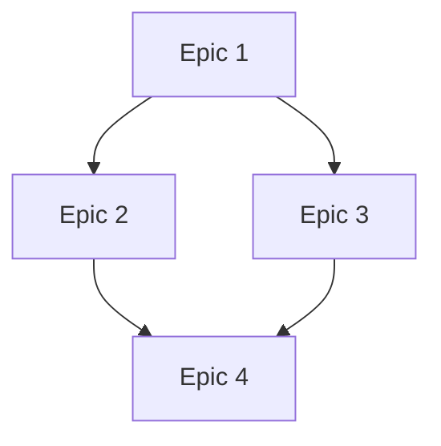

# Create Epics from PRD Shards

## When to Use This Skill

Activate this skill when:

- PRD has been sharded using `shard-prd`
- Need to convert PRD documentation into actionable development epics
- Building comprehensive system requiring multiple coordinated phases
- Want traceability from PRD sections to implementation epics

**Natural activation triggers:**
- "Create epics from the sharded PRD"
- "Generate epic files from PRD shards"
- "Convert PRD shards to implementation epics"

**Prerequisites:**
- PRD must be sharded first (using `shard-prd`)
- Shards exist in PRD root directory (e.g., `docs/prd/system-name/`)
- Understanding of system architecture and dependencies
- **CRITICAL**: Access to epic registry (`/docs/development/epic-registry.md`) for number allocation

**Do NOT use for:**
- PRDs that haven't been sharded (shard first)
- Single-epic scenarios (brownfield typically uses one epic)
- Stories without epic structure

## Purpose

Convert PRD shards into focused implementation epics:

- Creates `epics/` subdirectory in PRD folder
- Generates one epic file per major PRD shard
- Follows standard epic structure with stories, acceptance criteria, technical requirements
- Maintains traceability to source PRD shards
- Creates epic index with roadmap and dependencies

## Workflow Overview

```
1. Input Validation & Discovery
   ├─ Locate PRD shards directory
   ├─ Read index.md for structure
   └─ List all shard files

2. Shard Analysis & Epic Planning
   ├─ Assess complexity of each shard
   ├─ Identify natural epic boundaries
   ├─ Plan epic numbering and sequencing
   └─ Consider dependencies

3. Epic Creation Process
   ├─ For each shard → Create epic file
   ├─ Use standard epic structure
   ├─ Break down into stories
   └─ Define acceptance criteria and technical requirements

4. Epic Index Creation
   ├─ Create epics/index.md
   ├─ Roadmap with phases
   ├─ Dependency diagram
   └─ Timeline estimates

5. Quality Validation
   ├─ Verify all shards covered
   ├─ Check story sizing
   ├─ Validate dependencies
   └─ Ensure traceability

6. Handoff Documentation
   └─ Summary and next steps
```

## Detailed Execution Steps

### Step 1: Input Validation and Discovery

**Locate PRD Shards:**
- Identify PRD directory (user provides or prompt)
- Verify sharded files exist
- Read `index.md` to understand structure
- List all shard files for processing

**Example structure:**
```
docs/prd/chat-system/
├── index.md                    # Overview
├── core-chat-integration.md    # Shard 1
├── payment-processing.md       # Shard 2
├── group-features.md          # Shard 3
└── epics/                     # Target directory
```

### Step 2: Shard Analysis and Epic Planning

For each shard, analyze:

**Complexity Assessment:**
- Feature scope and complexity level
- Integration points with other components
- Technical architecture requirements
- Development effort (1-3 epics vs single epic)

**Epic Identification:**
- Identify natural boundaries for epic creation
- Consider development dependencies and sequencing
- Assess if shard needs multiple epics or single epic
- Plan epic numbering and logical progression

### Step 3: Epic Creation Process

For each identified epic, create using this structure:

```markdown
---
title: "Epic [N]: [Epic Name]"
prd_source: "[shard-filename.md]"
epic_type: "system_implementation"
priority: "[high|medium|low]"
estimated_sprints: "[1-6]"
dependencies: ["epic.163", "epic.164"]  # Use actual epic numbers from registry
---

# Epic [N]: [Epic Name]

## Epic Goal

[1-2 sentences: what this accomplishes and business value]

## Background & Context

**Source PRD Section:** [Original PRD section]
**System Integration:** [How fits into overall system]
**Prerequisites:** [What must be completed first]

## Epic Description

### What We're Building
[Detailed description of features and functionality]

### Why It Matters
[Business value and user impact]

### Success Criteria
- [ ] [Measurable outcome 1]
- [ ] [Measurable outcome 2]
- [ ] [Measurable outcome 3]

## Stories Breakdown

### Story 1: [Story Title]
**As a** [user type]
**I want** [functionality]
**So that** [benefit]

**Acceptance Criteria:**
- [ ] [Specific criterion 1]
- [ ] [Specific criterion 2]
- [ ] [Specific criterion 3]

**Technical Requirements:**
- [ ] [Technical task 1]
- [ ] [Technical task 2]

### Story 2: [Story Title]
[Repeat structure...]

## Technical Architecture

### Components Involved
- [Component 1]: [Role/responsibility]
- [Component 2]: [Role/responsibility]

### Database Changes
- [ ] [Table/model changes]
- [ ] [Migration requirements]

### API Changes
- [ ] [New endpoints]
- [ ] [Modified endpoints]

### Integration Points
- [ ] [External system integrations]
- [ ] [Internal service dependencies]

## Dependencies

**Depends On:**
- [ ] Epic [N]: [Epic name] - [Reason]
- [ ] [External dependency] - [Reason]

**Blocks:**
- [ ] Epic [N]: [Epic name] - [Reason]

## Risks & Mitigation

**Primary Risks:**
- **Risk**: [Description]
  - **Probability**: [High/Medium/Low]
  - **Impact**: [High/Medium/Low]
  - **Mitigation**: [Strategy]

## Definition of Done

- [ ] All user stories completed with acceptance criteria met
- [ ] Technical requirements implemented and tested
- [ ] Integration tests passing with dependent systems
- [ ] Documentation updated (API docs, user guides)
- [ ] Code review completed and approved
- [ ] Performance requirements met
- [ ] Security review completed (if applicable)
- [ ] Deployment to staging successful
- [ ] Product owner acceptance received

## Estimated Timeline

- **Planning**: [X days]
- **Development**: [X sprints]
- **Testing**: [X days]
- **Deployment**: [X days]
- **Total**: [X weeks]

## Success Metrics

- [Quantifiable metric 1]
- [Quantifiable metric 2]
- [User satisfaction measure]
```

### Step 4: Epic Naming and Organization

**CRITICAL - Epic Registry Integration:**

Before creating any epic files, you MUST:
1. Check `/docs/development/epic-registry.md` for next available epic number
2. Reserve N sequential numbers in the registry (where N = number of epics you're creating)
3. Update "Next Available Epic Number" counter in registry
4. Use the reserved numbers for your epic files

**Example Registry Workflow:**
- Registry shows "Next Available Epic Number: 163"
- You're creating 3 epics
- Reserve numbers 163, 164, 165
- Update registry to "Next Available Epic Number: 166"
- Use these numbers in filenames below

**File Naming Convention:**
- Format: `epic.[number].[feature-name].md` (NOTE: Use DOTS, not dashes)
- Use globally unique sequential numbers from registry
- Lowercase with hyphens for descriptive names only
- Example: `epic.163.basic-messaging.md` (NOT `epic-163-basic-messaging.md`)

**Epic Directory:**
```
docs/prd/[system-name]/epics/
├── epic.163.core-infrastructure.md
├── epic.164.basic-messaging.md
├── epic.165.payment-integration.md
└── index.md  # Epic overview and roadmap
```

### Step 5: Create Epic Index

Create `epics/index.md`:

```markdown
# [System Name] Implementation Epics

## Overview

Implementation epics derived from [System Name] PRD shards. Each epic
represents focused development phase with clear deliverables.

## Epic Roadmap

### Phase 1: Foundation
- [Epic 163: Core Infrastructure](./epic.163.core-infrastructure.md)

### Phase 2: Core Features
- [Epic 164: Basic Features](./epic.164.basic-features.md)
- [Epic 165: Integration Layer](./epic.165.integration-layer.md)

### Phase 3: Advanced Features
- [Epic 166: Advanced Features](./epic.166.advanced-features.md)

## Dependencies



## Development Timeline

- **Phase 1**: [Timeframe]
- **Phase 2**: [Timeframe]
- **Phase 3**: [Timeframe]
- **Total**: [X months]

## Success Metrics

- [System metric 1]
- [System metric 2]
- [User adoption target]
```

### Step 6: Quality Validation

**Epic Quality Checklist:**
- [ ] Epic has clear, measurable goal
- [ ] Stories properly scoped (not too large/small)
- [ ] Acceptance criteria testable
- [ ] Technical requirements specific
- [ ] Dependencies clearly identified
- [ ] Risks assessed with mitigation
- [ ] Success metrics quantifiable
- [ ] Timeline estimates realistic

**Overall Validation:**
- [ ] All PRD shard content covered
- [ ] Epic dependencies logical
- [ ] No gaps in functionality
- [ ] Epic scope balanced
- [ ] Total timeline realistic

### Step 7: Handoff Documentation

Create handoff summary:

```markdown
# Epic Creation Summary

**Source PRD**: [path]
**Shards Processed**: [N] shards
**Epics Created**: [N] epics
**Estimated Time**: [X months]

## Epic Overview

1. Epic 1: [Name] - [Description] ([X weeks])
2. Epic 2: [Name] - [Description] ([X weeks])
3. Epic 3: [Name] - [Description] ([X weeks])

## Next Steps

1. Review epics with development team
2. Prioritize epic sequence
3. Begin story refinement for Epic 1
4. Set up project tracking

## Development Team Handoff

Epics ready for:
- Effort estimation and planning
- Sprint planning and refinement
- Architecture review
- Resource allocation
```

## Integration with Other Skills

**Called by:**
- `shard-prd` - After sharding completion
- User request - Direct activation

**Requires:**
- `shard-prd` - Must be run first

**Leads to:**
- Story refinement workshops
- Sprint planning
- Architecture review

## Success Criteria

Successful epic creation produces:

1. **All shards covered** - Every PRD shard converted to epic(s)
2. **Standard structure** - All epics follow template
3. **Clear traceability** - Each epic references source shard
4. **Logical dependencies** - Epic sequence makes sense
5. **Quality validated** - All checks pass
6. **Index created** - Roadmap and timeline documented
7. **Handoff complete** - Summary and next steps clear

## Example Activation

```
User: "Create implementation epics from the sharded PRD"

→ create-epics-from-shards activates
→ Locates docs/prd/chat-system/
→ Reads index.md (8 shards found)
→ Analyzes each shard for complexity
→ Creates 5 epics in docs/prd/chat-system/epics/:
   - epic.163.core-infrastructure.md
   - epic.164.basic-messaging.md
   - epic.165.payment-integration.md
   - epic.166.group-features.md
   - epic.167.advanced-features.md
→ Creates epics/index.md with roadmap
→ Validates quality
→ Presents handoff summary
```

## Common Pitfalls to Avoid

❌ **One-to-one mapping** - Not every shard needs exactly one epic
❌ **Epic too large** - Break down if >6 sprints estimated
❌ **Missing dependencies** - Document all prerequisites
❌ **Vague success criteria** - Make measurable and testable
❌ **No traceability** - Always reference source PRD shard

✅ **Assess complexity first**
✅ **Plan epic boundaries carefully**
✅ **Document dependencies explicitly**
✅ **Size stories appropriately**
✅ **Maintain traceability**

## Notes

- Epics from shards are implementation-focused (not discovery)
- Each epic should deliver deployable, testable value
- Epic scope balances velocity with deliverable value
- Dependencies form logical development sequence
- Traceability to PRD shards is mandatory
