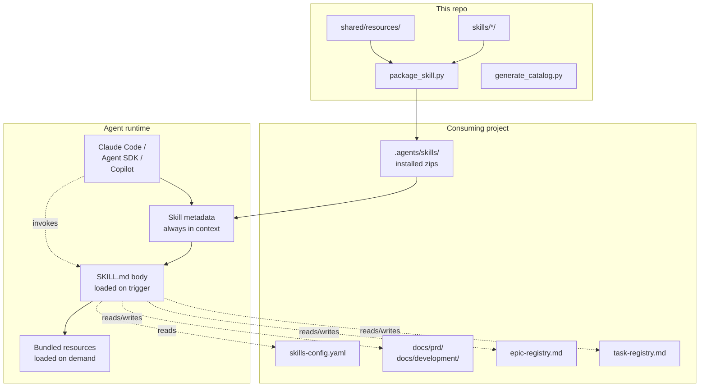
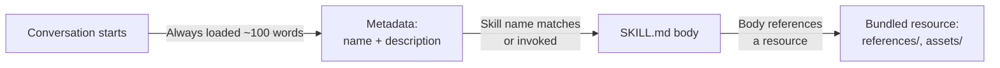
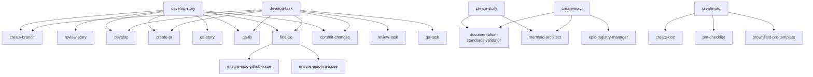
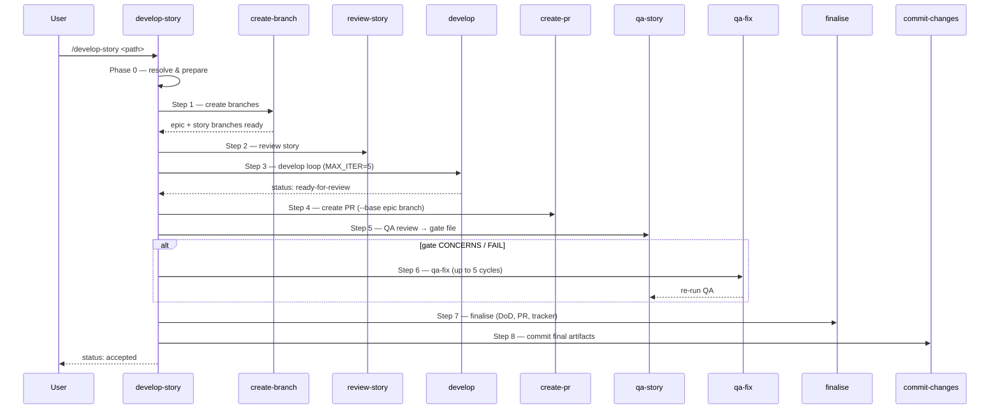
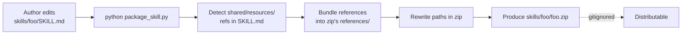
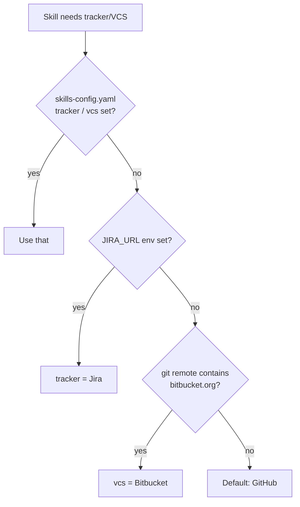

# Architecture

> **Audience:** anyone wanting to understand how the library fits together.

A library-level view: how skills are loaded, packaged, invoked, and how they interact with each other and the consuming project.

## System overview

**Three boundaries:**

- **This repo (`agent-skills`)** authors and packages skills. It is *not* installed into target projects.
- **Consuming project** has a `skills-config.yaml`, an `.agents/skills/` directory of installed zips, and project docs the skills read/write.
- **Agent runtime** loads the skills' progressive-disclosure tiers as needed.

## Progressive disclosure

Three tiers, loaded as relevance grows:

1. **Metadata** — `name` + `description` from every skill's frontmatter, always in context. ~100 words total. Powers auto-activation.
2. **SKILL.md body** — loaded when the skill triggers. The full instructions for that one skill.
3. **Bundled resources** — `references/` and `assets/` inside the zip. Loaded only when the body references them.

The cost ladder is steep: skipping tiers 2–3 for skills you don't need keeps the context window usable.

## Orchestrator → leaf skill dependency map

`finalise` picks one of `ensure-epic-{github,jira}-issue` via the [platform resolver](../../shared/resources/platform-detection.md).

## Pipeline phases (story)

Reference: [`skills/develop-story/README.md`](../../skills/develop-story/README.md).

## Packaging flow

Self-contained zips mean consuming projects don't need to install `shared/resources/` separately. The packager guarantees every reference resolves inside the zip.

## Platform resolver

Canonical: [`shared/resources/platform-detection.md`](../../shared/resources/platform-detection.md).

## Design principles

The architecture above reflects a small set of design choices:

- **Bounded loops** — never let an LLM loop indefinitely. MAX_ITER=5 on develop and qa-fix.
- **Gate ownership** — QA outputs (`*.gate.*.yml`) are owned by QA skills. Dev skills never write them.
- **Idempotent resume** — re-invoking an orchestrator picks up at the first incomplete step. No "should I redo this?" prompts.
- **Self-contained packaging** — installed skills carry their shared resources. No runtime dependency on this repo's layout.
- **Atomic registry updates** — new epics/tasks and their registry rows commit together.
- **Co-location** — plans, artifacts, and review reports live next to the work, not in scratch dirs.

See also [FAQ](../reference/faq.md) for the rationale behind each.

## See also

- [Overview](./overview.md) — what skills are
- [Getting started](./getting-started.md) — install and first command
- [FAQ](../reference/faq.md) — why the design works this way
- [Anti-patterns](../reference/anti-patterns.md) — what to never do
- [`develop-story` README](../../skills/develop-story/README.md)
- [`develop-task` README](../../skills/develop-task/README.md)
