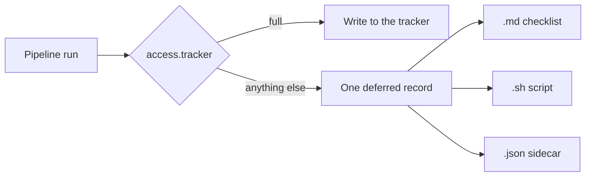

# Restricted tracker access

> **Audience:** anyone who cannot — or will not — give the locally running agent a tracker write token.

If the agent must not write to Jira or GitHub Issues, this page is the one to read first. The resolver, key table, and mutation roster live in the reference pages this sequence already owns — this page does not restate them.

## Does this apply to you?

Read the first match:

| Your situation | Use |
| --- | --- |
| The agent has a write token and you want it to update the board unattended | Leave `access` unset. That is `full` — today's default. Stop here. |
| You have a tracker, but the agent must **not** hold a write token | Yes. Pick a restricted **access model** below, or use the [decision guide](./which-access.md). |
| You have no tracker at all, and do not want one | **Skip — docs only** at the `/create-*` prompt. That is a per-run opt-out, not an access model. The board is never in play. |

Restricted access is **not** "run without a tracker". It is "run with a tracker whose writes a human (or a later unrestricted run) performs". The pipeline still finishes. The board stays put until someone works the **handover**.

## Limits — read these as loudly as the capabilities

These are shipped behaviour, not caveats:

1. **Enforcement is partial.** Jira REST through `jira-sync.js`, the sprint scripts, `jira-epic-creator.js`, GitHub board Status/membership, Priority, Estimate, and every `gh` mutation routed through `tracker_write` are **deferred and recorded**. Still **not** gated, by design: Jira writes issued as raw `curl` or through the Atlassian MCP tools, and GitHub calls whose stdout a caller captures (`gh issue create`, sub-issue links). A restricted run prints this on stderr every time. Key row: [`configuration.md` → `access.tracker`](../reference/configuration.md).
2. **`approve` does not yet ask.** The five mode names are valid config. Today every value other than `full` **defers the write and records it** — there is no per-mutation confirmation prompt. Batched confirmation is [task.57](../tasks/task.57.readonly-verification-and-reconcile/task.57.readonly-verification-and-reconcile.md), which has not shipped.
3. **`/develop-next` and `/develop-batch` still need VCS write.** `access.vcs` accepts only `full`. Tracker restriction does **not** stop those orchestrators; git push and `gh pr merge` still happen. What they will not do is move the tracker card — that goes into the handover. See [`access.vcs`](../reference/configuration.md).
4. **Issue creation converges over two runs.** A deferred create writes **no** placeholder `jira_key` / `github_issue`. The next run that is allowed to write creates the card for real. That is deliberate (a placeholder would duplicate on the unrestricted retry). Until then the work item has no remote id.
5. **`finalise` still writes `status: accepted` locally.** The tracker debt is recorded in the handover, the implementation report, and the PR — it is not a failed run. The board can lag the documents.
6. **`/tracker-reconcile` is not shipped.** [Task.57](../tasks/task.57.readonly-verification-and-reconcile/task.57.readonly-verification-and-reconcile.md) is still `planned`. Until it lands, work the committed checklist by hand (or run the `.sh` under `command`). There is no command that ticks the ledger from the live board.

Resolver internals, legal values, and most-restrictive-wins: [`platform-detection.md`](../../shared/resources/platform-detection.md). Record schema and mutation kinds: [`tracker-access-record.md`](../../shared/resources/tracker-access-record.md).

## What used to happen — silence

Without a write token, the only supported path was to leave `github_issue` / `jira_key` empty. Every tracker moment then no-op'd. The pipeline looked done. The board said otherwise. Nothing told anyone.

Restricted access replaces that silence with a **deferred** record: the run wanted a write, policy refused it, and the refusal is committed.

## One record, four renderings

The organising idea is one planned-mutation record. The access model decides **who executes it** and **how it is shown**, not which writes exist.

| Mode | Who executes | What you get at run end |
| --- | --- | --- |
| `full` | The agent | No handover, unless a write *failed* (`retry_of`) |
| `read-only` | A human; the agent may read | Checklist + script + JSON. Reads still work. |
| `approve` | A human, until task.57 | Same handover as the other restricted modes. **No ask prompt today.** |
| `command` | A human running the generated script | Same three files; the `.sh` is the intended path (dry-run by default) |
| `manual` | A human clicking the tracker UI | Same three files; the `.md` checklist is the intended path |

Which of the five to pick: [Which access model?](./which-access.md). What the files are named: [Pipeline artifacts → Tracker handover](../reference/pipeline-artifacts.md).



## What a restricted run produces

Local docs, branch, PR, QA gate — the same as `full`. Plus, **only if something was deferred**:

```
docs/tasks/task.{N}.{name}/
├── task.{N}.handover.{n}.{name}.md     # tick boxes; deep links; exact field values
├── task.{N}.handover.{n}.{name}.sh     # same records, dry-run until you pass --apply
└── task.{N}.handover.{n}.{name}.json   # machine copy, for the reconcile that has not shipped
```

The markdown file opens with `# Tracker actions required`. Each item is `- [ ]`, names the kind, and carries a **Where** / **Start here** URL and the **Status** (or other field) using **this board's column names**, not the pipeline moment names. On this library's own board those columns are `Todo`, `In Progress`, and `Done` — see [`tracker-workflow.yaml`](../../tracker-workflow.yaml).

A moment the run was expected to record but did not renders as `⚠️ UNRECORDED`. That is a bug in the run, not a skip you can ignore.

Walk through a real board: [Restricted access runbook](../runbooks/restricted-access.md).

## See also

- [Which access model?](./which-access.md) — three questions that discriminate the five modes
- [Restricted access runbook](../runbooks/restricted-access.md) — configure, run, work the checklist
- [Troubleshooting](../reference/troubleshooting.md) — board did not move, `UNRECORDED`, two-run create
- [`access.tracker` key](../reference/configuration.md) — config, env, what is gated
- [Getting started](./getting-started.md) — wizard prompt and Skip vs restrict