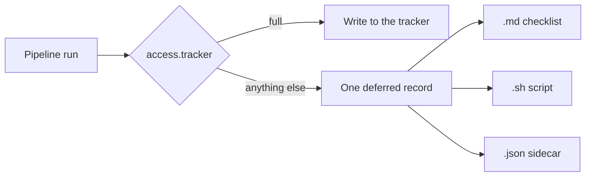

# Restricted tracker access

> **Audience:** anyone who cannot — or will not — give the locally running agent a tracker write token.

If the agent must not write to Jira or GitHub Issues, this page is the one to read first. The resolver, key table, and mutation roster live in the reference pages this sequence already owns — this page does not restate them.

## Does this apply to you?

Read the first match:

| Your situation | Use |
| --- | --- |
| The agent has a write token and you want it to update the board unattended | Leave `access` unset. That is `full` — today's default. Stop here. |
| You have a tracker, but the agent must **not** hold a write token | Yes. Pick a restricted **access model** below, or use the [decision guide](./which-access.md). |
| You have no tracker at all, and do not want one | **Skip — docs only** at the `/create-*` prompt. That is a per-run opt-out, not an access model. The board is never in play. |

Restricted access is **not** "run without a tracker". It is "run with a tracker whose writes a human (or a later unrestricted run) performs". The pipeline still finishes. The board stays put until someone works the **handover**.

## Limits — read these as loudly as the capabilities

These are shipped behaviour, not caveats:

1. **Enforcement is partial.** Jira REST through `jira-sync.js`, the sprint scripts, `jira-epic-creator.js`, GitHub board Status/membership, Priority, Estimate, and every `gh` mutation routed through `tracker_write` are **deferred and recorded**. Since task.56 the **GitHub issue lifecycle** is gated too — create, edit, close, reopen, milestone create and the sub-issue link, through [`tracker-issue.js`](../../shared/resources/tracker-issue-cli.md). Still **not** gated, by design: Jira writes issued as raw `curl` or through the Atlassian MCP tools. A restricted run prints this on stderr every time — and the notice enumerates both halves, so trust it over this page if the two ever disagree. Key row: [`configuration.md` → `access.tracker`](../reference/configuration.md).
2. **`approve` asks once, at handover.** During the run it defers and records like the other restricted modes — there is deliberately no per-mutation prompt. At handover the orchestrator asks **one batched confirmation** (`AskUserQuestion`) listing the outstanding actions; approved records execute via the committed script. **Without a tty it degrades to `command`** — no prompt, no execution, consent never assumed. See [task.57](../tasks/task.57.readonly-verification-and-reconcile/task.57.readonly-verification-and-reconcile.md).
3. **`/develop-next` and `/develop-batch` still need VCS write.** `access.vcs` accepts only `full`. Tracker restriction does **not** stop those orchestrators; git push and `gh pr merge` still happen. What they will not do is move the tracker card — that goes into the handover. See [`access.vcs`](../reference/configuration.md).
4. **Issue creation converges over two runs — and the middle step is yours.** A deferred create writes **no** placeholder `jira_key` / `github_issue`, deliberately: a placeholder defeats the idempotent search that stops the next run creating a *duplicate*, so a wrong key is worse than no key. What makes it converge is three steps, not two:

   1. Perform the create — the checklist opens with a `🚫 BLOCKING — do these first` banner naming it.
   2. **Write the number it produced into the document's frontmatter.**
   3. Re-run. The skill finds the field set and takes its ordinary update path.

   Step 2 is the one that is easy to skip, and skipping it is silent: re-running without it changes nothing, every time, and a run that appears to do nothing twice is indistinguishable from a broken one. See [troubleshooting → *I re-ran it and it did nothing again*](../reference/troubleshooting.md).
5. **Step 5c still runs, and still reviews.** `/review-pr` reads the diff and the artifact trail —
   both local — so a restricted run gets the same verdict and the same
   `*.pr-review.{n}.{name}.md` report. Only its **summary PR comment** is a gated call, and only
   on GitHub: there it goes through `tracker_call_with_retry` and so inherits the `ACCESS_TRACKER`
   deferral gate like any other, landing in the handover instead of on the PR. **On Bitbucket it is
   single-shot** — neither retried nor deferred, the same known gap `review-pr`'s own SKILL.md
   records. The verdict still routes normally —
   `REQUEST CHANGES` still returns the run to `qa-fix`. Note this is the **tracker** axis, not the
   VCS one: `access.vcs` accepts only `full`, so there is no mode in which pushing the branch itself
   defers.
6. **`finalise` still writes `status: accepted` locally.** The tracker debt is recorded in the handover, the implementation report, and the PR — it is not a failed run. The board can lag the documents.
7. **`/tracker-reconcile` ticks the ledger from the live board.** Run it against a work-item directory (or `--all`) days later: it re-reads the committed handover, ticks `satisfied` (struck through, with the observed value and time), flags `divergent` (someone moved the card somewhere neither the plan nor its starting point expected), marks `unverifiable` (ambiguous or unreadable — never guessed into `satisfied`), and sets the checklist frontmatter `status:` to `outstanding` / `partial` / `complete`. `--apply` executes what is still outstanding **only under `access.tracker: full`** — under every other mode it is refused, naming the blocker. See [`tracker-reconcile`](../../skills/tracker-reconcile/SKILL.md).

Resolver internals, legal values, and most-restrictive-wins: [`platform-detection.md`](../../shared/resources/platform-detection.md). Record schema and mutation kinds: [`tracker-access-record.md`](../../shared/resources/tracker-access-record.md).

## What used to happen — silence

Without a write token, the only supported path was to leave `github_issue` / `jira_key` empty. Every tracker moment then no-op'd. The pipeline looked done. The board said otherwise. Nothing told anyone.

Restricted access replaces that silence with a **deferred** record: the run wanted a write, policy refused it, and the refusal is committed.

## One record, four renderings

The organising idea is one planned-mutation record. The access model decides **who executes it** and **how it is shown**, not which writes exist.

| Mode | Who executes | What you get at run end |
| --- | --- | --- |
| `full` | The agent | No handover, unless a write *failed* (`retry_of`) |
| `read-only` | A human; the agent may read | Checklist + script + JSON. Reads still work. |
| `approve` | The agent, after one batched confirmation at handover | md + sh + summary on a tty; degrades to `command` (sh only) without one |
| `command` | A human running the generated script | Same three files; the `.sh` is the intended path (dry-run by default) |
| `manual` | A human clicking the tracker UI | Same three files; the `.md` checklist is the intended path |

Which of the five to pick: [Which access model?](./which-access.md). What the files are named: [Pipeline artifacts → Tracker handover](../reference/pipeline-artifacts.md).



## What a restricted run produces

Local docs, branch, PR, QA gate — the same as `full`. Plus, **only if something was deferred**:

```
docs/tasks/task.{N}.{name}/
├── task.{N}.handover.{n}.{name}.md     # tick boxes; deep links; exact field values
├── task.{N}.handover.{n}.{name}.sh     # same records, dry-run until you pass --apply
└── task.{N}.handover.{n}.{name}.json   # machine copy — /tracker-reconcile's input
```

The markdown file opens with `# Tracker actions required` and a context table. Each item is `- [ ]`, names the kind, and carries a **Where** / **Start here** URL and the **Status** (or other field) using **this board's column names**, not the pipeline moment names. On this library's own board those columns are `Todo`, `In Progress`, and `Done` — see [`tracker-workflow.yaml`](../../tracker-workflow.yaml).

Two markers change what you do next, and both are hoisted rather than left in document order:

- **`🚫 BLOCKING — do these first`** sits directly under the context table when any record yields a value nothing else can supply — an issue number, a milestone number. These are the ones that need the write-back-and-re-run of limit 4 above, not just a tick. A blocking item at position 17 of a checklist is one nobody does first, which is why it is not left there.
- **`⚠️ UNRECORDED`** — a moment the run was expected to record and did not. That is a bug in the run, not a skip you can ignore.

Note the `.sh` renderer carries **no** blocking banner: a script cannot pause for you to edit a document. If you work under `command` and run only the script, read the `.md` first for the blocking items.

Walk through a real board: [Restricted access runbook](../runbooks/restricted-access.md).

## See also

- [Which access model?](./which-access.md) — three questions that discriminate the five modes
- [Restricted access runbook](../runbooks/restricted-access.md) — configure, run, work the checklist
- [Troubleshooting](../reference/troubleshooting.md) — board did not move, `UNRECORDED`, two-run create
- [`access.tracker` key](../reference/configuration.md) — config, env, what is gated
- [Getting started](./getting-started.md) — wizard prompt and Skip vs restrict