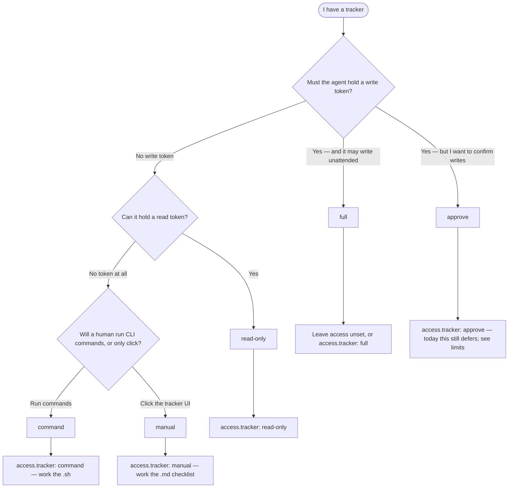

# Which access model?

> **Audience:** anyone configuring `access.tracker` for the first time.

Not sure whether to set `full`, `read-only`, `approve`, `command`, or `manual`? Answer three questions about **your** tokens and **who** will perform tracker writes. This is a sibling of [Which path?](./which-path.md), which routes work type (`/create-task` vs `/create-story`). This page routes **how much** the agent may do to the tracker.

What restricted access *is*, and the limits: [Restricted tracker access](./restricted-access.md). Resolver and legal values: [`platform-detection.md`](../../shared/resources/platform-detection.md).

## Decision flowchart

## Prose fallback

> If Mermaid does not render in your viewer, follow this question chain instead.

**Question 1 — Must the agent hold a write token?**

A write token is whatever would let the agent create issues, comment, or move cards (a `gh` login with `repo`/`project` scopes, or `JIRA_API_TOKEN` with write).

- **Yes, and it may write unattended** → `full`. Omit the `access:` block entirely if that is the default you want.
- **Yes, but a human must confirm first** → `approve`. Writes are deferred during the run and confirmed **once, batched, at handover** — approved records then execute via the committed script. Not per-mutation, by design: one prompt per run keeps the confirmation meaningful. Without a tty (CI, autonomous runs) it degrades to `command` — the operator gets the script; consent is never assumed.
- **No write token** → continue to Question 2.

---

**Question 2 — Can it hold a read token?**

A read token lets the agent see current column, issue body, and comments. It does not let it change them.

- **Yes** → `read-only`. Reads proceed; writes are **deferred** into the handover.
- **No token at all** → continue to Question 3.

---

**Question 3 — Will a human run CLI commands, or only click?**

- **Run commands** (`gh`, `curl`, a generated script) → `command`. After the run, execute `task.{N}.handover.{n}.{name}.sh` (dry-run until you pass `--apply`). **Read the `.md` first if the run created anything** — the `.sh` carries no blocking banner, because a script cannot pause for you to edit a document, and a deferred issue create needs its number written into frontmatter before the next run converges.
- **Only click the tracker UI** → `manual`. After the run, tick `task.{N}.handover.{n}.{name}.md`. Column names in that file come from **your board**, not from this page.

> **Default:** when in doubt between `command` and `manual`, choose `manual`. The checklist is always emitted; the script is a convenience for people who already run `gh`.

## Quick-reference table

| Situation | Mode |
|-----------|------|
| Agent has write credentials; unattended board updates are wanted | `full` |
| Agent has write credentials; a human confirms once at handover | `approve` |
| Agent may read the tracker, not write | `read-only` |
| No token; a human will run the generated script | `command` |
| No token; a human will click the board | `manual` |
| No tracker at all | **Skip — docs only** at `/create-*` — not an access model |

## Related

- [Restricted tracker access](./restricted-access.md) — what it is, limits, what a run produces
- [Restricted access runbook](../runbooks/restricted-access.md) — walkthrough on this repo's board
- [Which path?](./which-path.md) — task vs story vs hotfix
- [Getting started](./getting-started.md) — wizard prompt