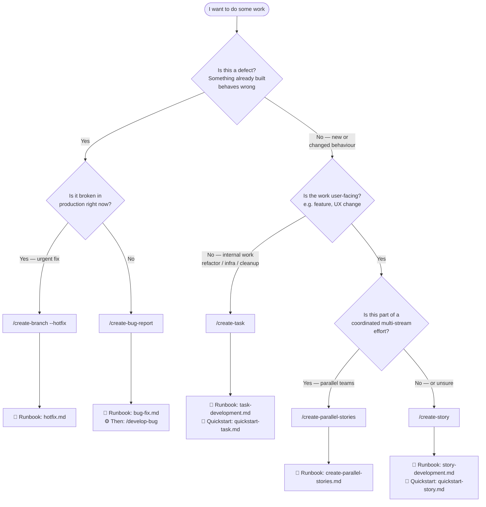

# Which path? — Decision tree

Not sure whether to run `/create-bug-report`, `/create-task`, `/create-story`, `/create-branch --hotfix`, or `/create-parallel-stories`? Answer up to four questions.

> **Defects come first.** A bug — anything already built that behaves wrong — has its own document type,
> its own numbering and its own orchestrator (`/develop-bug`). Ask Question 1 before anything else, or a
> defect gets filed as a feature and loses its reproduction record.

## Decision flowchart

## Prose fallback

> If Mermaid does not render in your viewer, follow this question chain instead.

**Question 1 — Is this a defect?**

A defect is something that already exists and behaves wrong: a QA finding, a reported bug, a regression,
a cross-cutting problem a sweep turned up. New or changed behaviour is not a defect, however small.

- **Yes** → continue to Question 2.
- **No** → continue to Question 3.

---

**Question 2 — Is it broken in production right now?**

- **Yes** (urgent fix needed immediately) → use [/create-branch --hotfix](../runbooks/hotfix.md)
- **No** → use [/create-bug-report](../runbooks/bug-fix.md), then `/develop-bug` to fix it end to end
  - The runbook picks the mode for you: a **story bug** beside its story, a **task bug** inside its task
    directory, or a **general bug** in `docs/bugs/` with a globally-numbered registry row

---

**Question 3 — Is the work user-facing?**

A feature or UX change is user-facing. A refactor, infrastructure change, or cleanup task is internal.

- **Internal** → use [/create-task](../runbooks/task-development.md)
  - Quickstart: [quickstart-task.md](./quickstart-task.md)
- **User-facing** → continue to Question 4.

---

**Question 4 — Is this part of a coordinated multi-stream effort?**

For example: several developers are each shipping separate pieces of a larger feature in parallel.

- **Yes** → use [/create-parallel-stories](../runbooks/create-parallel-stories.md)
- **No** (or unsure) → use [/create-story](../runbooks/story-development.md)
  - Quickstart: [quickstart-story.md](./quickstart-story.md)

> **Default:** when in doubt between `/create-story` and anything else for user-facing work, choose `/create-story`. It is the most expressive path and can always be narrowed later. This default does **not** extend to defects — a bug filed as a story loses its reproduction record, its Status History and its registry row.

## Quick-reference table

| Situation | Skill |
|-----------|-------|
| QA finding or reported bug against a story or task | `/create-bug-report` → `/develop-bug` |
| Cross-cutting defect with no story or task owner (lint, deps, drift) | `/create-bug-report` (general mode) → `/develop-bug` |
| Production system broken right now | `/create-branch --hotfix` |
| Feature or UX change — non-urgent, solo | `/create-story` |
| Feature or UX change — parallel teams | `/create-parallel-stories` |
| Refactor, infra, cleanup, tech debt | `/create-task` |

## Related

- [Bug Fix runbook](../runbooks/bug-fix.md) — the full defect path, all three bug modes
- [docs/runbooks/README.md](../runbooks/README.md) — full runbook index
- [docs/reference/invocation.md](../reference/invocation.md) — complete skill invocation reference
- [Which access model?](./which-access.md) — how much tracker access to grant the agent
