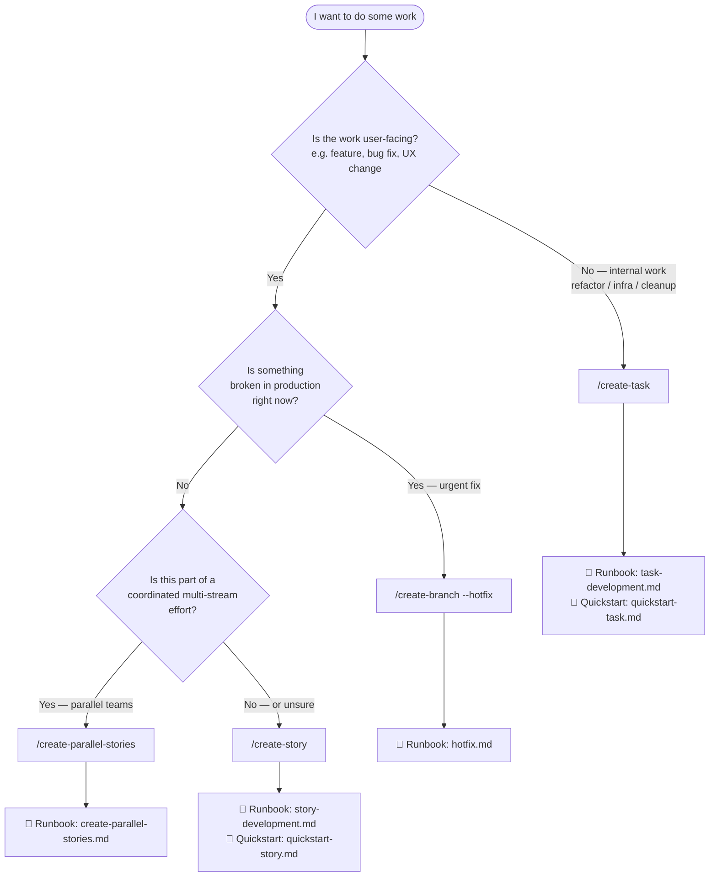

# Which path? — Decision tree

Not sure whether to run `/create-task`, `/create-story`, `/create-branch --hotfix`, or `/create-parallel-stories`? Answer three questions.

## Decision flowchart

## Prose fallback

> If Mermaid does not render in your viewer, follow this question chain instead.

**Question 1 — Is the work user-facing?**

A feature, bug fix, or UX change is user-facing. A refactor, infrastructure change, or cleanup task is internal.

- **Internal** → use [/create-task](../runbooks/task-development.md)
  - Quickstart: [quickstart-task.md](./quickstart-task.md)
- **User-facing** → continue to Question 2.

---

**Question 2 — Is something broken in production right now?**

- **Yes** (urgent fix needed immediately) → use [/create-branch --hotfix](../runbooks/hotfix.md)
- **No** → continue to Question 3.

---

**Question 3 — Is this part of a coordinated multi-stream effort?**

For example: several developers are each shipping separate pieces of a larger feature in parallel.

- **Yes** → use [/create-parallel-stories](../runbooks/create-parallel-stories.md)
- **No** (or unsure) → use [/create-story](../runbooks/story-development.md)
  - Quickstart: [quickstart-story.md](./quickstart-story.md)

> **Default:** when in doubt between `/create-story` and anything else for user-facing work, choose `/create-story`. It is the most expressive path and can always be narrowed later.

## Quick-reference table

| Situation | Skill |
|-----------|-------|
| Feature, bug fix, UX change — non-urgent, solo | `/create-story` |
| Feature, bug fix, UX change — parallel teams | `/create-parallel-stories` |
| Production system broken right now | `/create-branch --hotfix` |
| Refactor, infra, cleanup, tech debt | `/create-task` |

## Related

- [docs/runbooks/README.md](../runbooks/README.md) — full runbook index
- [docs/reference/invocation.md](../reference/invocation.md) — complete skill invocation reference
