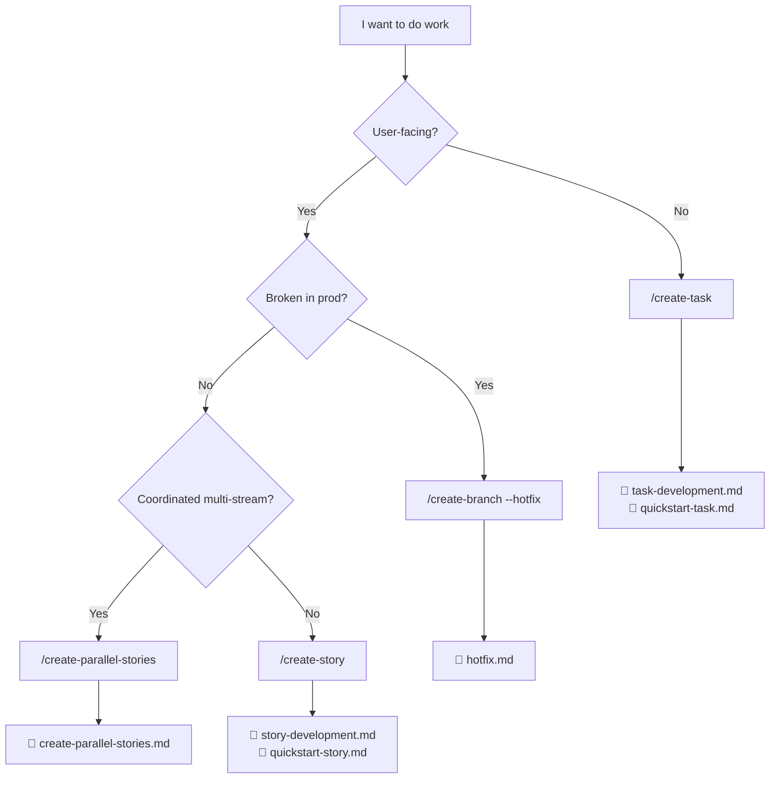

# Implementation Plan: Decision tree which-path

> Requirements: [story.1.3.decision-tree-which-path.md](story.1.3.decision-tree-which-path.md)

## Overview

Single doc at `docs/concepts/which-path.md`. Two views of the same decision logic: Mermaid flowchart (primary) + prose fallback (accessibility).

## Decision logic

```
Q1: Is the work user-facing (a feature, bug, UX) or internal (refactor, infra, cleanup)?
├── user-facing → Q2
└── internal    → /create-task

Q2: Is it broken in production right now?
├── yes → /hotfix
└── no  → Q3

Q3: Is this part of a coordinated multi-stream effort?
├── yes → /create-parallel-stories
└── no  → /create-story  ← default for ambiguous user-facing work
```

## Task-by-Task Implementation Guide

### Task 1 — Skeleton

```yaml
---
name: which-path
description: Decision tree mapping intent to skill. Use when uncertain whether your work is a task, story, hotfix, or parallel-stream effort.
type: guide
status: draft
version: 0.1.0
created: 2026-05-11
---
```

### Task 2 — Decision hierarchy

3-question chain (above). Default to `/create-story` for ambiguous user-facing work.

### Task 3 — Mermaid flowchart



### Task 4 — Prose fallback

```markdown
## Prose fallback (screen-reader-friendly)

If Mermaid does not render in your viewer, walk this question chain:

1. **Is your work user-facing?** A feature, bug fix, or UX change is user-facing. A refactor, infra change, or cleanup is internal.
   - Internal → **/create-task** (see [task-development.md](../runbooks/task-development.md), [quickstart-task.md](./quickstart-task.md))
   - User-facing → continue to question 2.

2. **Is the system broken in production right now?**
   - Yes → **/hotfix** (see [hotfix.md](../runbooks/hotfix.md))
   - No → continue to question 3.

3. **Is this part of a coordinated multi-stream effort** (e.g., several developers shipping pieces in parallel)?
   - Yes → **/create-parallel-stories** (see [create-parallel-stories.md](../runbooks/create-parallel-stories.md))
   - No → **/create-story** (see [story-development.md](../runbooks/story-development.md), [quickstart-story.md](./quickstart-story.md))
```

### Task 5 — Wire links

Verify all paths above resolve. Use markdown link checker before opening PR.

### Task 6 — Visual verify

Push to a draft PR; open the file on GitHub web UI; confirm Mermaid renders. If it falls back to code block, fix syntax.

### Task 7 — Validation + status flip

Same pattern as Story 1.1 / 1.2.

## Key Patterns and References

- Mermaid inline-in-md pattern confirmed by commit `a79d3ee`.
- Sibling docs: `quickstart-task.md` (1.1), `quickstart-story.md` (1.2).
- Runbook hub: `docs/runbooks/README.md`.

## Testing Approach

- Static: `documentation-standards-validator`.
- Link: markdown link check workflow.
- Visual: GitHub web Mermaid render (manual, one-shot).

## Risk register

| Risk | Likelihood | Impact | Mitigation |
|---|---|---|---|
| Mermaid syntax error renders as code | Medium | Medium | Task 6 visual verify gate |
| Decision tree misroutes user (e.g., bug → task instead of story) | Medium | High | Default ambiguous user-facing work to /create-story; verify against `docs/reference/invocation.md` |
| Runbook target file renamed later | Low | Low | Markdown link check catches |
