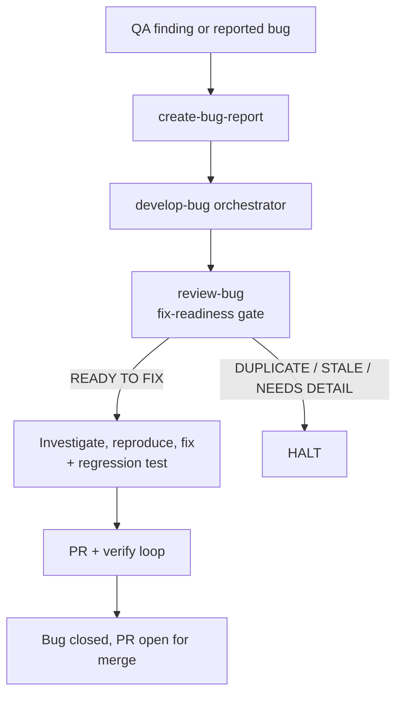

# Runbook — Bug Fix

> ### Is this the right runbook?
>
> **Use this if** you're tracking down a bug in your local development cycle (not a live production incident).
>
> **Use a different runbook if:**
>
> - The bug is in production right now → [`hotfix.md`](./hotfix.md)
> - The bug fix needs PRD/epic-level planning (architectural change) → [`story-development.md`](./story-development.md)
> - You're not sure → [decision tree](../concepts/which-path.md)

---

## Before you start

> **Audience:** developers responding to a QA finding or a reported bug inside the normal pipeline.

A bug is a **first-class work item** here: its own document, number, tracker card and orchestrator —
`/develop-bug`, which runs it from open to closed the way `/develop-story` runs a story.

**Skim these standards first (5 min total):**

- [`bug-documents.md`](../standards/bug-documents.md) — bug schema, and the `new → in-progress → ready-for-qa → closed | reopened` lifecycle
- [`bug-registry.md`](../standards/bug-registry.md) — global numbering for cross-cutting bugs
- [`file-naming.md`](../standards/file-naming.md) — the three bug filename patterns

## When to use this runbook

- `qa-story` or `qa-task` produces a `FAIL` or `CONCERNS` gate naming specific bugs.
- A user-reported bug needs tracking against an existing story or task.
- A sweep (lint, deps, security, drift) finds a defect belonging to no single story or task.

## Pick the bug mode first

The mode decides the filename, the directory and the numbering.

| Mode            | When                                                    | Lives in                             | Filename                                 | Numbering                          |
| --------------- | ------------------------------------------------------- | ------------------------------------ | ---------------------------------------- | ---------------------------------- |
| **Story bug**   | Found during story testing                              | beside the story file                | `story.{epic}.{story}.bug.{n}.{name}.md` | per-story (scan the dir, max + 1)  |
| **Task bug**    | Found during technical-task QA                          | `docs/tasks/task.{id}.{name}/`       | `task.{id}.bug.{n}.{name}.md`            | per-task (scan the dir, max + 1)   |
| **General bug** | Cross-cutting, **no single story or task owner**        | `docs/bugs/bug.{N}.{name}/`          | `bug.{N}.{name}.md`                      | **global**, via the bug registry   |

**A general bug is a core document, like a task** — its own self-named subdirectory, and a number from
[`docs/bugs/bug-registry.md`](../../docs/bugs/bug-registry.md): read **Next Available Bug Number**,
append a row, increment the counter, and commit the registry bump **in the same commit** as the bug
files. Numbers are globally unique and never reused.

## Pipeline diagram



## Phase A — File the bug

### A.1 `create-bug-report`

| | |
|---|---|
| **Invoke** | `"file a bug for X"` · `/create-bug-report` |
| **What it does** | Picks the mode from the table above, assigns the number, writes the bug from the shared template, and links it into its parent (story `## Bug Reports` section, task Bug Reports list) or the registry — in one change. |
| **Pitfalls** | The bug report carries `## Status History`, **never** a `## Change Log` — see Pitfalls below. A general bug's registry row must be in the same commit as the bug file. |
| **Reference** | [`create-bug-report` SKILL.md](../../skills/create-bug-report/SKILL.md) |

### A.2 `review-bug` — optional here, mandatory inside the pipeline

`/develop-bug` runs it as Step 2 regardless, so filing straight into the pipeline is fine; run it
standalone when a report needs tightening before anyone picks it up.

Two modes. **Interactive** (default) asks batched clarifying questions about missing reproduction
detail, wrong severity or priority, and linkage gaps. **Validate** (`--validate`, or "is this bug ready
to fix?") is a non-interactive GO/NO-GO gate scoring fix-readiness 1–10 across Completeness,
Reproducibility, Classification and Linkage, after two read-only pre-pass scans — a **duplicate** scan
over sibling bugs and the registry, and an **already-fixed/stale** scan of the root-cause area. It
reports readiness and **never mutates the bug lifecycle `status`**: a ready bug stays `new`, and Step 3
is what moves it to `in-progress`.

**Reference:** [`review-bug` SKILL.md](../../skills/review-bug/SKILL.md)

## Phase B — Fix it (`develop-bug`)

One command runs the whole lifecycle — `/develop-bug docs/bugs/bug.12.some-name/bug.12.some-name.md`.

### Phase 0 — Resolve & prepare

Three prompts, each with an auto-derived recommended option: **Q1 branch model**, which drives **Q2
base branch** and **Q3 PR target**.

```
bugfix   (default) →  develop  →  feature branch  →  PR back to develop
hotfix            →  main     →  hotfix/vX.Y.Z   →  PR to main, then merge back to develop
```

### Phase 1 — The 8 steps

| Step | Skill | What happens |
|---|---|---|
| 1 | `create-branch` | Cuts the branch per Q1. **Ensures the tracker issue first** (see below), so the lock records a real issue. |
| 2 | `review-bug` | Validate-and-apply. **READY TO FIX** → proceed. **NEEDS DETAIL**, **DUPLICATE**, or **STALE (already fixed)** → HALT. |
| 3 | Investigate & fix | Sets `new → in-progress`, opens `### Iteration 1`, **reproduces** the failure, locates the root cause, implements the fix **plus a regression test that fails without it**, writes Investigation + Fix Implementation into the Developer Fix Cycle, adds a Status History row, sets `ready-for-qa`. Not reproducible → HALT; never fabricate a fix. |
| 4 | `create-pr` | Pushes and opens the PR against the Q3 target. |
| 5–6 | Verify & fix loop | QA verifies **the bug scenario is gone** and nothing regressed. PASS → writes QA Verification (✅ Fixed). FAIL → appends `### Iteration N+1`, sets status `reopened`, runs `/qa-fix`. Bounded at 5 cycles. |
| 7 | `finalise` + close | DoD checks, then writes `## Resolution Summary`, sets `status: closed`, adds the final Status History row, and updates the parent: story bug → **Closed Bugs** in the story's `## Bug Reports`; task bug → ✅ Closed in the task's list; general bug → the registry row flips to `closed`. |
| 8 | `commit-changes` | Final commit of artifacts, final push, lock removed. |

**Lite mode applies to Step 5 only.** Step 7 runs in full in every mode.

Crash-safe: re-invoke `/develop-bug <same-path>` to resume — it verifies per-step artifacts and continues
at the first incomplete step.

### Tracker sync — both arms

Step 1 ensures the bug has a real tracker card before the pipeline records anything. The caller branches
on `TRACKER` (set by `shared/resources/resolve-platform.sh`) and calls one of two sub-routines:

| `TRACKER` | Sub-routine | Parent linkage |
|---|---|---|
| `github` | [`ensure-bug-github-issue`](../../skills/ensure-bug-github-issue/SKILL.md) | **Sub-issue** of the parent story/task issue when that parent has one; adds to the project board and mirrors Priority. |
| `jira` | [`ensure-bug-jira-issue`](../../skills/ensure-bug-jira-issue/SKILL.md) | **Sibling, not child** — the relationship travels as a Jira issue link plus a Source Documents section pointing at the bug, its parent document, its parent's card and (story mode) the epic. |

**The two arms are not built the same way.** The Jira sub-routine *delegates* — `invokes:
[sync-jira-bug]`, and its create step is titled "Create via `sync-jira-bug` Delegation". The GitHub
one *creates the issue itself* (dedup → `gh issue create` → sub-issue link → board + Priority →
frontmatter write-back → Status History) and never references `sync-github-bug`. Both write **Status
History** rows on creation and transition only. Open/closed reconciliation lives in the **full** sync
skills — [`sync-github-bug`](../../skills/sync-github-bug/SKILL.md) /
[`sync-jira-bug`](../../skills/sync-jira-bug/SKILL.md) — which Step 1 never runs on the GitHub arm;
invoke one directly if a card's state needs re-reconciling.

A general bug is anchored to the registry and to nothing else — it has no parent to link to.

**An empty return is a degraded run, not a halt** — the create may have failed, or been deferred by a
restricted `access.tracker`. Never write a placeholder number: a wrong one defeats the dedup search
that stops the next run creating a duplicate.

## Artifacts a bug run leaves behind

All co-located with the bug document — for a **general** bug that is its own directory, shown here:

```
docs/bugs/bug.12.some-name/
├── bug.12.some-name.md                   # the report — Status History, fix cycle, Resolution Summary
├── bug.12.review.1.some-name.md          # Step 2 fix-readiness review
├── bug.12.implementation.1.some-name.md  # orchestrator decisions + issues log
└── bug.12.dod.1.some-name.md             # Step 7 Definition of Done
```

Story and task bugs produce the same set, prefixed `story.{e}.{s}.bug.{n}.` / `task.{id}.bug.{n}.`, in
**the parent's** directory rather than one of their own.

## Pitfalls

- **Never add a `## Change Log` to a bug report.** Bug reports are the one document type excluded from
  it; `## Status History` is the equivalent and carries a `Status` column besides.
  `upsertChangeLog(content, entry, { docType: "bug" })` does **not** fail — there is no `bug` anchor,
  so it silently appends the forbidden table. Use
  [`status-history.js`](../../shared/resources/status-history.js), not the `docType`.
- **Don't edit the gate file** to "close" a finding without retesting — gate files are owned by the QA
  skills (`qa-story` / `qa-task` / `qa-gate`).
- **Don't bundle unrelated fixes** into one commit. One bug → one commit, or one PR if it spans files.
- **Don't skip the regression test.** Step 3 requires a test that *fails without the fix*; one that
  passes either way has not shown the fix fixes anything.
- **Don't reuse a general bug number**, even a cancelled one. On a conflict over the next number, the
  higher wins and the loser bumps to the next free slot.
- **A hotfix needs a merge-back.** Its PR targets `main`; the fix must also reach `develop`, or the
  next release re-introduces the bug.

## Verification

Substitute a real bug directory for `$BUG`. Two details are easy to get wrong: resolve to the **report
alone** (the directory also holds review, implementation and DoD artifacts with their own `status:`),
and match `**Status**:` with the colon **outside** the bold — unlike a task or story:

```bash
BUG=docs/bugs/bug.12.review-syncs-relink-without-no-transition
REPORT="$BUG/$(basename "$BUG").md"                # the self-named-subdirectory rule guarantees this
grep -E '^status:|^\*\*Status\*\*:' "$REPORT"     # closed, and the body agrees
grep -c '## Resolution Summary' "$REPORT"          # 1 — the fix record exists
grep -c '## Change Log' "$REPORT"                  # 0 — none was introduced
grep 'bug.12' docs/bugs/bug-registry.md            # registry row agrees (general bugs only)
```

## See also

- [`develop-bug` SKILL.md](../../skills/develop-bug/SKILL.md) — the orchestrator
- [`review-bug` SKILL.md](../../skills/review-bug/SKILL.md) · [`create-bug-report` SKILL.md](../../skills/create-bug-report/SKILL.md)
- [`qa-fix` SKILL.md](../../skills/qa-fix/SKILL.md) — drives the fix inside the verify loop
- [Bug documents](../standards/bug-documents.md) · [Bug registry](../standards/bug-registry.md)
- [Document change log](../../shared/resources/document-change-log.md) — §Exclusions, the bug-report rule
- [QA Flow](./qa-flow.md) · [Story Development](./story-development.md) · [Task Development](./task-development.md)
