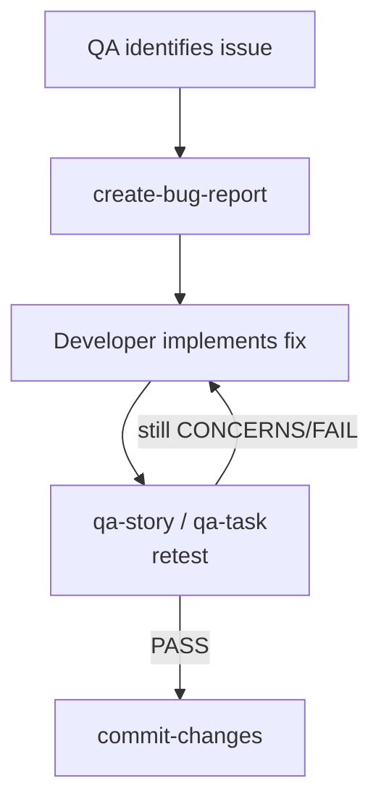

# Runbook — Bug Fix

> ### Is this the right runbook?
>
> **Use this if** you're tracking down a bug in your local development cycle (not a live production incident).
>
> **Use a different runbook if:**
> - The bug is in production right now → [`hotfix.md`](./hotfix.md)
> - The bug fix needs PRD/epic-level planning (architectural change) → [`story-development.md`](./story-development.md)
> - You're not sure → [decision tree](../concepts/which-path.md)

---

> **Audience:** developers responding to a QA finding or a reported bug inside the normal pipeline.

When QA identifies a bug — during story review or after deployment — record it as a structured bug report, fix it, and retest. This runbook covers the loop without re-running a full `develop-story` cycle.

For **emergency production issues**, use [Hotfix](./hotfix.md) instead.

## When to use this runbook

- `qa-story` or `qa-task` produces a `FAIL` or `CONCERNS` gate with specific bugs identified.
- A user-reported bug needs to be tracked against an existing story.
- You're inside the QA fix loop and want to record findings before fixing.

## Pipeline



## Steps

```
1. [QA finds issue during review]   → /qa-story or /qa-task
2. /create-bug-report               → story.{epic}.{story}.bug.{n}.{name}.md (co-located)
3. [Developer fixes bug]            → /qa-fix can be used to drive the fix
4. /qa-story <story>                → re-review against the bug report
5. /commit-changes                  → focused commit referencing the bug report
```

## Bug report naming

```
story.{epic}.{story}.bug.{n}.{name}.md    # bug against a story
task.{n}.bug.{n}.{name}.md               # bug against a task
```

`{n}` is the sequential bug number within the story or task. See [file naming](../standards/file-naming.md).

## Pitfalls

- **Don't edit the gate file** to "close" a finding without retesting — gate files are owned by QA skills (`qa-story` / `qa-task` / `qa-gate`).
- **Don't bundle unrelated fixes** into the same commit. One bug → one commit (or one PR if the fix spans many files).
- **Don't skip the retest.** A new gate file must be produced after the fix.

## See also

- [`create-bug-report` SKILL.md](../../skills/create-bug-report/SKILL.md)
- [`qa-fix` SKILL.md](../../skills/qa-fix/SKILL.md)
- [QA Flow Runbook](./qa-flow.md)
- [Story Development Runbook](./story-development.md)
- [Task Development Runbook](./task-development.md)
