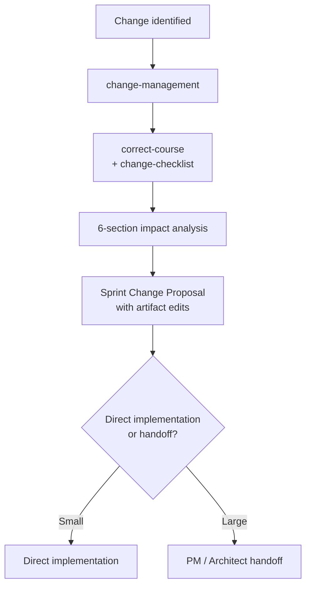

# Runbook — Change Management

> **Audience:** anyone responding to a pivot, blocker, or scope change mid-project.

When the plan breaks — a story fails, a tech assumption turns out wrong, a stakeholder demands a pivot, a requirement was missing — drive the response through `change-management` rather than improvising. The output is a Sprint Change Proposal with concrete artifact edits.

## When to use this runbook

- A story or task has **failed** and the team needs to decide what to do.
- A **scope pivot** has been requested by a stakeholder.
- A **tech blocker** invalidates a previously-approved approach.
- A **missing requirement** is discovered after PRD acceptance.

For day-to-day rework on QA findings, use [QA Flow](./qa-flow.md) or [Bug Fix](./bug-fix.md) instead — change management is for plan-level disruption.

## Pipeline



## Steps

```
1. /change-management              → invokes correct-course + change-checklist
2. Work through the 6-section change-checklist interactively
3. Output: Sprint Change Proposal — impact analysis + specific edits to PRD/epic/story
4. Apply the edits via /edit-epic, /edit-story, or hand-editing the PRD
5. If the change cascades, return to PRD authoring (see PM Workflows Runbook)
```

## The 6-section impact framework

`change-checklist` walks you through:

1. **Issue summary** — what changed and why
2. **Affected artifacts** — PRD, epics, stories, tasks impacted
3. **Cascade analysis** — downstream artifacts that must change
4. **Options** — at least two paths forward, with trade-offs
5. **Recommended action** — chosen path with rationale
6. **Edits** — specific changes to make, in priority order

Full spec: [`change-checklist` SKILL.md](../../skills/change-checklist/SKILL.md).

## Pitfalls

- **Don't apply edits before completing the checklist.** Premature edits leave related artifacts inconsistent.
- **Don't pivot silently.** Record the change in the Sprint Change Proposal so future readers (and future you) can trace the decision.
- **Cascading PRDs** — if the change invalidates a section of the PRD, run `review-prd` after editing to revalidate against the codebase.

## See also

- [`change-management` SKILL.md](../../skills/change-management/SKILL.md)
- [`correct-course` SKILL.md](../../skills/correct-course/SKILL.md)
- [`change-checklist` SKILL.md](../../skills/change-checklist/SKILL.md)
- [`edit-epic` SKILL.md](../../skills/edit-epic/SKILL.md)
- [`edit-story` SKILL.md](../../skills/edit-story/SKILL.md)
- [PM Workflows Runbook](./pm-workflows.md)
- [Story Development Runbook](./story-development.md)
