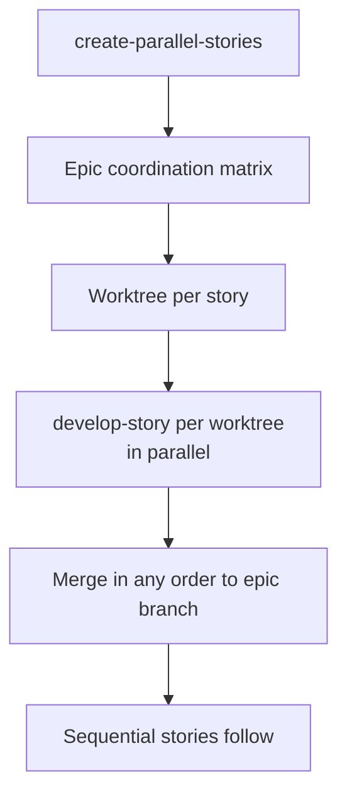

# Runbook — Parallel Story Development

> **Audience:** teams developing multiple stories of one epic simultaneously without merge conflicts.

> ⚠️ **Epic 3.2 pending:** An advanced multi-team and cross-epic coordination guide will link here once Epic 3.2 lands. The steps below cover single-repo parallel stories within one epic; Epic 3.2 will extend this to larger-scale parallel patterns.

When several stories under the same epic can be implemented in parallel — different files, different concerns — use Git worktrees to isolate them and let multiple developers (or multiple agent sessions) work at the same time.

## When to use this runbook

- Two or more sibling stories under the same epic have **no file overlap**.
- You want to ship stories out of dependency order.
- You're running multiple agent sessions and need isolation.

If stories share files, do not use this runbook — sequence them via the normal [Story Development Runbook](./story-development.md).

## Prerequisites

- Git worktrees are available (`git worktree --help` succeeds).
- Stories are already authored and reviewed (`status: ready-for-development`).
- File boundaries between stories are explicit — list them up front.

## Pipeline



## Steps

```
1. /create-parallel-stories <epic-path>     → produces coordination matrix + worktree setup commands
2. For each parallelisable story:
   git worktree add ../{repo}-story-{E}.{S} feature/story.{E}.{S}.{name}
   cd ../{repo}-story-{E}.{S}
   /develop-story <story-path>
3. Merge each story PR to the epic branch as it lands (any order).
4. After all parallel stories merge, sequential stories proceed normally.
```

## Pitfalls

- **Don't share dirty worktrees across agent sessions** — each session needs an isolated checkout.
- **File-boundary discipline is on you.** `create-parallel-stories` produces a coordination matrix; respect it. If a story's diff touches files claimed by a sibling, abort and re-sequence.
- **PRs target the epic branch**, not `develop`. Same convention as serial development.
- **Worktree cleanup:** after merge, remove the worktree (`git worktree remove ../{repo}-story-…`) to free disk space.

## See also

- [`create-parallel-stories` SKILL.md](../../skills/create-parallel-stories/SKILL.md)
- [Story Development Runbook](./story-development.md)
- [Sprint Cycle Runbook](./sprint-cycle.md)
