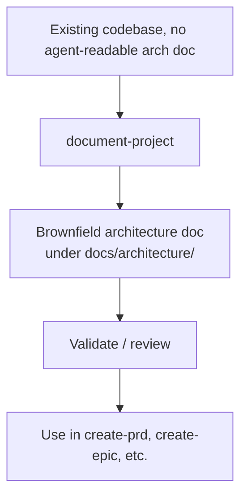

# Runbook — Document an Existing Project

> **Audience:** developers adopting this library on a brownfield codebase that has no architecture docs yet.

Before you can run brownfield PRD flows (`create-prd`) or land enhancements safely, the agent needs a picture of what exists. `document-project` generates a brownfield architecture document optimised for AI consumption — actual patterns, technical debt, and constraints.

## When to use this runbook

- You're adopting the library on an **existing codebase** with no agent-readable architecture doc.
- You're onboarding to a project and want a structured overview before making changes.
- A `create-prd` (brownfield) run failed because architecture context was missing.

For a fresh project, use [New Project Setup](./new-project-setup.md).

## Pipeline



## Steps

```
1. /document-project                            → analyses code, captures actual patterns + tech debt
2. Review the generated doc for accuracy        → spot-check against the codebase
3. Commit the doc to docs/architecture/         → location per skills-config.yaml
4. Proceed with create-prd / create-epic        → the agent now has the context it needs
```

## What the doc captures

`document-project` is **not** a green-field architecture template — it captures what's actually in the codebase:

- Module/service inventory and boundaries
- Data model and key tables
- External integrations
- Tech debt and known-broken areas
- Conventions (naming, error handling, logging) inferred from existing code
- Build / deploy pipeline as actually configured

## Prerequisites

- `skills-config.yaml` has `architecture.architectureSharded` and `architecture.architectureShardedLocation` set.
- You have read access to the full repo (the skill scans it).
- For sensitive codebases, review the generated doc before committing — the skill may surface secrets it found in code.

## Pitfalls

- **Don't accept the output blindly.** It's the agent's best inference, not ground truth. Spot-check assertions about ownership, broken areas, and integration boundaries.
- **Re-run when the codebase shifts significantly.** The doc is a snapshot; it will drift.
- **Don't use this for greenfield projects** — `architect` is the right skill for green-field design.

## See also

- [`document-project` SKILL.md](../../skills/document-project/SKILL.md)
- [PM Workflows Runbook](./pm-workflows.md) — what to do once the doc exists
- [New Project Setup Runbook](./new-project-setup.md) — greenfield alternative
- [`create-prd` SKILL.md](../../skills/create-prd/SKILL.md)
- [`create-architecture-doc` SKILL.md](../../skills/create-architecture-doc/SKILL.md)
