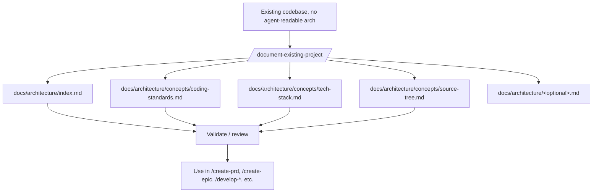

# Runbook — Document an Existing Project

> **Audience:** developers adopting this library on a brownfield codebase that has no architecture docs yet.

Before you can run brownfield PRD flows (`create-prd`) or land enhancements safely, the pipeline needs a picture of what exists. `/document-existing-project` analyses your codebase and writes a **sharded** brownfield architecture tree under `docs/architecture/` — the exact layout downstream skills consume via `devLoadAlwaysFiles`.

(Note: there is also a legacy `/document-project` slug; it is now a thin deprecation stub that points here.)

## When to use this runbook

- You're adopting the library on an **existing codebase** with no agent-readable architecture doc.
- You're onboarding to a project and want a structured overview before making changes.
- A `create-prd` (brownfield) run failed because architecture context was missing.
- Pipeline skills (`/develop`, `/develop-story`, `/develop-task`, `/review-story`, `/qa-*`) fail loading `devLoadAlwaysFiles` because the `concepts/` shards don't exist yet.

For a fresh project, use [New Project Setup](./new-project-setup.md).

## Pipeline



## Steps

```
1. Confirm skills-config.yaml has architecture.architectureShardedLocation set
   (default: docs/architecture).
2. /document-existing-project                  → analyses code, elicits coding standards,
                                                 writes the sharded tree
3. For each pre-existing shard, the skill shows a diff and asks
   [overwrite / merge / skip]                  → choose per file
4. Review every generated shard for accuracy   → spot-check against the codebase
5. Commit the docs/architecture/ tree          → matches docs/standards/architecture-docs.md
6. Proceed with /create-prd, /create-epic,
   /develop-*                                  → pipeline now has the context it needs
```

## What gets written

The skill writes **directly into a sharded layout** — never a single monolithic file.

Required (always written, loaded by every pipeline run via `devLoadAlwaysFiles`):

- `docs/architecture/index.md`
- `docs/architecture/concepts/coding-standards.md`
- `docs/architecture/concepts/tech-stack.md`
- `docs/architecture/concepts/source-tree.md`

Optional (written only when content exists):

- `docs/architecture/quick-reference.md`
- `docs/architecture/data-models.md`
- `docs/architecture/technical-debt.md`
- `docs/architecture/integrations.md`
- `docs/architecture/deployment.md`
- `docs/architecture/testing.md`
- `docs/architecture/impact-analysis.md` *(only when a PRD is in scope)*
- `docs/architecture/appendix.md`

Each shard captures **reality, not aspiration** — actual patterns (even if inconsistent), tech debt and workarounds, integration gotchas, areas that can't be changed. See [`docs/standards/architecture-docs.md`](../standards/architecture-docs.md) for the full contract and [`docs/examples/architecture/`](../examples/architecture/) for the layout shape.

## Prerequisites

- `skills-config.yaml` at the repo root with at least:
  ```yaml
  architecture:
    architectureSharded: true
    architectureShardedLocation: docs/architecture
    architectureVersion: v4
  devLoadAlwaysFiles:
    - docs/architecture/concepts/coding-standards.md
    - docs/architecture/concepts/tech-stack.md
    - docs/architecture/concepts/source-tree.md
  ```
- You have read access to the full repo (the skill scans it).
- For sensitive codebases, review the generated shards before committing — the skill may surface secrets it found in code.

## Pitfalls

- **Don't accept the output blindly.** It's the skill's best inference, not ground truth. Spot-check every shard before committing.
- **Re-run when the codebase shifts significantly.** Shards are snapshots; they will drift. Re-running diffs against existing files and asks before overwriting.
- **Don't use this for greenfield projects** — `/architect` (or `/create-architecture-doc`) is the right skill for green-field design.
- **Legacy monolith?** If you have an older `docs/brownfield-architecture.md`, run `/shard-doc` against it to split into the sharded tree, *then* delete the monolith. This skill will not consume the monolith.

## See also

- [Architecture documents standard](../standards/architecture-docs.md) — the layout contract this skill satisfies
- [`docs/examples/architecture/`](../examples/architecture/) — copy-paste skeleton showing the target shape
- [`document-existing-project` SKILL.md](../../skills/document-existing-project/SKILL.md)
- [PM Workflows Runbook](./pm-workflows.md) — what to do once the docs exist
- [New Project Setup Runbook](./new-project-setup.md) — greenfield alternative
- [`create-prd` SKILL.md](../../skills/create-prd/SKILL.md)
- [`create-architecture-doc` SKILL.md](../../skills/create-architecture-doc/SKILL.md) — greenfield producer (still outputs monolith; pair with `/shard-doc`)
