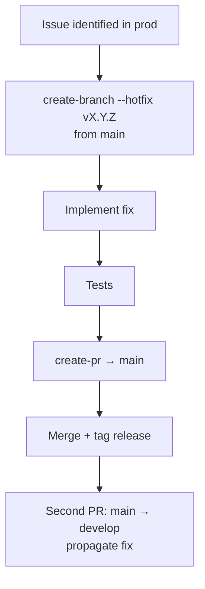

# Runbook — Hotfix

> **Audience:** developers shipping an emergency production fix outside the normal develop-story / develop-task flow.

A hotfix branches from `main` (not `develop`), ships a minimal targeted change, and is propagated back to `develop` after merge. Use this runbook only when production is broken and you cannot wait for the regular pipeline.

## When to use this runbook

- A production-only issue needs a fix **right now**.
- The fix is small and targeted (one bug, no scope creep).
- You're willing to skip the orchestrator and drive each step manually.

For any non-emergency change, use [Story Development](./story-development.md) or [Task Development](./task-development.md).

## Pipeline



## Steps

```
1. /create-branch --hotfix v1.2.1    → creates hotfix/v1.2.1 from main
2. [Implement the critical fix]      → keep scope minimal
3. [Run relevant tests]              → testing-setup-* skill for your stack
4. /commit-changes                   → single focused commit
5. /create-pr                        → PR against main
6. [After merge to main]             → tag the release: git tag v1.2.1 && git push --tags
7. [Open a second PR: main → develop] → propagate the fix back so develop doesn't regress
```

## Pitfalls

- **Don't skip step 7.** If you don't propagate to `develop`, the next release from `develop` re-introduces the bug.
- **Don't expand scope.** A hotfix branch is for one fix. Unrelated cleanup goes to `develop` via a normal task or story.
- **Don't skip tests.** Even under pressure — a broken hotfix is worse than no hotfix.
- **Force-pushing main is never authorised by this runbook.** If you need to undo a merge, do it with a revert commit.

## See also

- [`create-branch` SKILL.md](../../skills/create-branch/SKILL.md) — `--hotfix` flag semantics
- [`commit-changes` SKILL.md](../../skills/commit-changes/SKILL.md)
- [`create-pr` SKILL.md](../../skills/create-pr/SKILL.md)
- [Bug Fix Runbook](./bug-fix.md) — for non-emergency bug fixes inside the normal flow
