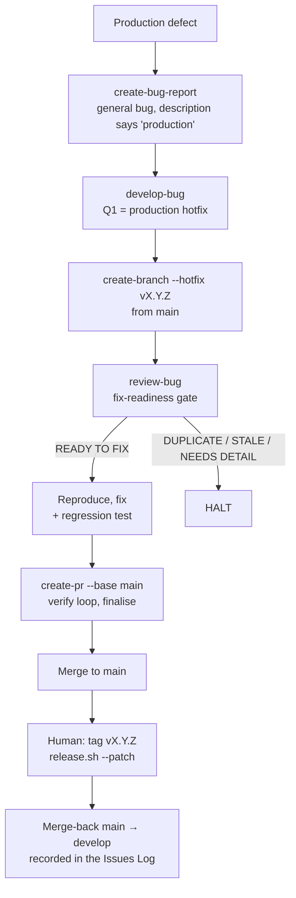

# Runbook — Hotfix

> ### Is this the right runbook?
>
> **Use this if** something is broken in production *right now* and the fix must land on `main` before the next release.
>
> **Use a different runbook if:**
>
> - The bug is not live-broken → [`bug-fix.md`](./bug-fix.md) (same pipeline, regular branch model)
> - The work is internal (refactor, infra) → [`task-development.md`](./task-development.md)
> - The work is a feature → [`story-development.md`](./story-development.md)
> - You're not sure → [decision tree](../concepts/which-path.md)

---

## Before you start

> **Audience:** developers shipping an emergency production fix. The pipeline is the same one a regular bug uses — `/develop-bug` — with one answer changed: the branch model.

A hotfix is a **bug with a different branch model**, not a different process. It still gets its own document, number, tracker card and fix record; `/develop-bug` cuts the branch from `main` instead of `develop`, targets the PR at `main`, and records the mandatory merge-back to `develop` so it is not lost under pressure. What the pipeline does **not** do is cut the version tag — that stays a human call.

**Skim these first (5 min total):**

- [`bug-fix.md`](./bug-fix.md) — the bug modes, the eight pipeline steps, the artifacts; this page only states what differs
- [`bug-documents.md`](../standards/bug-documents.md) · [`bug-registry.md`](../standards/bug-registry.md) — schema and global numbering
- [`releases.md`](../contributing/releases.md) — who cuts the tag, and how `develop` is synced from `main`

## When to use this runbook

- A production-only defect needs a fix **right now**, before the next release from `develop`.
- The fix is small and targeted (one bug, no scope creep).
- The fix has to reach `main` first and `develop` second — the reverse of everything else in this repo.

## Pick the bug mode first

The mode decides the filename, the directory and the numbering — exactly as in
[`bug-fix.md` → Pick the bug mode first](./bug-fix.md#pick-the-bug-mode-first). A production
regression is usually a **general bug** (`docs/bugs/bug.{N}.{name}/`, numbered from the registry),
because the story or task that introduced it is already accepted; file it as a story or task bug only
when that parent is still open. Write **"production"** or **"regression"** in the description — that is
what makes `/develop-bug` offer the hotfix branch model as Q1's recommended default (and the answer an
autonomous run takes); the prompt itself is still asked.

## Pipeline diagram



## Phase A — File the bug

`/create-bug-report` — pick the mode above, say **production** in the description. `/develop-bug` runs
`review-bug` itself as Step 2 (duplicate scan, already-fixed scan, reproducibility from the report), so
filing straight into the pipeline is fine. Reference: [`create-bug-report` SKILL.md](../../skills/create-bug-report/SKILL.md) ·
[`review-bug` SKILL.md](../../skills/review-bug/SKILL.md).

## Phase B — Fix it (`develop-bug`, hotfix model)

One command — `/develop-bug docs/bugs/bug.12.some-name/bug.12.some-name.md`. Phase 0d asks three
branch questions once, each with a recommended default derived from the bug:

| Prompt               | Bugfix (default) | **Hotfix**                                                                     |
| -------------------- | ---------------- | ------------------------------------------------------------------------------ |
| Q1 — Branch model    | regular bugfix   | **production hotfix** — recommended when the report says production/regression |
| Q2 — Base branch     | `develop`        | **`main`** (auto-set from Q1)                                                  |
| Q3 — PR target       | `develop`        | **`main`** (auto-set from Q1; becomes `--base` at Step 4)                      |

An autonomous run (`/develop-next`, a loop) applies the recommended defaults and records them as
`auto-answered`. The eight steps are the ones in [`bug-fix.md`](./bug-fix.md#phase-1--the-8-steps);
what changes under the hotfix answer:

| Step | Hotfix difference                                                                                                                                                                                                     |
| ---- | --------------------------------------------------------------------------------------------------------------------------------------------------------------------------------------------------------------------- |
| 1    | `/create-branch --hotfix v{X.Y.Z}` → `hotfix/vX.Y.Z` off `main`. The version is the next patch; if it cannot be derived the pipeline asks once. The tracker card is ensured first, on either arm.                       |
| 2–3  | Unchanged: `review-bug` gate, then reproduce → root cause → fix **plus a regression test that fails without it**.                                                                                                       |
| 4    | `create-pr --base main`. The **Branch Policy** workflow admits a PR into `main` only from `develop`, `hotfix/*` or `release/*` — the branch name from Step 1 is what gets it through.                                    |
| 4    | The pipeline writes `hotfix: merge-back to develop required` into the implementation report's **Issues Log** — the back-merge is a recorded follow-up from this moment on, not a step to remember.                       |
| 5–7  | Unchanged: verify loop (bounded at 5), then `finalise` closes the bug. The card reaches Done with the PR still open; the merge itself is a human review action on `main`.                                              |

**Tracker sync — both arms.** Step 1 branches on `TRACKER` and ensures the card through
[`ensure-bug-github-issue`](../../skills/ensure-bug-github-issue/SKILL.md) or
[`ensure-bug-jira-issue`](../../skills/ensure-bug-jira-issue/SKILL.md); the two arms differ in how the
parent relationship travels — see [`bug-fix.md` → Tracker sync](./bug-fix.md#tracker-sync--both-arms).
A general bug is anchored to the registry and has no parent to link.

## Phase C — Tag and merge back (human)

The pipeline ends with the bug closed and the PR open against `main`. Two actions remain, and both are
yours:

1. **Merge the PR into `main`**, then **cut the tag**. Tagging is a release action, not a pipeline step:
   from `main` with a clean tree, `bash scripts/release.sh --patch` runs the checks, moves
   `[Unreleased]` in `CHANGELOG.md`, commits `chore(release): vX.Y.Z`, creates the annotated tag and
   pushes — and pushing a `v*.*.*` tag is what triggers the release workflow.
2. **Merge back to `develop`.** `release.sh` does this at the end of every fresh release (`git merge
main` into `develop`, then push); if you passed `--no-sync-develop`, or tagged by hand, do it yourself —
   `git checkout develop && git pull --rebase && git merge main && git push`. Then close the Issues-Log
   item the pipeline wrote at Step 4.

The order is deliberate: the tag marks the `main` that shipped, and the merge-back carries the
`chore(release)` commit into `develop` along with the fix.

## Pitfalls

- **Don't skip the merge-back.** The Issues-Log row is a reminder, not a mechanism — until `main` is
  merged into `develop`, the next release re-introduces the bug.
- **Don't expand scope.** A hotfix branch is for one fix. Unrelated cleanup goes to `develop` via a
  normal task or story.
- **Don't skip the regression test.** Even under pressure — a broken hotfix is worse than no hotfix, and
  Step 3 requires a test that fails without the fix.
- **Don't answer "bugfix" to Q1 to save a prompt.** The branch model is the only thing that makes this a
  hotfix; off `develop` the fix waits for the next release like everything else.
- **Force-pushing main is never authorised by this runbook.** If you need to undo a merge, do it with a revert commit.

## Verification

```bash
BUG=docs/bugs/bug.12.some-name
grep -E '^status:' "$BUG/$(basename "$BUG").md"                      # closed
git branch -r --list 'origin/hotfix/*'                                 # the branch Step 1 cut
gh pr list --state merged --base main --head 'hotfix/v1.2.1'           # merged into main (GitHub)
git tag --contains "$(git rev-parse origin/main)" | grep '^v'          # the tag sits on main
git merge-base --is-ancestor origin/main origin/develop && echo synced  # merge-back done
```

## See also

- [`develop-bug` SKILL.md](../../skills/develop-bug/SKILL.md) — Phase 0d Q1 (branch model), Step 1 `--hotfix`, Step 4 `--base main` and the merge-back note
- [`create-branch` SKILL.md](../../skills/create-branch/SKILL.md) — `hotfix/v<version>` naming, `main` as base
- [Releases](../contributing/releases.md) — `release.sh`, the Branch Policy workflow, syncing `develop` with `main`
- [Bug Fix Runbook](./bug-fix.md) — the shared pipeline, modes, artifacts and tracker arms
