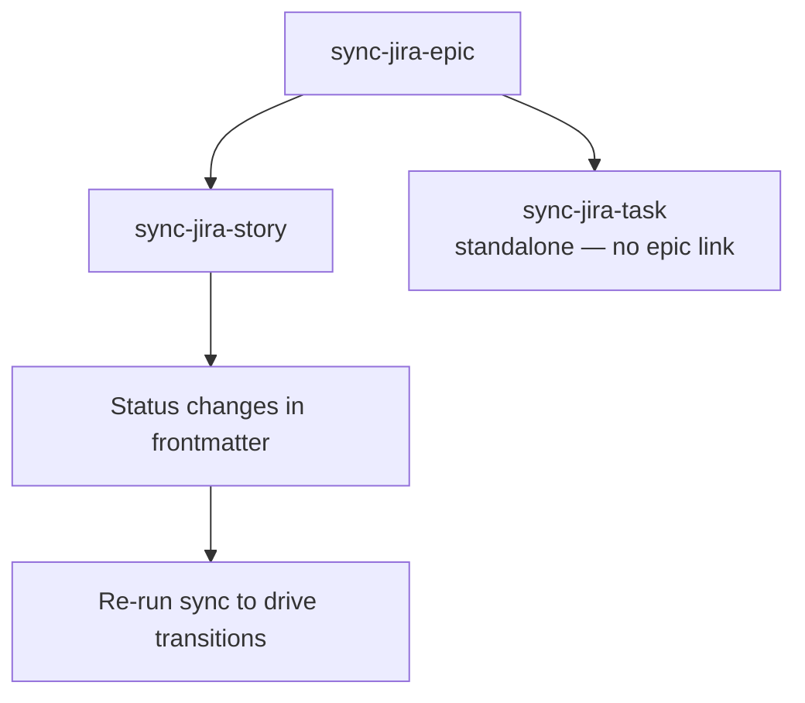

# Runbook — Jira Publish

> **Audience:** developers using these skills in a project tracked in Jira.

Sync local markdown artifacts (epics, stories, tasks) to Jira. All sync skills are **idempotent** — create on first run, update on subsequent runs based on the `jira_key` recorded in frontmatter.

## When to use this runbook

- You author epics/stories/tasks locally and want them published to Jira.
- You want frontmatter `status:` changes to drive Jira status transitions automatically.
- You need a fresh Jira issue from an existing local document that doesn't yet have a `jira_key`.

If you're running `develop-story` / `develop-task`, Jira sync happens **inside `finalise`** for the story/task itself — you only need this runbook for parent epics or for manual out-of-band syncing.

## Prerequisites

- `JIRA_URL` env var set → platform resolver picks Jira automatically. See [`shared/resources/platform-detection.md`](../../shared/resources/platform-detection.md).
- Jira authentication configured (Atlassian MCP or PAT, depending on your setup).
- The document's `jira_key` frontmatter field is unset on first sync; the skill writes it after creating the Jira issue.

## Pipeline



## Phase 1 — Sync the parent epic

```bash
/sync-jira-epic <epic-path>
```

- Creates the Jira epic if `jira_key` is absent; updates it otherwise.
- Embeds Bitbucket links to the parent PRD and epic file (rendered via ADF).
- Renders the Stories Breakdown **overview table** as a real ADF table (per-story subsections stay in the file).
- Maintains a Change Log in the local epic file.
- Concurrent-edit guard via stored Jira `updated` timestamp.

Writes `jira_key` + `jira_url` back to the local epic's frontmatter.

> **Alternative:** `jira-epic-creator` for bulk creation from a sharded PRD.

## Phase 2 — Sync child stories

```bash
/sync-jira-story <story-path>
```

- Creates the Jira story if `jira_key` is absent; updates it otherwise.
- Links the Jira story to its parent Jira epic (team-managed `parent` field or classic Epic Link customfield — auto-detected with retry).
- Adds the story to the project backlog (Scrum boards only).
- Embeds Bitbucket links rendered via ADF.
- Maintains a Change Log in the local story file.

The parent epic **must already exist in Jira** with `jira_key` set — Phase 1 first.

## Phase 3 — Sync standalone tasks (no epic link)

```bash
/sync-jira-task <task-path>
```

- Creates the Jira task if `jira_key` is absent; updates it otherwise.
- **Not linked** to any Jira epic — tasks are standalone.
- Idempotent create via `synced-from-*` label search.
- Adds the task to the project backlog (Scrum boards only).
- Embeds Bitbucket links rendered via ADF.

## What lands on a card

Every card is a **summary that points at the local document**, never a copy of
it: a short summary, criteria capped at 5 with a `+N more` pointer, metadata, and
links to the file. The document's Change Log is never published — Jira keeps its
own issue history.

The full contract, including the caps and the per-type section lists, is
[`shared/resources/tracker-card-summary.md`](../../shared/resources/tracker-card-summary.md).

## Status transitions

All three sync skills drive the Jira issue's status from the local frontmatter `status:`. When you change `status:` locally and re-run sync, the Jira transition fires automatically (provided the corresponding transition exists in your Jira workflow).

## Common workflow

```
1. Author/update epic locally   →  /sync-jira-epic    (Jira epic exists + jira_key set)
2. Author/update story locally  →  /sync-jira-story   (linked to Jira epic, on backlog)
3. During development           →  /sync-jira-story   (status changes drive transitions)
4. After acceptance             →  finalise auto-syncs the final state
```

## See also

- [`sync-jira-epic` SKILL.md](../../skills/sync-jira-epic/SKILL.md)
- [`sync-jira-story` SKILL.md](../../skills/sync-jira-story/SKILL.md)
- [`sync-jira-task` SKILL.md](../../skills/sync-jira-task/SKILL.md)
- [`jira-epic-creator` SKILL.md](../../skills/jira-epic-creator/SKILL.md)
- [`ensure-epic-jira-issue` SKILL.md](../../skills/ensure-epic-jira-issue/SKILL.md) — called by `finalise`
- [Platform detection](../../shared/resources/platform-detection.md)
- [Story Development Runbook](./story-development.md)
- [Task Development Runbook](./task-development.md)
