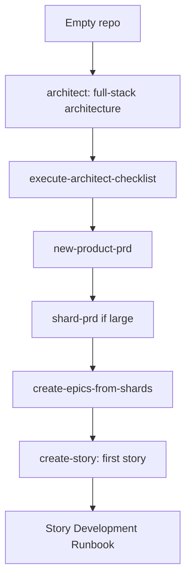

# Runbook — New Project Setup

> **Audience:** developers spinning up a brand-new project with this library.

The order of operations for going from "empty repo" to "first story in flight." For an existing codebase you're documenting, use [`document-existing-project`](../../skills/document-existing-project/SKILL.md) instead.

## When to use this runbook

- Starting a greenfield product.
- Want architecture + PRD + first story scaffolded before any feature work begins.

## Pipeline



## Steps

```
1. /architect                              → full-stack architecture doc
2. /execute-architect-checklist            → validate the architecture
3. /new-product-prd                         → product requirements
4. /shard-prd            (optional)        → split if 5+ epics or 30+ stories
5. /create-epics-from-shards               → one epic per sharded section
6. /create-story                           → first story for epic 1
7. → Story Development Runbook
```

## Repository prep (one-time)

Before step 1:

- `skills-config.yaml` at repo root with at least:

  ```yaml
  prd:
    prdShardedLocation: docs/prd
  architecture:
    architectureShardedLocation: docs/architecture
  ```

  Both roots are configurable (defaults shown). Nested structure under each root is fixed — see [Configurable roots and fixed conventions](../reference/configuration.md#configurable-roots-and-fixed-conventions).

- `docs/epic-registry.md` exists (empty registry — `create-epic` and `epic-registry-manager` will populate it).
- `develop` branch created from `main`.
- Choose your platform combo — VCS (`github` or `bitbucket`) and tracker (`github` Issues or `jira`) are independent. Auto-detected from git remote + `JIRA_URL` env var, or override explicitly in `skills-config.yaml`:

  ```yaml
  tracker: jira       # or: github | auto (default)
  vcs: bitbucket      # or: github   | auto (default)
  ```

  Auth env vars per combo: `gh auth login` (GitHub VCS); `BITBUCKET_USERNAME` + `BITBUCKET_APP_PASSWORD` (Bitbucket VCS); `JIRA_URL` + `JIRA_USER_EMAIL` + `JIRA_API_TOKEN` (Jira tracker). Full spec: [platform detection](../../shared/resources/platform-detection.md).

## See also

- [`architect` SKILL.md](../../skills/architect/SKILL.md)
- [`execute-architect-checklist` SKILL.md](../../skills/execute-architect-checklist/SKILL.md)
- [`new-product-prd` SKILL.md](../../skills/new-product-prd/SKILL.md)
- [`shard-prd` SKILL.md](../../skills/shard-prd/SKILL.md)
- [PRD documents standard](../standards/prd-documents.md)
- [Architecture documents standard](../standards/architecture-docs.md) — required `docs/architecture/` layout, with copy-paste skeleton at [`docs/examples/architecture/`](../examples/architecture/)
- [PM Workflows Runbook](./pm-workflows.md)
- [Story Development Runbook](./story-development.md)
