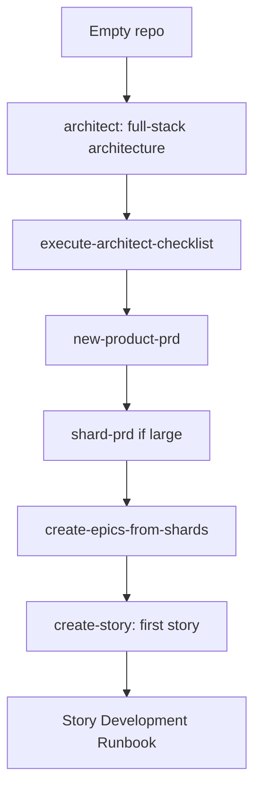

# Runbook — New Project Setup

> **Audience:** developers spinning up a brand-new project with this library.

The order of operations for going from "empty repo" to "first story in flight." For an existing codebase you're documenting, use [`document-existing-project`](../../skills/document-existing-project/SKILL.md) instead.

## When to use this runbook

- Starting a greenfield product.
- Want architecture + PRD + first story scaffolded before any feature work begins.

## Pipeline



## Steps

```
1. /architect                              → full-stack architecture doc
2. /execute-architect-checklist            → validate the architecture
3. /new-product-prd                         → product requirements
4. /shard-prd            (optional)        → split if 5+ epics or 30+ stories
5. /create-epics-from-shards               → one epic per sharded section
6. /create-story                           → first story for epic 1
7. → Story Development Runbook
```

## Repository prep (one-time)

Before step 1:

- `skills-config.yaml` at repo root with at least:

  ```yaml
  prd:
    prdSharded: true
    prdShardedLocation: docs/prd
    epicFilePattern: "*/epics/epic.{n}.*.md"
  architecture:
    architectureSharded: true
    architectureShardedLocation: docs/architecture
  devStoryLocation: nested
  ```

- `docs/epic-registry.md` exists (empty registry — `create-epic` and `epic-registry-manager` will populate it).
- `develop` branch created from `main`.
- Choose tracker (GitHub vs Jira) — see [platform detection](../../shared/resources/platform-detection.md).

## See also

- [`architect` SKILL.md](../../skills/architect/SKILL.md)
- [`execute-architect-checklist` SKILL.md](../../skills/execute-architect-checklist/SKILL.md)
- [`new-product-prd` SKILL.md](../../skills/new-product-prd/SKILL.md)
- [`shard-prd` SKILL.md](../../skills/shard-prd/SKILL.md)
- [PRD documents standard](../standards/prd-documents.md)
- [Architecture documents standard](../standards/architecture-docs.md) — required `docs/architecture/` layout, with copy-paste skeleton at [`docs/examples/architecture/`](../examples/architecture/)
- [PM Workflows Runbook](./pm-workflows.md)
- [Story Development Runbook](./story-development.md)
