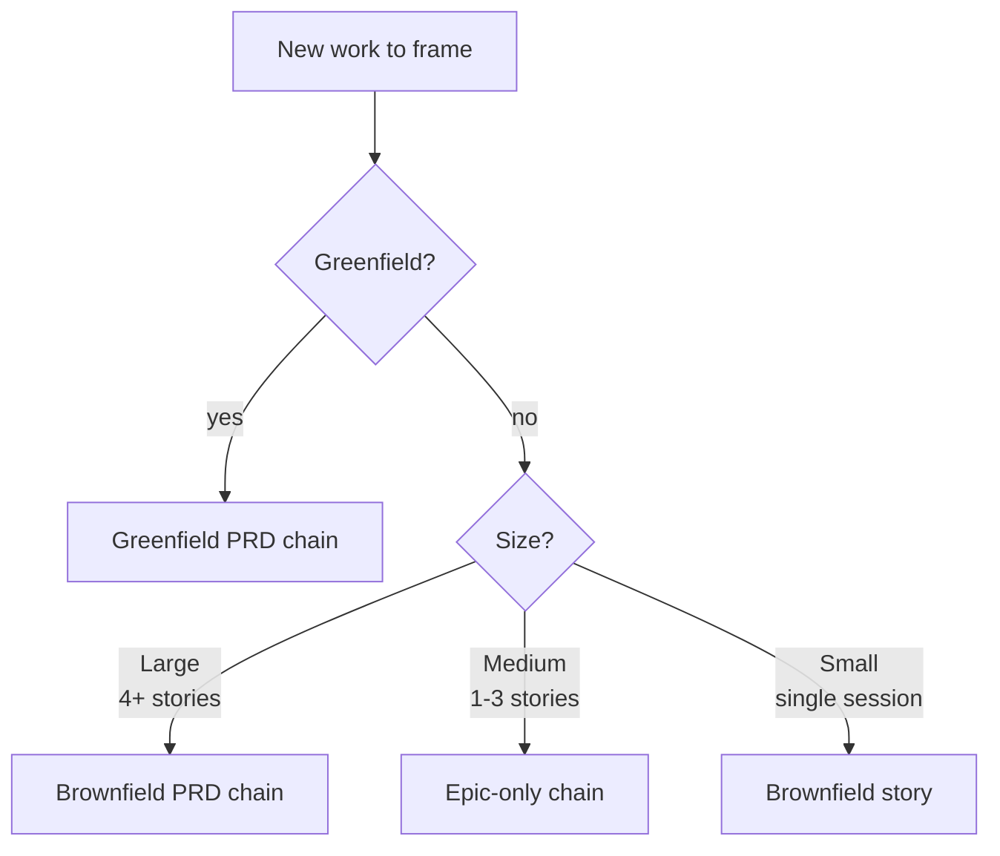

# Runbook — Product Management Workflows

> **Audience:** product managers (and developers wearing the PM hat) framing work before development begins.

Decision tree and skill chains for product-management activities: PRD authoring, epic scoping, change management. Covers the upstream half of the [Story Development Runbook](./story-development.md) — once you have a PRD and a scoped epic, hand off to that runbook.

## When to use this runbook

- Starting a **greenfield product** — no existing codebase to constrain you.
- Adding a **significant enhancement** to an existing product.
- Reacting to a **change in direction** (failed story, scope pivot, new constraint).

## Decision tree



## Chain 1 — Greenfield product development

```
1. /deep-research-prompt        (optional — market/competitor research first)
2. /new-product-prd              → uses create-doc + prd-template → validates with pm-checklist
3. /shard-prd                   (if 5+ epics or 30+ stories)
4. /create-epics-from-shards    → one epic per sharded section
5. → Handoff to UX Expert and Architect
6. → Story Development Runbook  (per epic)
```

## Chain 2 — Brownfield enhancement (large, 4+ stories)

```
1. /document-existing-project            (if no architecture docs exist)
2. /create-prd                  → brownfield-prd-template
3. /pm-checklist                → validate completeness
4. → Architect for tech design
5. → Story Development Runbook
```

## Chain 3 — Epic-only (medium, 1-3 stories)

Skip the PRD when the enhancement fits inside a single epic.

```
1. /create-epic                 → epic-registry-manager assigns N
2. /review-epic                 → catches scope overlap with existing epics
3. → Story Development Runbook  (Phase C onwards)
```

## Chain 4 — Brownfield story (small, single session)

For work that fits in one story and doesn't need an epic.

```
1. /brownfield-story            → single-story scoping
2. → Story Development Runbook  (Phase C onwards, with the story in hand)
```

## Change management

When something derails the current plan (failed story, pivot, missing requirements, tech blocker):

```
1. /change-management   → uses correct-course + change-checklist
2. → Sprint Change Proposal  (impact analysis + artifact edits)
3. → Direct implementation OR PM/Architect handoff
```

See [`change-management` SKILL.md](../../skills/change-management/SKILL.md) for the full 6-section impact framework.

## Natural-language activation

| User says | Activates | Why |
|---|---|---|
| "Create PRD for new mobile app" | `new-product-prd` | "new" + "PRD" |
| "Add feature to existing system" | `create-prd` or `create-epic` | "add" + "existing" (size-dependent) |
| "Story failed due to…" | `change-management` | "failed" + reason |
| "Validate my PRD" | `pm-checklist` | "validate" + "PRD" |

## See also

- [PRD documents standard](../standards/prd-documents.md)
- [Epic documents standard](../standards/epic-documents.md)
- [Story Development Runbook](./story-development.md) — downstream of every chain above
- [`new-product-prd` SKILL.md](../../skills/new-product-prd/SKILL.md)
- [`create-prd` SKILL.md](../../skills/create-prd/SKILL.md)
- [`pm-checklist` SKILL.md](../../skills/pm-checklist/SKILL.md)
- [`change-management` SKILL.md](../../skills/change-management/SKILL.md)
- [`correct-course` SKILL.md](../../skills/correct-course/SKILL.md)
- [`document-existing-project` SKILL.md](../../skills/document-existing-project/SKILL.md)
