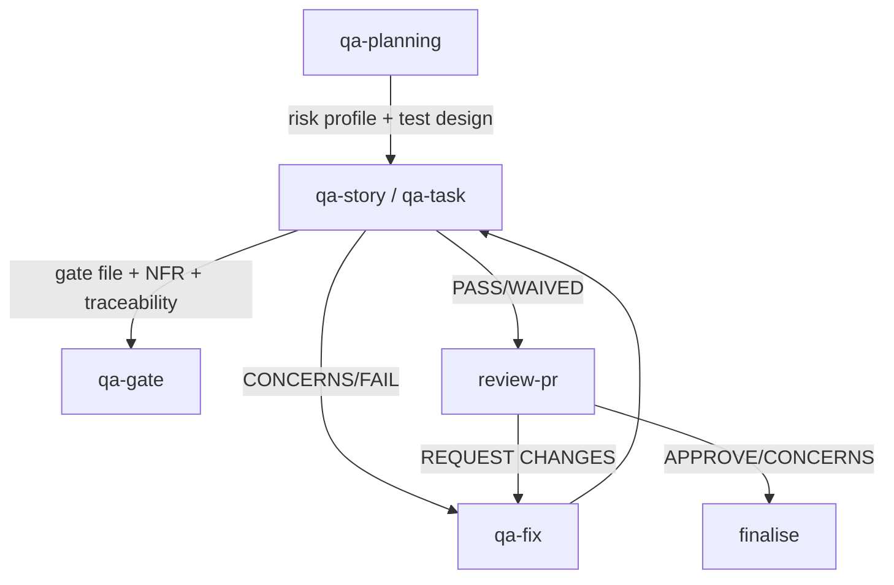

# Runbook — QA Flow

> **Audience:** developers running QA without the full develop-story / develop-task orchestrator.

When you only need the QA half of the pipeline — produce a gate file, run NFR / traceability assessments, or rework on existing findings — bypass the orchestrators and drive the QA skills directly.

## When to use this runbook

- A story or task is already implemented (by hand or by an earlier `develop-*` run) and you need a fresh QA pass.
- You need to do **pre-implementation** QA planning (risk profile, test design) before development starts.
- You're reworking on QA findings without re-running the full pipeline.

If you're shipping new work end-to-end, use [Story Development](./story-development.md) or [Task Development](./task-development.md) instead — they invoke the QA skills automatically.

## Pipeline



The `finalise` node is here because the QA gate is no longer where this flow ends. `review-pr`
(**Step 5c** in `/develop-story` and `/develop-task`) is the loop's exit gate, so the first thing
outside the loop belongs on the diagram — otherwise the picture stops one step before the decision
that matters.

## Phase 1 — Pre-implementation (optional)

`qa-planning` produces a risk profile and test design before code is written.

```bash
/qa-planning <story-or-task-path>
```

Outputs (co-located with the story or task):

- `story.{E}.{S}.risk.{N}.{name}.md` / `task.{id}.risk.{N}.{name}.md`
- `story.{E}.{S}.test-design.{N}.{name}.md` / `task.{id}.test-design.{N}.{name}.md`

These feed into the gate decision later (risk score ≥9 → FAIL, ≥6 → CONCERNS).

## Phase 2 — Review the implementation

```bash
/qa-story <story-path>     # for stories
/qa-task <task-path>       # for tasks
```

Produces (co-located with the story or task):

- QA narrative report (includes NFR + traceability) — `story.{E}.{S}.qa.{N}.{name}.md` / `task.{id}.qa.{N}.{name}.md`
- Gate file — `story.{E}.{S}.gate.{N}.{name}.yml` / `task.{id}.gate.{N}.{name}.yml` (**owned by QA skills — never edit from dev**)

## Phase 3 — Fix cycle

If the gate is `CONCERNS` or `FAIL`:

```bash
/qa-fix <story-or-task-path>
```

`qa-fix` ingests the gate file, prioritises findings risk-first, applies fixes, and updates the story/task. Re-run `qa-story` / `qa-task` after fixes land.

**A `PASS` or `WAIVED` gate is no longer where this ends.** Inside `/develop-story` and
`/develop-task` a clean gate hands to **Step 5c**, `review-pr` — see below. `qa-fix` also runs on
that step's `REQUEST CHANGES` verdict, and those cycles come out of the same 5-cycle budget.

### How the loop ends

Three exits, and they are not interchangeable:

| Exit | Fires when | Effect |
|---|---|---|
| Clean gate | `PASS` / `WAIVED` | Hands to Step 5c |
| **Diminishing returns** | All three conditions below hold | Hands to Step 5c — the loop *finished working* |
| Convergence check | HIGH findings **remain and stop falling** | Escalates — the loop *stopped working* |

**The diminishing-returns exit needs all three conditions, and every one of them fails closed.** This is the canonical statement; other pages give the short form and point here.

| # | Condition | Fails when |
|---|---|---|
| 1 | Two consecutive gates with no blocker | The HIGH sequence is shorter than the cycle count, or the last two are not both zero |
| 2 | Every finding names a file, and every file is machinery | **Any finding carries no `file:`** — condition 2 is opt-in on positive evidence, so a finding that names nothing fails it — or any named file sits outside `qa.testArtifactGlobs` |
| 3 | Nothing implicates product behaviour | `nfr_validation` reports any status other than `pass`, or any finding is `category: bug` against a file that is not machinery |

**Condition 3 is evaluated before condition 2**, deliberately: a product defect filed *against a test file* satisfies condition 2 and must still block the exit, and only that ordering surfaces it.

So "zero HIGH and the rest is test noise" is the short form, not the rule. A run with a clean HIGH sequence, every finding inside the test globs, and a single `security: CONCERNS` in `nfr_validation` does **not** take this exit.

The last two are opposites and now say so. The Convergence check measures HIGH findings that persist;
the diminishing-returns exit fires when they are gone and what is left is the run refining its own
pins. A run can reach zero HIGH and keep producing MEDIUM and LOW findings inside its own test
machinery, satisfying nothing the Convergence check looks at — that run used to burn to the
five-cycle limit with the product finished two cycles earlier. Escalating it would misreport finished
work as stalled.

Neither guard can claim the other's run: the exit requires **two consecutive** zero-HIGH gates, so a
flat non-zero sequence is never its business. The exit does not recount HIGH either — it reads the
sequence the Convergence check already recorded, because two implementations of one count drift
silently and would leave the two guards disagreeing about the same run while each looked right alone.

Which paths count as machinery is `qa.testArtifactGlobs` in `skills-config.yaml`.

**The exit hands to 5c exactly as a clean gate does.** Since 5c became the loop's exit gate, the only
route to Step 7 is a PR conformance review, and this deliberately does not become the one path around
it — that would make it a *weaker* exit than a `PASS` takes, on a run that by construction has
stopped finding blockers.

## Phase 3b — PR conformance review (`review-pr`, Step 5c)

The exit gate of the QA loop, and the only way out of it.

```bash
/review-pr --effort medium --comment
```

`qa-story` / `qa-task` validate the work against its acceptance or success criteria and dispatch the
code reviewer. `review-pr` asks a different question: does the PR *deliver what the work item
promised*, did it drift outside that scope, and is the artifact trail behind it complete and honest?
Nothing else in the pipeline asks it.

| Verdict | What happens |
| --- | --- |
| 🚨 `REQUEST CHANGES` | Back to `qa-fix`, consuming a cycle from the shared 5-cycle budget |
| ⚠️ `CONCERNS` | Findings recorded, run continues to `finalise` |
| ✅ `APPROVE` | Straight on to `finalise` |

It writes `*.pr-review.{n}.{name}.md` beside the work item and is **advisory**: no gate file, no
formal PR review, no code edits. The orchestrator acts on the verdict. Lite mode degrades it to
`--effort low` and never skips it.

## Phase 4 — Gate decision (manual override only)

`qa-gate` is normally invoked by `qa-story` / `qa-task`. Call it directly only when you need to record a `WAIVED` decision or revise an existing gate after out-of-band review.

```bash
/qa-gate <story-or-task-path>
```

## File organisation

**All QA artifacts are co-located with the story or task they belong to.** There is no central `docs/qa/` directory.

```
docs/prd/[domain]/[feature]/epics/epic.{N}.{name}/stories/story.{E}.{S}.{name}/
├── story.{E}.{S}.{name}.md                       # the story
├── story.{E}.{S}.qa.{N}.{name}.md                # QA narrative + NFR + traceability
├── story.{E}.{S}.dod.{N}.{name}.md               # Definition of Done
└── story.{E}.{S}.gate.{N}.{name}.yml             # gate decision (QA-owned)
```

Tasks follow the same pattern under `docs/tasks/task.{N}.{name}/`. See [Story documents](../standards/story-documents.md#co-located-artifacts) and [Task documents](../standards/task-documents.md#co-located-artifacts) for the full artifact list.

> **Legacy note:** older skill text references `{qa.qaLocation}/gates/...` or `{qa.qaLocation}/assessments/...`. Those paths are deprecated; co-location is the canonical layout.

## Cross-skill data flow

- `qa-planning` → `qa-story`: risk profile and test design feed into review assessments.
- `qa-story` → `qa-gate`: NFR validation, trace data, and issues feed into gate decisions.
- `qa-planning` → `qa-gate`: risk summary directly influences gate status (≥9 → FAIL, ≥6 → CONCERNS).
- `qa-story` / `qa-task` → `review-pr`: a `PASS`/`WAIVED` gate hands to Step 5c, which reads the gate and the rest of the artifact trail as the evidence it audits.
- `review-pr` → `qa-fix`: a `REQUEST CHANGES` verdict re-enters the fix cycle with the review's findings.

## See also

- [`qa-planning` SKILL.md](../../skills/qa-planning/SKILL.md)
- [`qa-story` SKILL.md](../../skills/qa-story/SKILL.md)
- [`qa-task` SKILL.md](../../skills/qa-task/SKILL.md)
- [`qa-gate` SKILL.md](../../skills/qa-gate/SKILL.md)
- [`qa-fix` SKILL.md](../../skills/qa-fix/SKILL.md)
- [`review-pr` SKILL.md](../../skills/review-pr/SKILL.md) — Step 5c, the QA loop's exit gate
- [Story Development Runbook](./story-development.md)
- [Task Development Runbook](./task-development.md)
- [Operations / Workflows](../operations/workflows.md)
