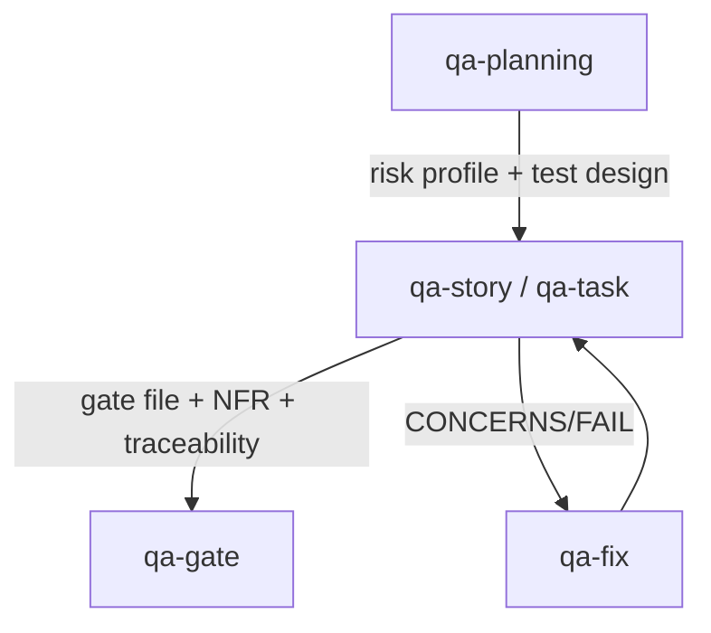

# Runbook — QA Flow

> **Audience:** developers running QA without the full develop-story / develop-task orchestrator.

When you only need the QA half of the pipeline — produce a gate file, run NFR / traceability assessments, or rework on existing findings — bypass the orchestrators and drive the QA skills directly.

## When to use this runbook

- A story or task is already implemented (by hand or by an earlier `develop-*` run) and you need a fresh QA pass.
- You need to do **pre-implementation** QA planning (risk profile, test design) before development starts.
- You're reworking on QA findings without re-running the full pipeline.

If you're shipping new work end-to-end, use [Story Development](./story-development.md) or [Task Development](./task-development.md) instead — they invoke the QA skills automatically.

## Pipeline



## Phase 1 — Pre-implementation (optional)

`qa-planning` produces a risk profile and test design before code is written.

```bash
/qa-planning <story-or-task-path>
```

Outputs:

- `risk-{YYYY-MM-DD}.md` + `risk_summary` YAML
- `test-design-{YYYY-MM-DD}.md` + `test_design` YAML

These feed into the gate decision later (risk score ≥9 → FAIL, ≥6 → CONCERNS).

## Phase 2 — Review the implementation

```bash
/qa-story <story-path>     # for stories
/qa-task <task-path>       # for tasks
```

Produces:

- QA narrative report — `*.qa.{N}.{name}.md` (co-located)
- NFR assessment — `nfr-{YYYY-MM-DD}.md` + `nfr_validation` YAML
- Requirements traceability — `trace-{YYYY-MM-DD}.md` + `trace` YAML
- Gate file — `*.gate.{N}.{name}.yml` (**owned by QA skills — never edit from dev**)

## Phase 3 — Fix cycle

If the gate is `CONCERNS` or `FAIL`:

```bash
/qa-fix <story-or-task-path>
```

`qa-fix` ingests the gate file, prioritises findings risk-first, applies fixes, and updates the story/task. Re-run `qa-story` / `qa-task` after fixes land. Repeat until `PASS` or `WAIVED`.

## Phase 4 — Gate decision (manual override only)

`qa-gate` is normally invoked by `qa-story` / `qa-task`. Call it directly only when you need to record a `WAIVED` decision or revise an existing gate after out-of-band review.

```bash
/qa-gate <story-or-task-path>
```

## File organisation

```
docs/
├── prd/
│   └── [domain]/[feature]/
│       ├── story.1.1.md
│       └── story.1.1.qa.{N}.{name}.md     # narrative (co-located)
└── qa/
    ├── assessments/
    │   ├── 1.1-risk-{date}.md
    │   ├── 1.1-test-design-{date}.md
    │   ├── 1.1-nfr-{date}.md
    │   └── 1.1-trace-{date}.md
    └── gates/
        └── [mirrored-prd-structure]/
            └── story.1.1.gate.{N}.{name}.yml
```

Configure base via `qa.qaLocation` in `skills-config.yaml`. See [Configuration](../reference/configuration.md).

## Cross-skill data flow

- `qa-planning` → `qa-story`: risk profile and test design feed into review assessments.
- `qa-story` → `qa-gate`: NFR validation, trace data, and issues feed into gate decisions.
- `qa-planning` → `qa-gate`: risk summary directly influences gate status (≥9 → FAIL, ≥6 → CONCERNS).

## See also

- [`qa-planning` SKILL.md](../../skills/qa-planning/SKILL.md)
- [`qa-story` SKILL.md](../../skills/qa-story/SKILL.md)
- [`qa-task` SKILL.md](../../skills/qa-task/SKILL.md)
- [`qa-gate` SKILL.md](../../skills/qa-gate/SKILL.md)
- [`qa-fix` SKILL.md](../../skills/qa-fix/SKILL.md)
- [Story Development Runbook](./story-development.md)
- [Task Development Runbook](./task-development.md)
- [Operations / Workflows](../operations/workflows.md)
