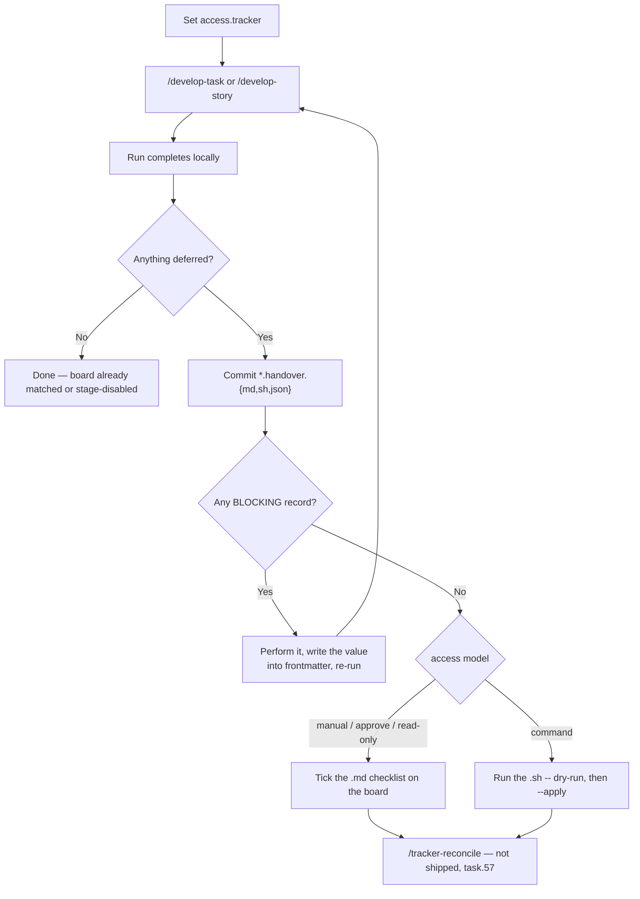

# Runbook — Restricted tracker access

> ### Is this the right runbook?
>
> **Use this if** the agent must not write to the tracker, and you need to see what a run actually hands you.
>
> **Use a different runbook if:**
> - You want the agent to update the board itself → leave `access` unset (`full`) and use [Task Development](./task-development.md) or [Story Development](./story-development.md)
> - You have no tracker and do not want one → **Skip — docs only** at `/create-*` ([Getting started](../concepts/getting-started.md))
> - You're not sure which of the five modes to pick → [Which access model?](../concepts/which-access.md)

---

> **Audience:** developers running a pipeline under `access.tracker: manual` or `command`.

Walkthrough of a restricted run on **this library's own GitHub board**, then the same shape under `command`. Column names and links below came from that board, not from a task document.

## When to use this runbook

- `access.tracker` is `manual`, `command`, `approve`, or `read-only`.
- You need to know what to do when the pipeline succeeds and the card did not move.
- You are about to tell a teammate "the board will lag; here is the checklist."

## Prerequisites

- `skills-config.yaml` at the repo root.
- `tracker-workflow.yaml` at the repo root (this repo's copy is live — see below).
- VCS write still works (`gh auth login` / git push). Restricted **tracker** access does not relax that. `access.vcs` is `full` only.

## This board (sourced, not invented)

The [Agent Skills](https://github.com/Gamaroff/agent-skills/issues) GitHub project is `project_board_number: 1`. [`tracker-workflow.yaml`](../../tracker-workflow.yaml) on `develop` declares the whole ladder:

```yaml
statuses:
  - Todo
  - In Progress
  - Done
pipeline:
  work-started: In Progress
  done: Done
```

`in-review`, `in-qa`, and `ready-for-merge` are **omitted**. Those moments report `reason: "stage-disabled"` and the pipeline continues — there is no column to move to.

Confirm any time (no write; `--print-plan` is credential-free):

```bash
node shared/resources/gh-stage.js --stage work-started --print-plan
node shared/resources/gh-stage.js --stage done --print-plan
```

A consumer install uses the bundled copy:

```bash
node .agents/skills/develop-task/references/gh-stage.js --stage work-started --print-plan
```

`--print-plan` names the target rung from the ladder file. `--probe-board` (needs `gh` read) lists the live options. If they disagree, the ladder is stale — `--dry-run` is the authority.

This task's card is [#236](https://github.com/Gamaroff/agent-skills/issues/236). Deep links in a real handover point at that issue (or yours), not at a generic "the card".

## Pipeline



## Phase 1 — configure `manual`

Add (or change) the block. Do **not** set `access.vcs` to anything but `full`.

```yaml
access:
  tracker: manual
```

Env `AGENT_SKILLS_ACCESS_TRACKER` is combined **most-restrictive-wins** with config — it can lock a run down, never loosen it. Key row: [`configuration.md`](../reference/configuration.md).

On the next sourced `resolve-platform.sh` you will see the partial-enforcement warning on stderr. That warning is the feature working.

## Phase 2 — run the pipeline

```text
/develop-task docs/tasks/task.{N}.{name}/
```

Same chain as [Task Development](./task-development.md). Tracker writes do not fail the run; they print `⏸️` and a record id. `--json` from the stage CLIs carries `"reason": "deferred"`.

Pitfall: `finalise` still sets local `status: accepted`. The board staying on `Todo` or `In Progress` is expected until you work the handover.

## Phase 3 — read the committed checklist

When something was deferred, Step 8 commits three files next to the work item ([naming](../standards/file-naming.md)):

| File | Use |
| --- | --- |
| `task.{N}.handover.{n}.{name}.md` | Tick boxes. **This is the `manual` path.** |
| `task.{N}.handover.{n}.{name}.sh` | Same records as a script (dry-run by default). |
| `task.{N}.handover.{n}.{name}.json` | Sidecar for `/tracker-reconcile` — **that skill is not shipped** ([task.57](../tasks/task.57.readonly-verification-and-reconcile/task.57.readonly-verification-and-reconcile.md)). |

`tracker-issue.js` is the fourth stage-CLI peer, added by
[task.56](../tasks/task.56.tracker-issue-cli/task.56.tracker-issue-cli.md). It gates the GitHub issue
lifecycle and produces the **blocking** records above — so on a run that creates anything, it is the
CLI whose output you meet first. Contract:
[`tracker-issue-cli.md`](../../shared/resources/tracker-issue-cli.md).

Open the `.md`. It starts `# Tracker actions required` and a context table.

**If a `🚫 BLOCKING — do these first` section follows, start there.** A run that created an issue or a
milestone puts it here, because those actions yield a value the pipeline cannot obtain for itself.
Ticking is *not* sufficient for them:

1. Perform the action from its deep link.
2. **Copy the number it produced into the document's frontmatter** — `github_issue: 207`,
   `jira_key: PROJ-42`.
3. Re-run the pipeline. It finds the field set and carries on.

Skip step 2 and the next run does nothing at all, silently, every time — see
[*I re-ran it and it did nothing again*](../reference/troubleshooting.md).

Then the ordinary items. A Status move on **this** board looks like:

- **Status**: `In Progress` or `Done` — those strings, not `work-started` / `done`
- **Where** / **Start here**: a URL on `github.com/Gamaroff/agent-skills/issues/{N}`

Work each `- [ ]`. Tick it when the live card matches. Do not delete lines — item count is the ledger.

If you see `⚠️ UNRECORDED`, the run dropped a moment. That is not "nothing to do": [Troubleshooting](../reference/troubleshooting.md#the-handover-says-unrecorded).

## Phase 4 — the same run under `command`

Change only the mode:

```yaml
access:
  tracker: command
```

Re-run (or use the `.sh` already committed from a `manual` run — the records are the same).

```bash
bash docs/tasks/task.{N}.{name}/task.{N}.handover.{n}.{name}.sh
# dry-run is the default — prints what it would execute
bash docs/tasks/task.{N}.{name}/task.{N}.handover.{n}.{name}.sh --apply
```

`--apply` under `manual` is not how `manual` is meant to be used; the checklist is. `/tracker-reconcile` will **refuse `--apply`** under `manual`, `command`, and `read-only` when it ships, for the same reason.

## What this runbook cannot do yet

`/tracker-reconcile` is **not shipped**. You cannot re-read a week-old handover and have the tool tick `satisfied` / flag `divergent` / skip `unverifiable` from the live board. Until [task.57](../tasks/task.57.readonly-verification-and-reconcile/task.57.readonly-verification-and-reconcile.md) lands, compare the checklist to the card by hand.

## Called-skills map

This runbook does not invoke an orchestrator of its own. It wraps:

| Skill / helper | Role |
| --- | --- |
| [`develop-task`](../../skills/develop-task/SKILL.md) / [`develop-story`](../../skills/develop-story/SKILL.md) | The run that defers |
| `handover-render.js` | Three files from `.claude/state/tracker-actions.jsonl` |
| `gh-stage.js --print-plan` | Credential-free column names |
| `/tracker-reconcile` | **Not shipped** — task.57 |

## Verification

- [ ] `access.tracker` is one of `manual` · `command` · `approve` · `read-only`
- [ ] A restricted run printed the partial-enforcement warning
- [ ] Handover files exist **only** if something was deferred
- [ ] Checklist **Status** values are `Todo` / `In Progress` / `Done` on this board (or your board's real names, from `--print-plan`)
- [ ] Deep links open the issue, not a docs page
- [ ] Local `status: accepted` can be true while the card is still `Todo` — that is the accept gap, not a bug

## See also

- [Restricted tracker access](../concepts/restricted-access.md)
- [Which access model?](../concepts/which-access.md)
- [Task Development](./task-development.md)
- [Troubleshooting](../reference/troubleshooting.md)
- [Pipeline artifacts](../reference/pipeline-artifacts.md)