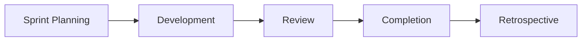

# Runbook — Sprint Cycle

> **Audience:** teams running sprints with this library.

End-to-end activities for a sprint that uses agent-skills as the implementation engine. This runbook is a thin coordination layer — most of the work is delegated to the [Story Development Runbook](./story-development.md) and [QA Flow Runbook](./qa-flow.md).

## When to use this runbook

- You're a scrum master or tech lead planning a sprint.
- You want a checklist mapping sprint ceremonies to skill invocations.
- You're picking up the library mid-sprint and need to know what to run when.

## Phases



## Phase 1 — Sprint planning

For each story going into the sprint:

```
1. /create-story                    → next story for the active epic
2. /review-story --validate         → GO/NO-GO readiness score (non-interactive)
   OR /review-story                 → interactive review with clarifying questions
```

Validate the whole backlog before development starts. A story that scores below the readiness threshold should be deferred or reworked.

## Phase 2 — Development

For each story:

```
3. /develop-story <story-path>   → full orchestrated lifecycle (recommended)
```

Or, if you need manual control: see [Story Development Runbook — Phase D](./story-development.md#phase-d--implementation-develop-story).

Run testing skills appropriate to your stack as part of the loop (e.g. `testing-setup-react-native`, `testing-setup-nestjs`).

## Phase 3 — Review

```
4. /qa-story <story-path>             → if not already run by develop-story
5. /execute-checklist <dod-checklist> → if your team requires manual DoD validation
```

`develop-story` runs `qa-story` and DoD validation automatically — invoke separately only for stories developed outside the orchestrator.

## Phase 4 — Completion

```
6. /commit-changes        → finalise any uncommitted work
7. [Deploy]               → your existing release process
8. /sync-jira-story       → if Jira is the tracker and develop-story didn't already sync
```

## Phase 5 — Retrospective

Use [`autoskill`](../../skills/autoskill/SKILL.md) to extract lessons from the sprint's transcripts and update relevant skills, and [`remember-insight`](../../skills/remember-insight/SKILL.md) to record durable preferences.

## See also

- [Story Development Runbook](./story-development.md)
- [QA Flow Runbook](./qa-flow.md)
- [Jira Publish Runbook](./jira-publish.md)
- [`scrum-master` SKILL.md](../../skills/scrum-master/SKILL.md)
- [`create-parallel-stories` SKILL.md](../../skills/create-parallel-stories/SKILL.md) — when stories can run in parallel worktrees
