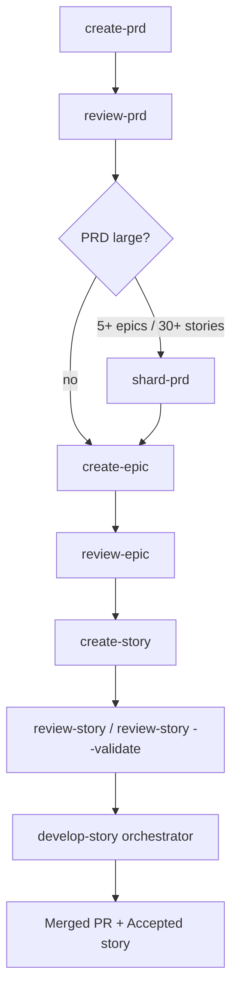

# Runbook — Story Development

End-to-end walkthrough for shipping a user-facing feature using this repo's skills. Takes you from "I have a product idea" to a merged PR with a green QA gate.

## When to use this runbook

Use when the change is large enough to need product framing: it lives under a PRD, fits inside an epic, and ships as one or more stories. If the work is a standalone refactor or infra change, use the [Task Development Runbook](./task-development.md) instead.

## Prerequisites

- Project root has a `skills-config.yaml`. Minimum keys used by the story pipeline:
  ```yaml
  prd:
    prdShardedLocation: docs/prd
  architecture:
    architectureShardedLocation: docs/architecture
  devLoadAlwaysFiles:
    - docs/architecture/concepts/coding-standards.md
  ```
  PRD and architecture roots are configurable (defaults shown). Nested layout under `${PRD_ROOT}` is fixed — see [Configurable roots and fixed conventions](../reference/configuration.md#configurable-roots-and-fixed-conventions). QA artifacts are co-located with the story — no `qa.qaLocation` config is needed.
- The repo has an **epic registry** at `docs/epic-registry.md`. Epic numbers are globally unique — `create-epic` and `epic-registry-manager` enforce this.
- Branch hygiene: `develop` exists (story PRs target an epic branch cut from `develop`).
- Platform detection (GitHub vs Bitbucket vs Jira) is automatic — see [`../../shared/resources/platform-detection.md`](../../shared/resources/platform-detection.md).

## Pipeline diagram



`develop-story` itself runs an 8-step pipeline — see [Phase D](#phase-d--implementation-develop-story) and the skill README at [`../../skills/develop-story/README.md`](../../skills/develop-story/README.md).

---

## Phase A — Product planning

### A.1 `create-prd`

**Use when:** adding a significant feature (4+ stories, architectural impact) to an existing codebase. For a brand-new product, use `new-product-prd` instead — the rest of this runbook still applies.

| | |
|---|---|
| **Invoke** | `"create a PRD for X"` · `/create-prd` |
| **Inputs** | Product context, goals, constraints. Skill is interactive — it elicits section-by-section. |
| **Outputs** | `docs/prd/{domain}/{feature}/prd.md` (or path per `skills-config.yaml`). YAML frontmatter with `status: draft`. |
| **Pitfalls** | Don't skip the interactive elicitation — `create-doc` enforces it. Frontmatter `status:` is lowercase kebab-case; body `Status:` is Title Case (see [`../../shared/resources/document-status-lifecycle.md`](../../shared/resources/document-status-lifecycle.md)). |
| **Calls** | `create-doc`, `brownfield-prd-template` (or `prd-template` for greenfield), `pm-checklist`, optionally `mermaid-architect` for embedded diagrams. |
| **Reference** | [`../../skills/create-prd/SKILL.md`](../../skills/create-prd/SKILL.md) |

### A.2 `review-prd`

**Use when:** PRD draft is complete, before any epics are written.

| | |
|---|---|
| **Invoke** | `"review the PRD at <path>"` · `/review-prd <path>` |
| **What it does** | Verifies claims against the actual codebase, checks requirements traceability, detects staleness, asks clarifying questions. |
| **Outputs** | Co-located review report `prd.review.{YYYY-MM-DD}.md`, or an inline action plan if minor. Update frontmatter `status: ready-for-development` once review is resolved. |
| **Pitfalls** | The review *will* find inaccuracies — budget time to revise. Don't write epics until `status: ready-for-development`. |
| **Reference** | [`../../skills/review-prd/SKILL.md`](../../skills/review-prd/SKILL.md) |

### A.3 `shard-prd` (optional)

If the PRD exceeds ~5 epics or ~30 stories, shard it by level-2 sections to keep epic creation manageable.

```
/shard-prd docs/prd/{domain}/{feature}/prd.md
```

Produces one file per section under the same directory. See [`../../skills/shard-prd/SKILL.md`](../../skills/shard-prd/SKILL.md).

---

## Phase B — Epic authoring

### B.1 `create-epic`

**Use when:** PRD is approved and you're scoping the next chunk of work into an epic.

| | |
|---|---|
| **Invoke** | `"create an epic for <scope> from <prd-path>"` · `/create-epic` |
| **Inputs** | PRD path; the section/sections this epic covers. |
| **Outputs** | `docs/prd/{domain}/{feature}/epics/epic.{N}.{name}/epic.{N}.{name}.md` plus a stories/ subdir (empty at first). `{N}` is the next number from the **epic registry**. |
| **Pitfalls** | Never invent an epic number — `epic-registry-manager` assigns it and updates `docs/epic-registry.md`. Commit the registry update **in the same commit** as the new epic file. |
| **Calls** | `epic-registry-manager`, `documentation-standards-validator`, optionally `mermaid-architect`. |
| **Reference** | [`../../skills/create-epic/SKILL.md`](../../skills/create-epic/SKILL.md) |

### B.2 `review-epic`

| | |
|---|---|
| **Invoke** | `"review epic <path>"` · `/review-epic <path>` |
| **What it does** | Template compliance, scope-overlap detection with existing epics, architecture-doc alignment, codebase scan for already-implemented features. |
| **Outputs** | Co-located review report `epic.{N}.review.{YYYY-MM-DD}.md`. |
| **Pitfalls** | The codebase scan often reveals duplicate work — don't ignore it. Resolve scope overlaps before writing stories. |
| **Reference** | [`../../skills/review-epic/SKILL.md`](../../skills/review-epic/SKILL.md) |

### B.3 Tracker issue (auto, flagged for awareness)

Epic GitHub/Jira issues are created automatically downstream by `develop-story` → `finalise`, via `ensure-epic-github-issue` or `ensure-epic-jira-issue` (chosen by the platform resolver). You generally don't invoke these directly — but if you want the tracker issue *before* story development, run the appropriate skill manually.

---

## Phase C — Story authoring

### C.1 `create-story`

| | |
|---|---|
| **Invoke** | `"create the next story for epic <N>"` · `/create-story <epic-path>` |
| **What it does** | 10-step process that identifies the next logical story, extracts technical context from architecture docs and the codebase, and writes a story with anti-hallucination safeguards. |
| **Outputs** | `docs/prd/.../epics/epic.{N}.{name}/stories/story.{E}.{S}.{name}/story.{E}.{S}.{name}.md`. Story directory is created with the same stem as the file. |
| **Pitfalls** | Don't hand-edit story numbering — the skill computes the next `{S}` from existing siblings. Story acceptance criteria must be testable; vague criteria block `review-story`. |
| **Calls** | `documentation-standards-validator`, optionally `mermaid-architect`. |
| **Reference** | [`../../skills/create-story/SKILL.md`](../../skills/create-story/SKILL.md) |

### C.2 Review the story

Two options depending on how much human input you want:

| Mode | Interactive? | When to use |
|---|---|---|
| `review-story` (default) | Yes — asks clarifying questions, applies fixes | First-pass review, ambiguous requirements |
| `review-story --validate` | No — read-only GO/NO-GO with 1–10 readiness score | Pre-implementation gate, batch validation, CI |

```bash
/review-story <story-path>
# or (automated/non-interactive)
/review-story --validate <story-path>
```

`review-story` produces a co-located review report `story.{E}.{S}.review.{n}.{name}.md`. Validate mode produces `story.{E}.{S}.validate.{YYYY-MM-DD}.md`. Both update the story's `status` once it's `ready-for-development`.

Reference: [`../../skills/review-story/SKILL.md`](../../skills/review-story/SKILL.md).

---

## Phase D — Implementation (`develop-story`)

This is the orchestrator. One command runs the full lifecycle.

```bash
/develop-story docs/prd/.../stories/story.{E}.{S}.{name}/
# or
/develop-story docs/prd/.../story.{E}.{S}.{name}.md
```

### Phase 0 — Resolve & Prepare

`develop-story` prompts (via `AskUserQuestion`) for:

- **Story path** if not supplied
- **Base branch** for the epic branch (default `develop`)
- **Epic branch creation** if one doesn't already exist (default Yes, base = `develop`)
- **PR target branch** (default = epic branch)
- **Lite mode** for low-risk stories (skips some context-gathering)

Branch model:

```
develop
└── feature/epic.{N}.{name}              ← epic branch (created once per epic)
    └── feature/story.{E}.{S}.{name}     ← story branch (one per story)
```

Story PRs target the **epic branch**. The epic branch is merged to `develop` manually once all child stories are accepted.

### Phase 1 — 8-step pipeline

| Step | Skill | What happens |
|---|---|---|
| 1 | `create-branch` | Cuts the epic branch from `develop` if missing, then the story branch from the epic branch. |
| 2 | `review-story` | Runs the interactive review (skipped if the story was reviewed recently and is still `ready-for-development`). |
| 3 | `develop` | Implements the story. Bounded loop, `MAX_ITER=5`. Each iteration: plan → code → test → DoD check. |
| 4 | `create-pr` | Pushes the branch, opens a PR against the epic branch with auto-generated description. `--base` is pre-supplied from Phase 0. |
| 5–6 | `qa-story` → `qa-fix` | QA review produces a gate file (`PASS` / `CONCERNS` / `FAIL` / `WAIVED`). If `CONCERNS`/`FAIL`, `qa-fix` runs. Up to 5 cycles. |
| 7 | `finalise` | Validates against the Definition of Done, posts DoD summary to the PR, comments the tracker issue, updates the board. **Runs full side-effects even in lite mode.** |
| 8 | `commit-changes` | Stages and commits any final artifacts (implementation report, DoD summary, status updates). |

Throughout, `develop-story` records every decision in a co-located implementation report: `story.{E}.{S}.implementation.{N}.{name}.md`.

### Phase 2 — Completion

Story `status` advances to `accepted`. PR is left for human merge. The epic branch is *not* auto-merged.

### Lite mode

Add `--lite` (or answer "Lite" at the Phase 0 prompt) to skip pre-develop codebase mapping and other context-gathering for low-risk stories. Side-effects in Step 7 (`finalise`) **still run in full** — that's not a corner you can cut.

### Resume semantics

If the pipeline is interrupted, re-invoke `/develop-story <same-path>`. The skill verifies per-step artifacts (branch exists? PR open? gate file present?) and resumes at the first incomplete step. It will not redo completed work.

**Reference:** [`../../skills/develop-story/SKILL.md`](../../skills/develop-story/SKILL.md). See also: [`../../skills/develop-story/README.md`](../../skills/develop-story/README.md).

---

## Called-skills map

What the orchestrator invokes internally, top-down.

**`develop-story` calls:**

| Called skill | Role inside the pipeline |
|---|---|
| [`create-branch`](../../skills/create-branch/SKILL.md) | Creates epic branch (from `develop`) and story branch (from epic). |
| [`review-story`](../../skills/review-story/SKILL.md) | Resolves ambiguities before code is written. |
| [`develop`](../../skills/develop/SKILL.md) | Actual implementation loop (plan → code → test → DoD). |
| [`create-pr`](../../skills/create-pr/SKILL.md) | Pushes branch, opens PR with `--base` = epic branch. |
| [`qa-story`](../../skills/qa-story/SKILL.md) | Produces QA gate file. Dev skills must not edit gate files. |
| [`qa-fix`](../../skills/qa-fix/SKILL.md) | Applies fixes for `CONCERNS`/`FAIL` gates. Up to 5 cycles. |
| [`finalise`](../../skills/finalise/SKILL.md) | DoD check, PR comment, tracker comment, board update. |
| [`commit-changes`](../../skills/commit-changes/SKILL.md) | Final commit of artifacts and status updates. |

Inside `finalise`, the platform resolver picks one of:

- [`ensure-epic-github-issue`](../../skills/ensure-epic-github-issue/SKILL.md) — GitHub projects
- [`ensure-epic-jira-issue`](../../skills/ensure-epic-jira-issue/SKILL.md) — Jira

**Upstream skills also call others:**

| Parent | Calls |
|---|---|
| `create-prd` | `create-doc`, `(brownfield-)prd-template`, `pm-checklist`, optionally `mermaid-architect` |
| `create-epic` | `epic-registry-manager`, `documentation-standards-validator`, optionally `mermaid-architect` |
| `create-story` | `documentation-standards-validator`, optionally `mermaid-architect` |

---

## Verification

After the pipeline completes, confirm:

```bash
# Gate file exists and is PASS or WAIVED
ls docs/prd/.../story.{E}.{S}.{name}/*.gate.*.yml
grep '^gate:' docs/prd/.../story.{E}.{S}.{name}/*.gate.*.yml

# Story status is accepted
grep -E '^status:|^Status:' docs/prd/.../story.{E}.{S}.{name}.md

# Implementation report exists
ls docs/prd/.../story.{E}.{S}.{name}/*.implementation.*.md
```

PR-side checks depend on your VCS:

```bash
# GitHub
gh pr view --json baseRefName,statusCheckRollup
gh pr view --json comments | jq '.comments[].body' | grep -i 'definition of done'

# Bitbucket — view PR in the web UI, or:
curl -u $BITBUCKET_USERNAME:$BITBUCKET_APP_PASSWORD \
  "https://api.bitbucket.org/2.0/repositories/{workspace}/{repo}/pullrequests/{id}"
```

Once you're satisfied, merge the PR (manual gate). When all stories under an epic are accepted, merge the epic branch to `develop`.

---

## Cross-cutting references

- File naming: [`../standards/file-naming.md`](../standards/file-naming.md)
- Status lifecycle: [`../standards/status-lifecycle.md`](../standards/status-lifecycle.md)
- Platform detection: [`../../shared/resources/platform-detection.md`](../../shared/resources/platform-detection.md)
- Plan file locations: `AGENTS.md` § "Plan File Locations"
- Document schemas: [`../standards/story-documents.md`](../standards/story-documents.md), [`../standards/epic-documents.md`](../standards/epic-documents.md), [`../standards/prd-documents.md`](../standards/prd-documents.md)
