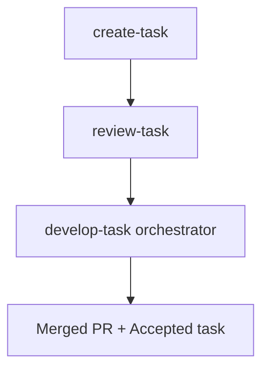

# Runbook — Task Development

End-to-end walkthrough for shipping a standalone technical task (refactor, infra change, tooling, cleanup) using this repo's skills. Tasks don't need a PRD or an epic — they live in their own registry.

## When to use this runbook

Use when the work is:

- Non-user-facing or product-orthogonal (refactor, dependency upgrade, build/CI change, scripted migration, doc overhaul).
- Self-contained — doesn't need to be scoped inside a PRD/epic hierarchy.
- Tracked individually rather than as part of a feature stream.

If the work is a user-facing feature inside a PRD, use the [Story Development Runbook](./story-development.md).

## Prerequisites

- `skills-config.yaml` exists at project root. Tasks read very little from it; defaults are usually fine.
- The repo has a **task registry** at `docs/development/tasks/task-registry.md`. It tracks the **Next Available Task Number** and the status of every task. Task numbers are globally unique and never reused.
- Branch hygiene: `develop` exists (task PRs typically target `develop`, but Phase 0 of `develop-task` lets you pick a different base).
- Platform detection (GitHub vs Bitbucket vs Jira) is automatic — see [`../../shared/resources/platform-detection.md`](../../shared/resources/platform-detection.md).

## Pipeline diagram



`develop-task` runs an 8-step pipeline mirroring `develop-story` — see [Phase B](#phase-b--implementation-develop-task) and the skill README at [`../../skills/develop-task/README.md`](../../skills/develop-task/README.md).

---

## Phase A — Task authoring

### A.1 `create-task`

| | |
|---|---|
| **Invoke** | `"create a task for X"` · `/create-task` |
| **Inputs** | Interactive elicitation: scope, motivation, success criteria, risk profile, non-functional constraints. |
| **Outputs** | `docs/development/tasks/task.{N}.{name}/task.{N}.{name}.md` plus a new row in `task-registry.md`. `{N}` is read from the registry's **Next Available Task Number**. |
| **Pitfalls** | The registry update **must be in the same commit** as the new task files — atomic. Don't reuse a cancelled task's number; always increment. Frontmatter `status:` is lowercase kebab-case; body `Status:` is Title Case. |
| **Reference** | [`../../skills/create-task/SKILL.md`](../../skills/create-task/SKILL.md). See also `AGENTS.md` § "Task Registry". |

### A.2 `review-task`

| | |
|---|---|
| **Invoke** | `"review task <path>"` · `/review-task <path>` |
| **What it does** | Interactive review that resolves inaccuracies, gaps, and implementability issues by asking clarifying questions — does **not** make assumptions. |
| **Outputs** | Co-located review report `task.{N}.review.{name}.md`. Updates task `status` to `ready-for-development` when resolved. |
| **Pitfalls** | The skill will pause on ambiguous success criteria. Answer rather than skipping — `develop-task` will surface the same issue later, more expensively. |
| **Reference** | [`../../skills/review-task/SKILL.md`](../../skills/review-task/SKILL.md) |

---

## Phase B — Implementation (`develop-task`)

One command runs the full lifecycle.

```bash
/develop-task docs/development/tasks/task.{N}.{name}/
# or
/develop-task docs/development/tasks/task.{N}.{name}.md
```

### Phase 0 — Resolve & Prepare

`develop-task` prompts (via `AskUserQuestion`) for:

- **Task path** if not supplied
- **Base branch** for the task branch (default `develop`)
- **PR target branch** (default = base branch)
- **Lite mode** for low-risk tasks (skips pre-develop codebase mapping and other context-gathering)

Branch model — simpler than stories, no epic branch:

```
develop
└── feature/task.{N}.{name}     ← task branch
```

### Phase 1 — 8-step pipeline

| Step | Skill | What happens |
|---|---|---|
| 1 | `create-branch` | Cuts the task branch from the base chosen in Phase 0. |
| 2 | `review-task` | Runs the interactive review (skipped if recently reviewed and `ready-for-development`). |
| 3 | `develop` | Implements the task. Bounded loop, `MAX_ITER=5`. Each iteration: plan → code → test → success-criteria check. |
| 4 | `create-pr` | Pushes the branch, opens a PR against the chosen base with `--base` pre-supplied. |
| 5–6 | `qa-task` → `qa-fix` | QA review produces a gate file. If `CONCERNS`/`FAIL`, `qa-fix` runs. Up to 5 cycles. `qa-task` focuses on success-criteria validation, implementation-phase verification, and NFRs for infra/refactor work. |
| 7 | `finalise` | Validates against the Definition of Done, posts DoD summary to the PR, comments the tracker issue, updates the board. **Full side-effects in lite mode too.** Also flips the task registry row to the final status. |
| 8 | `commit-changes` | Final commit of artifacts and status updates. |

`develop-task` records every decision in a co-located implementation report: `task.{N}.implementation.{M}.{name}.md`.

### Phase 2 — Completion

Task `status` advances to `accepted`. PR is left for human merge. The task registry row reflects the final status.

### Lite mode

`--lite` skips context-gathering steps for low-risk tasks. Step 7 (`finalise`) side-effects still run in full.

### Resume semantics

Re-invoke `/develop-task <same-path>` to resume. The skill verifies per-step artifacts (branch, PR, gate file, etc.) and continues at the first incomplete step.

**Reference:** [`../../skills/develop-task/SKILL.md`](../../skills/develop-task/SKILL.md). See also: [`../../skills/develop-task/README.md`](../../skills/develop-task/README.md).

---

## Called-skills map

**`develop-task` calls:**

| Called skill | Role inside the pipeline |
|---|---|
| [`create-branch`](../../skills/create-branch/SKILL.md) | Creates the task branch from the chosen base. |
| [`review-task`](../../skills/review-task/SKILL.md) | Resolves ambiguities before code is written. |
| [`develop`](../../skills/develop/SKILL.md) | Actual implementation loop. |
| [`create-pr`](../../skills/create-pr/SKILL.md) | Pushes branch, opens PR with `--base` pre-supplied. |
| [`qa-task`](../../skills/qa-task/SKILL.md) | Produces QA gate file. Dev skills must not edit gate files. |
| [`qa-fix`](../../skills/qa-fix/SKILL.md) | Applies fixes for `CONCERNS`/`FAIL` gates. Up to 5 cycles. |
| [`finalise`](../../skills/finalise/SKILL.md) | DoD check, PR comment, tracker comment, board update, registry-row finalisation. |
| [`commit-changes`](../../skills/commit-changes/SKILL.md) | Final commit of artifacts and status updates. |

Tracker linkage inside `finalise` uses the platform resolver (GitHub or Jira) — no epic-issue helper is needed since tasks are standalone.

---

## How task development differs from story development

| Aspect | Story | Task |
|---|---|---|
| Upstream docs | PRD → epic → story | Task only |
| Numbering authority | epic registry + per-epic story sequence | task registry (global) |
| Branch model | `develop` → `feature/epic.{N}.*` → `feature/story.{E}.{S}.*` | `develop` → `feature/task.{N}.*` |
| PR target | Epic branch | Configurable base (default `develop`) |
| QA skill | `qa-story` | `qa-task` (NFR/refactor-aware) |
| Epic issue helper | `ensure-epic-{github,jira}-issue` | n/a |

Everything else — `create-branch`, `develop`, `create-pr`, `qa-fix`, `finalise`, `commit-changes`, resume semantics, lite mode, MAX_ITER=5 — is the same.

---

## Verification

```bash
# PR open against chosen base, checks green
gh pr view --json baseRefName,statusCheckRollup

# Gate file exists and is PASS or WAIVED
ls docs/development/tasks/task.{N}.{name}/*.gate.*.yml
grep '^gate:' docs/development/tasks/task.{N}.{name}/*.gate.*.yml

# Task status is accepted
grep -E '^status:|^Status:' docs/development/tasks/task.{N}.{name}.md

# Registry row reflects final status
grep "task.{N}" docs/development/tasks/task-registry.md

# Implementation report exists
ls docs/development/tasks/task.{N}.{name}/*.implementation.*.md

# DoD summary posted to PR
gh pr view --json comments | jq '.comments[].body' | grep -i 'definition of done'
```

Merge the PR manually once you're satisfied.

---

## Cross-cutting references

- File naming: [`../standards/file-naming.md`](../standards/file-naming.md)
- Status lifecycle: [`../standards/status-lifecycle.md`](../standards/status-lifecycle.md)
- Platform detection: [`../../shared/resources/platform-detection.md`](../../shared/resources/platform-detection.md)
- Plan file locations: `AGENTS.md` § "Plan File Locations"
- Task registry rules: `AGENTS.md` § "Task Registry"
- Document schema: [`../standards/task-documents.md`](../standards/task-documents.md)
