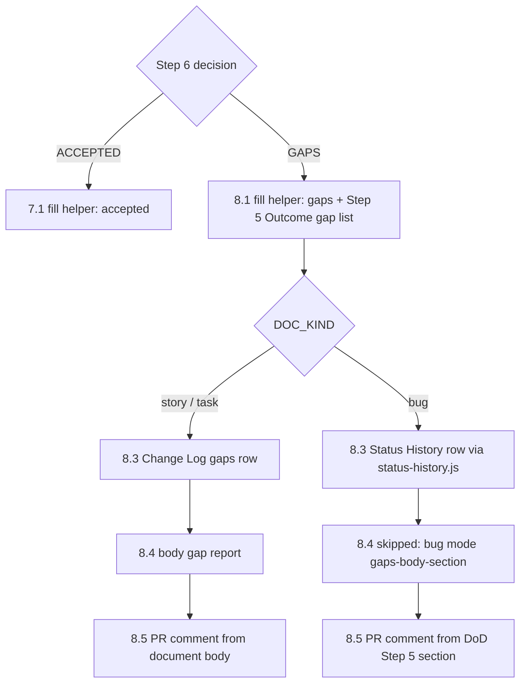

# Technical Task: finalise — bug-mode gaps path and the co-located-document blind spot in 8a and the doc-links guard

**Status:** Planned

**GitHub Issue**: [#482](https://github.com/Gamaroff/agent-skills/issues/482)

---

## 1. Overview

`/finalise` has two scope edges. Each was drawn around the case the author had in front of them, and
real runs have since reached past both. Both were observed on real runs this week.

- **Part A — bug mode stops at Step 7 (obs #148).** The `--bug` skip table says what bug mode runs
  and skips, but it only covers the ACCEPTED path. Step 8 (the GAPS path) has no bug-mode rows. A
  `--bug` run that follows Step 8 as written doubles the `## Verification Complete` heading, appends
  a Change Log row that bug mode forbids, and writes a second verdict into the bug report's body.
- **Part B — the link guards stop at the document (obs #155).** Step 8a's docs-link clause, the
  fix-and-recheck evaluator's scope rule and the `doc-links` corpus guard each check only the
  work-item document. CI's `docs-link-check` checks every changed `docs/**/*.md`, and that includes
  the QA reports, DoD files, implementation reports and PR reviews the pipeline writes next to the
  document.

**Scope**: `skills/finalise/SKILL.md` (skip table, Steps 7.1, 8 and 8a); two shared engines
(`status-history.js`, `finalise-fix-and-recheck.mjs`) and one new shared helper; the report-writing
step of `qa-task`, `qa-story` and `review-pr`; four test files; CHANGELOG.

**Key deliverables**:

1. Five new skip-table rows for Step 8, with a marker beside each Step 8 item. The table and the
   markers stay in two-way agreement under `evals/shared/tests/finalise-bug-mode.test.mjs`.
2. One `## Verification Complete` fill helper that takes the verdict as input, called by both 7.1
   and 8.1. `status-history.js` gains `--json` with the shared `reason` contract and writes Title
   Case lifecycle statuses.
3. Step 8a and the evaluator accept a link-check-only red on the document **or on a co-located
   artifact**. The corpus guard walks the artifacts under a separate ratchet. `qa-task`,
   `qa-story` and `review-pr` run `doc-links.js` on each report they write.

**Expected outcome**: a `/finalise --bug` run that finds gaps leaves one heading, one
`❌ GAPS IDENTIFIED - NOT ACCEPTED` status line, a Status History row, no Change Log and no body
verdict. A dead link that a QA report quotes is caught by the skill that wrote the report, or by
`npm test`, or at worst fixed by 8a on its first appearance. It no longer halts a whole `/finalise`
run on a CI red (task.139 run 2).

---

## 2. Motivation

### Current Problems

1. **A verbatim bug-mode Step 8 doubles the heading (obs #148, E2E-1).** Step 8.1 at
   `skills/finalise/SKILL.md:2138` (*`1. **Finalize Running Summary File with Gaps:**`*) says
   "Append the `## Verification Complete` section" and carries no bug-mode marker. The bug DoD
   template (`skills/finalise/assets/bug-dod-template.md`, § *Verification Complete*) already ships
   that block, with a `**Final Status:** {✅ ACCEPTED | ❌ GAPS IDENTIFIED - NOT ACCEPTED}`
   placeholder. The only fill that exists is 7.1's block (`SKILL.md:956`, *`**Bug mode
   (\`verification-complete\`):** run — **fill**`*), and it hard-codes `✅ ACCEPTED`. So Step 8
   either appends a second heading, which is the task.125 5c CR-2 shape that task.138 fixed for
   Step 7, or reuses the fill and writes the wrong verdict.
2. **Step 8 writes two things bug mode forbids (E2E-2).** Step 8.3 (`SKILL.md:2180`, *`3. **Append
   the gaps row to \`## Change Log\`**`*) and Step 8.4 (`SKILL.md:2192`, *`4. **Add Gap Report to
   Document Body:**`*) have no marker. Their Step 7 counterparts are skipped in bug mode:
   `change-log-row` is "forbidden" and `body-dod-section` is a second verdict.
3. **Step 8.5's PR comment cannot post in bug mode.** This defect was found while checking the
   observation on current `develop`; obs #148 does not list it. 8.5 reads the gap list from the
   document body (`SKILL.md:2275`, *`GAP_REPORT_BODY=$(awk '/^## Definition of Done - Gaps
   Identified/…`*). Once 8.4 is skipped for a bug, that section does not exist, and the
   post-condition at `SKILL.md:2290` (*`gap report body is empty — not posting`*) halts. In bug
   mode the gap list lives in the DoD file's `## Step 5: Acceptance Decision` → `**Outcome:**`.
4. **`status-history.js` rejects `--json` (E2E-3).** Its `main()` (`shared/resources/status-history.js:202`)
   maps five flags and returns 1 on any other with `Unknown option`. Every sibling engine
   (`doc-links.js`, `tracker-comment.js`, `registry-tick.js`) accepts `--json` and uses exit 2 for
   usage errors. Verified: `command node shared/resources/status-history.js --file /dev/null --json`
   prints `Unknown option: --json` and exits 1.
5. **Status cells are written in whatever case the caller passes (E2E-4, cosmetic).** 7.3 passes
   the bug's current status as `bug-doc.js` reports it, which is lowercase, into a table whose rows
   use Title Case. Measured across the corpus with the command in § 3: 220 `Ready for QA`, 197 `New`,
   153 `Closed`, 144 `In Progress`, 20 `Reopened`, and 3 lowercase `new`.
6. **8a admits only the document, but CI checks the artifacts (obs #155).** The clause at
   `SKILL.md:2347` (*`**One CI red is a Docs-section finding, not a CI verdict`*) admits a red that
   `doc-links.js` reproduces "on the work-item document, and **nowhere else in the diff**". The
   evaluator's `inside-files-summary` (`shared/resources/finalise-fix-and-recheck.mjs:150–165`)
   admits exactly one path, `documentPath`. `WORK_ITEM_ARTIFACT_RE` (`:69`) explicitly excludes
   `.qa.`, `.dod.`, `.pr-review.` and `.implementation.` files. On task.139 run 2
   (2026-09-22, per the observation's `date:`), CI went red on `task.139.qa.4.*` and `task.139.qa.5.*`
   because of a quoted `` `[x](a.md)` then [y](b.md) `` span. 8a could not admit that red, and the
   run halted.
7. **The corpus guard skips the files the pipeline writes most (obs #155).** In
   `shared/resources/tests/doc-links.test.mjs:328` (`const ARTIFACT_RE =`), `workItemDocs()` filters
   artifacts **out**. `.github/workflows/docs-link-check.yml` link-checks every changed `docs/**/*.md`
   and does not exclude artifacts.
8. **No report writer checks its own links.** `git grep -n 'doc-links' -- 'skills/*/SKILL.md'` hits
   only `finalise`, `review-task` and `review-story`. `qa-task` Step 11, `qa-story` *Output 1* and
   `review-pr` Step 7 write the co-located reports that carry the quotations, and none of them runs
   the engine.

### Benefits of Solution

- A bug-mode GAPS run leaves a DoD file and a bug report in the same shape the ACCEPTED path
  leaves them in, and a test holds that. The mode then covers both of Step 6's exits, not one.
- The skip table's two-way parity test covers Step 8, so a Step 8 item added later without a marker
  fails CI (the principle in obs #148).
- The last pipeline engine without `--json` gets the shared `reason` contract, so a call site that
  copies the `tracker-comment.js` habit works.
- 8a, the evaluator and the corpus guard check the same set of files CI checks (the principle in
  obs #155).
- The skill that writes a report is the cheapest place to check it. A quotation that renders as a
  link is caught at write time, before a push and a CI round trip.

---

## 3. Technical Background

### Current Architecture

**Bug-mode skip table.** `skills/finalise/SKILL.md` § *What bug mode runs and skips* (table header
at `:96`). The table has 17 rows. Count them with
`awk '/#### What bug mode runs and skips/,/^### Step 0/' skills/finalise/SKILL.md | grep -c '^| \`'`.
Every row covers Steps 0–7. `evals/shared/tests/finalise-bug-mode.test.mjs` holds the table in two
places:
`EXPECTED_VERBS` (`:142`), which enumerates every key and its verb, and `parseMarkers` (`:122`), which
requires **exactly one** `**Bug mode (\`key\`):** skip|run` marker per row. It checks both
directions. Because a key may have only one marker, Step 8 cannot reuse the Step 7 keys. Each
Step 8 item needs its own key.

**The 7.1 fill.** An inline bash block at `SKILL.md:956`. It `sed`-replaces the template's
`**Final Status:** {…}` placeholder with the literal `✅ ACCEPTED`, fills `**Completion Time:**`, and
asserts one heading and one status line on the written file. The test extracts it with `fillBlock()`
(`finalise-bug-mode.test.mjs:1316`) and executes it under each shell (`:1345`, *`7.1 bug mode FILLS
the template's block`*). Precedent for moving a block into a shared helper:
`shared/resources/newest-numbered.sh`, sourced from `.agents/skills/finalise/references/` at three
sites, with a test asserting a single definition (`:1442`).

**Step 8** (`SKILL.md:2132–2336`): 8.1 appends Verification Complete, 8.2 leaves the status alone,
8.3 appends a Change Log row, 8.4 writes `## Definition of Done - Gaps Identified` into the document
body, 8.5 builds the PR comment from that body section, and 8.6 reports to the user.
`awk 'NR>=2132 && NR<=2336' skills/finalise/SKILL.md | grep -c -i bug` prints 0. No rows, no markers.

**Re-runs.** Step 0 numbers the running summary `{bug-prefix}.dod.{num}.{name}.md` and says
"increment if re-running finalise". A filled DoD file is therefore never re-filled with a different
verdict. The next run writes `dod.{N+1}`.

**`status-history.js`** (`shared/resources/status-history.js`): the module is pure. `sync-jira-bug`
uses it through `SH.upsertStatusHistory` (`skills/sync-jira-bug/scripts/sync-jira-bug.js:359`), so
the module API is unaffected by this task. The CLI `main()` (`:202–230`) accepts `--file --date
--status --changed-by --notes`, prints `updated`/`unchanged`, and returns 1 for both usage errors and
unknown flags. Two call sites use the CLI: `skills/finalise/SKILL.md` 7.3 and
`skills/ensure-bug-github-issue/SKILL.md:246`. Neither branches on the exit code or reads stdout.
The status values come from the bug lifecycle (`docs/standards/bug-documents.md:57`): `new`,
`in-progress`, `ready-for-qa`, `closed`, `reopened`.

Status casing corpus command (produced the figures in § 2 problem 5):

```bash
git grep -h -A30 '^## Status History' -- 'docs/**/*.md' \
  | grep -oE '^\| [0-9]{4}-[0-9]{2}-[0-9]{2}[^|]*\| *[^|]+\|' \
  | awk -F'|' '{gsub(/^ +| +$/,"",$3); print $3}' | sort | uniq -c | sort -rn
```

**Step 8a docs-link clause** (`SKILL.md:2340–2383`) and the CI-table row that points to it
(`SKILL.md:857`). The finding record has a `documentPath`. The evaluator's `isWorkItemDocument`
(`finalise-fix-and-recheck.mjs:71`) accepts only a task/story/epic/bug document under `docs/`, and
rejects anything `WORK_ITEM_ARTIFACT_RE` matches (`:69`,
`/\.(qa|gate|bug|implementation|review|dod|plan|handover|pr-review|risk|test-design)\./`). The
precondition statement lives in `shared/resources/finalise-fix-and-recheck-preconditions.json:19`
(`inside-files-summary`, `input: "touched, filesSummary, documentPath"`).

**Corpus guard** (`shared/resources/tests/doc-links.test.mjs:316–386`). It walks
`git ls-files docs/tasks docs/prd docs/development` filtered by `WORK_ITEM_RE`, then removes
`ARTIFACT_RE` matches. It pins pre-existing dead links in `KNOWN` by `file → target`, asserts
`openFences` is empty, and has non-vacuity floors of 100 documents and 200 links. It runs in
`npm test` under `.github/workflows/test.yml`, which has no path filter, so a PR that changes only
a QA report still runs it (obs #102 check: nothing to add).

**The artifact corpus today.** Measured on 2026-09-24 with the same walk and `ARTIFACT_RE`
**inverted**; the command is in the plan file § *Phase 5*. It finds 1,182 tracked artifacts
carrying 1,461 relative links, 11 dead targets across 5 files, and 2 unterminated fences
(`story.4.4.plan.day-4-parallel.md`, `task.81.bug.1.malformed-nested-fences-in-prompt.md`).
`task.139.qa.4`/`qa.5` are clean now: run 2 fixed them. The measurement sizes the ratchet only.
The test records the real list.

**The engine resolves against the git index.** `trackedSet()` (`doc-links.js:197`) is
`git ls-files`. A sibling that a report links to and that has not been staged, such as the gate
file written one step earlier, reads as dead. Staged files resolve.

### Target Architecture

**Part A.**

- `shared/resources/fill-verification-complete.sh <DOD_PATH> <accepted|gaps>` is a bundled helper
  with one job. It replaces the template's `**Final Status:** {…}` placeholder with `✅ ACCEPTED` or
  `❌ GAPS IDENTIFIED - NOT ACCEPTED`, fills `**Completion Time:**`, and then asserts on the written
  file: exactly one heading, exactly one `**Final Status:**` line, and that line reads the requested
  verdict. Running it again with the same verdict changes nothing. Running it on a file that already
  holds the **other** verdict halts, because a decided file is not re-decided (re-runs write
  `dod.{N+1}`). 7.1's block calls it with `accepted`. The new 8.1 marker calls it with `gaps`.
  Nothing else changes in 7.1.
- Five new skip-table rows and markers. The keys are new because the parity test allows one marker
  per key:

  | Key | Step | story / task | bug |
  | --- | --- | --- | --- |
  | `gaps-verification-complete` | Step 8.1 — the `## Verification Complete` block | run — append | run — **fill** via the helper with `gaps`; the gap list goes under `## Step 5` `**Outcome:**` as `- [ ]` lines |
  | `gaps-change-log-row` | Step 8.3 — Change Log gaps row | run | **skip — forbidden** (same grounds as `change-log-row`) |
  | `gaps-status-history-row` | Step 8.3 — Status History row | — | run — `status-history.js`, status unchanged, notes `DoD incomplete — N gap(s) — {dod file}` |
  | `gaps-body-section` | Step 8.4 — gap report in the document body | run | **skip** — the gap report lives in the DoD file; a body section is a second verdict |
  | `gaps-pr-comment` | Step 8.5 — gaps PR comment | run | run — `GAP_REPORT_BODY` from the DoD file's `## Step 5: Acceptance Decision` section, not the bug body |

- The Step 8 Completion Checklist line "Gap report section added to story document body" gets a
  bug-mode qualifier in plain text. A checklist line must not carry a `**Bug mode (` marker, or it
  would count as a second marker.
- `status-history.js` CLI:
  - `--json` prints one line, `{"reason":"updated"|"unchanged","exitCode":0,"file":…,"status":…}`.
  - Usage errors, unknown flags and missing operands exit **2**, and under `--json` print
    `{"reason":"usage","exitCode":2,"error":…}`. This matches `doc-links.js`'s `usage()`
    (`doc-links.js:287`).
  - `--status` is normalised to Title Case for the five lifecycle tokens: `new → New`,
    `in-progress → In Progress`, `ready-for-qa → Ready for QA`, `closed → Closed`,
    `reopened → Reopened`. Any other value passes through unchanged.
  - The mapping is exported as `normaliseStatus` and applied only in `main()`. `upsertStatusHistory`
    and `fmtEntry` do not change.

**Part B.**

- Evaluator: the finding record gets an optional `artifactPaths: string[]`. A path in it counts as
  inside scope only when all of these hold:
  1. `isWorkItemDocument(documentPath)` holds.
  2. The path is in the **same directory** as `documentPath`.
  3. Its basename starts with the document's id prefix plus `.` (`task.139.`, `story.2.1.`,
     `epic.1.`, `bug.14.`).
  4. It matches `WORK_ITEM_ARTIFACT_RE`, excluding `bug`.
  5. It ends in `.md`.
  6. It has no `..` and no NUL.

  Any other path listed in `artifactPaths` admits nothing. `documentPath` behaves as before. The
  preconditions JSON statement and `input` are updated to match.
- 8a clause and CI-table row: a link-check-only red qualifies when `doc-links.js` reproduces it on
  the document **or any co-located `.md` artifact**, and on nothing else in the diff. Every reproduced
  file is listed in `touched`. Each artifact goes in `artifactPaths`. `mutationProof.run` records the
  pre-fix engine run of **every** reproduced file, appended in turn, and `mutationProof.test` names
  the first. `mutationProof.run` must name the test near a red marker, and that already holds for
  the first file.
- Corpus guard: a second test in `doc-links.test.mjs`, **"corpus: every co-located pipeline
  artifact…"**:
  - It walks `WORK_ITEM_RE && ARTIFACT_RE`, the complement of the existing walk.
  - `KNOWN_ARTIFACT_LINKS` and `KNOWN_ARTIFACT_FENCES` are seeded from the measured list.
  - It has its own floors, 1,000 artifacts and 1,000 links, both below the measured 1,182 and 1,461.
  - It uses the same new, healed and fence assertions as the document guard, so the ratchet only
    tightens.
- Writer sites: `qa-task` Step 11, `qa-story` *Output 1: QA Report File* and `review-pr` Step 7 each
  end with the same short block:
  1. Stage the report, and any sibling it links to that this run wrote (the gate), with `git add`,
     because the engine resolves against the index.
  2. Run `node .agents/skills/{skill}/references/doc-links.js --file "{report path}"`.
  3. On exit 1, fix the quotation (fence it, or break the bracket-paren shape) and re-run until it
     exits 0.

  This makes the bundler copy `doc-links.js` into three more skills' `references/`.

### Same-class mechanism inventory (obs #103)

- **7.1 fill vs new helper.** The helper **replaces** the inline block. 7.1 keeps its marker and
  calls the helper. There is still exactly one fill, and it is now shared.
- **`documentPath` vs `artifactPaths`.** `artifactPaths` **extends** the one-path admission rule.
  It is anchored to `documentPath`, so it cannot admit anything outside that document's own
  directory and stem.
- **`KNOWN` vs `KNOWN_ARTIFACT_*`.** The artifact lists **sit beside** `KNOWN` rather than merging
  into it. Artifacts have a larger, older corpus with historical consumer-layout links (see the
  comment at the top of `docs-link-check.yml`). A separate ratchet keeps the document guard
  zero-tolerance for new documents, while artifacts can shrink their list at their own pace.
- **`review-task` / `review-story` doc-links check vs writer checks.** The writer checks **sit
  beside** those. The review skills check the work-item document, and by design (obs #154) they do
  not check artifacts. The writer checks cover the artifacts at the moment they are written.

### Decision Flow — bug mode at Step 6's two exits



---

## 4. Scope

### In Scope

- ✅ Five Step 8 skip-table rows and markers. `EXPECTED_VERBS` enumerates them.
- ✅ `shared/resources/fill-verification-complete.sh`, called from 7.1 and 8.1.
- ✅ The 8.5 bug-mode branch that reads the gap body from the DoD file.
- ✅ `status-history.js` CLI: `--json`, usage exit 2, and Title Case statuses.
- ✅ The evaluator's `artifactPaths`, the preconditions JSON, the 8a clause and the CI-table row.
- ✅ The artifact corpus assertion in `doc-links.test.mjs`.
- ✅ The writer-site `doc-links.js` run in `qa-task`, `qa-story` and `review-pr`.
- ✅ CHANGELOG `[Unreleased]`.

### Out of Scope

- ❌ **Step 3a's `git diff HEAD~1 HEAD` fallback** (obs #148, last sentence). It only goes wrong
  when there is no `gh` remote, which happened in task.138's scratch-clone recipe. It is not a
  bug-mode defect, and it belongs with that recipe.
- ❌ **Step 8a in bug mode.** 8a's preconditions read a Files Summary, which a bug report does not
  have. Whether 8a applies to `--bug` at all is a separate decision.
- ❌ **General bugs under `docs/bugs/`** in the artifact corpus guard. `WORK_ITEM_RE` matches
  neither `bug.N` documents nor their artifacts, and they are a different root. Widening the roots
  is a follow-up.
- ❌ **Fixing the 11 dead links and 2 open fences** the artifact guard pins. They are consumer-layout
  links in old artifacts, and the ratchet exists to leave them pinned rather than force a sweep.
- ❌ **`status-history.js`'s module API** and `sync-jira-bug`'s use of it.
- ❌ **Gate `.yml` files.** `docs-link-check` only reads `.md`.

---

## 5. Breaking Changes

1. **`status-history.js` usage-error exit code 1 → 2.**
   - Before: `status-history.js --bogus` prints `Unknown option: --bogus` and exits 1.
   - After: it exits 2, and prints `{"reason":"usage",…}` when `--json` is passed.
   - Affected: the two CLI call sites, `finalise` 7.3 and `ensure-bug-github-issue` B8. Neither
     branches on the code or chains `|| …` on it (verified with `git grep -n 'status-history.js'`
     over `skills/*/SKILL.md`).
   - Migration: none needed at those call sites. For any out-of-tree caller, the CHANGELOG entry
     states the change.
2. **Status History rows are written in Title Case by the CLI.**
   - Before: `--status ready-for-qa` writes `ready-for-qa`.
   - After: it writes `Ready for QA`.
   - Affected: bug reports written from now on. Existing rows are untouched.
   - Migration: none. This matches the case used by 734 of the 737 rows the corpus command in § 3
     measured.

No other breaking changes. Every Step 8 story/task path reads exactly as it does today.

---

## 6. Implementation Plan

> Detailed implementation guide: [task.152.plan.finalise-gaps-path-and-artifact-links.md](task.152.plan.finalise-gaps-path-and-artifact-links.md)

Parts A (Phases 1–3) and B (Phases 4–6) do not depend on each other. They share one file,
`skills/finalise/SKILL.md`, and they edit different regions of it (Step 7.1 and Step 8 for Part A,
Step 8a and the CI table for Part B).

### Phase 1: the shared fill helper (Risk: Low)

**Files**: `shared/resources/fill-verification-complete.sh`, `skills/finalise/SKILL.md` (7.1),
`evals/shared/tests/finalise-bug-mode.test.mjs`

- [ ] Write the helper with `<DOD_PATH> <accepted|gaps>`. It halts on unbound or placeholder
      arguments, on an unreadable file, on a doubled heading, and on a filled file whose verdict
      differs from the one requested.
- [ ] 7.1's bug-mode block sources or calls the helper through `.agents/skills/finalise/references/`,
      keeping its `DOC_KIND` / `DOD_PATH` binding guard.
- [ ] Tests: the helper fills `gaps` and `accepted` on the template, is idempotent, refuses the
      other verdict and refuses a doubled file. `fillBlock()` still executes 7.1 end-to-end. There
      is one definition (the `newest-numbered.sh` pattern).

### Phase 2: Step 8 bug-mode rows and markers (Risk: Medium)

**Files**: `skills/finalise/SKILL.md` (table, 8.1, 8.3, 8.4, 8.5, Step 8 checklist),
`evals/shared/tests/finalise-bug-mode.test.mjs`

- [ ] Add the five rows from § 3 to the skip table, and a marker beside each Step 8 item.
- [ ] 8.5: bind `DOC_KIND`. In bug mode, set `GAP_REPORT_BODY` from the DoD file's
      `## Step 5: Acceptance Decision` section, bounded at the next `## `. The empty-body
      post-condition stays as it is.
- [ ] Add a bug-mode qualifier to the Step 8 Completion Checklist, without a marker.
- [ ] Add the five keys to `EXPECTED_VERBS`. Add an executed test of the 8.5 block in bug mode
      against a filled-`gaps` DoD fixture.

### Phase 3: `status-history.js` CLI contract (Risk: Low)

**Files**: `shared/resources/status-history.js`, `shared/resources/tests/status-history-cli.test.mjs` (new)

- [ ] Add `--json`, the usage exit code 2 with `reason: "usage"`, and the exported
      `normaliseStatus`, applied in `main()` only.
- [ ] Tests: `--json` reason for `updated` and `unchanged`, the unknown-flag exit code, all five
      tokens mapped, and a non-token passed through.

### Phase 4: evaluator `artifactPaths` (Risk: Medium)

**Files**: `shared/resources/finalise-fix-and-recheck.mjs`,
`shared/resources/finalise-fix-and-recheck-preconditions.json`,
`shared/resources/tests/finalise-fix-and-recheck.test.mjs`

- [ ] Add `isCoLocatedArtifact(documentPath, p)` and admit `artifactPaths` entries in
      `inside-files-summary` only through it.
- [ ] Update the preconditions statement and `input` (`touched, filesSummary, documentPath, artifactPaths`).
- [ ] Tests: a co-located QA report is admitted. Each of these is refused: another directory,
      another stem, a `.bug.` report, a `.yml` gate, a `..` path, an artifact given without a
      `documentPath`, and a non-artifact file in the same directory.

### Phase 5: 8a clause and the artifact corpus guard (Risk: Low)

**Files**: `skills/finalise/SKILL.md` (8a clause, CI-table row at `:857`),
`shared/resources/tests/doc-links.test.mjs`

- [ ] Widen the 8a clause and the CI row to cover co-located `.md` artifacts. The finding record
      example gains `artifactPaths`. Explain the multi-file `mutationProof.run`.
- [ ] Add the artifact corpus test with `KNOWN_ARTIFACT_LINKS` / `KNOWN_ARTIFACT_FENCES`, seeded
      from the list the test prints on its first red run, and with floors.

### Phase 6: writer-site checks (Risk: Low)

**Files**: `skills/qa-task/SKILL.md` (Step 11), `skills/qa-story/SKILL.md` (Output 1),
`skills/review-pr/SKILL.md` (Step 7), `shared/resources/tests/doc-links.test.mjs`

- [ ] Add the stage-then-check block at each of the three sites.
- [ ] Add a section-scoped population test: each site's section names `references/doc-links.js --file`
      and `git add`, with a floor of 3 sections found.
- [ ] `npm run bundle`. `bundle:check` must report no `UNREACHED`.

### Phase 7: docs and validation (Risk: Low)

**Files**: `CHANGELOG.md`

- [ ] Add an `[Unreleased]` entry citing `(task 152)`, including both breaking changes.
- [ ] Run `npm run ci:fast`, `npm run format:check`, `npm run bundle:check`, and
      `python skills/create-skill/scripts/quick_validate.py` on the four edited skills.

---

## 7. Files Summary

### Core Implementation

1. ✅ `skills/finalise/SKILL.md` — skip table, 7.1 helper call, Step 8 markers and 8.5 branch, Step 8 checklist, 8a clause, CI-table row
2. ✅ `shared/resources/fill-verification-complete.sh` — **new**, the one `## Verification Complete` fill
3. ✅ `shared/resources/status-history.js` — CLI `--json`, usage exit 2, `normaliseStatus`
4. ✅ `shared/resources/finalise-fix-and-recheck.mjs` — `artifactPaths`, `isCoLocatedArtifact`
5. ✅ `shared/resources/finalise-fix-and-recheck-preconditions.json` — `inside-files-summary` statement and input
6. ✅ `skills/qa-task/SKILL.md` — Step 11 writer check
7. ✅ `skills/qa-story/SKILL.md` — Output 1 writer check
8. ✅ `skills/review-pr/SKILL.md` — Step 7 writer check

### Tests

9. ✅ `evals/shared/tests/finalise-bug-mode.test.mjs` — `EXPECTED_VERBS`, helper tests, 8.5 bug branch
10. ✅ `shared/resources/tests/status-history-cli.test.mjs` — **new**
11. ✅ `shared/resources/tests/finalise-fix-and-recheck.test.mjs` — `artifactPaths` admission and refusals
12. ✅ `shared/resources/tests/doc-links.test.mjs` — artifact corpus guard, writer-site population test

All four are inside `package.json`'s `test` globs (`shared/resources/tests/*.test.mjs`,
`evals/shared/tests/*.test.mjs`).

### Generated (never hand-edited: `npm run bundle`)

13. ✅ `skills/finalise/references/{fill-verification-complete.sh,status-history.js,finalise-fix-and-recheck.mjs,finalise-fix-and-recheck-preconditions.json}`
14. ✅ `skills/{qa-task,qa-story,review-pr}/references/doc-links.js` — new copies
15. ✅ Every other skill's `references/status-history.js` copy (`ensure-bug-github-issue`, `sync-github-bug`, `sync-jira-bug`)

### Documentation

16. ✅ `CHANGELOG.md`

### Deleted

None.

---

## 8. Testing Strategy

### Unit Tests

- **Scope**: the helper, the `status-history.js` CLI, the evaluator's `artifactPaths`, and both
  corpus guards.
- **Command**: `command node --test evals/shared/tests/finalise-bug-mode.test.mjs shared/resources/tests/status-history-cli.test.mjs shared/resources/tests/finalise-fix-and-recheck.test.mjs shared/resources/tests/doc-links.test.mjs`
- **Mutation proofs** (the repository rule: revert the behaviour and name the test that goes red):
  - Hard-code `ACCEPTED` in the helper → the `gaps` fill test goes red.
  - Delete one Step 8 marker → *"every table row has exactly one prose marker"* goes red.
  - Drop the 8.5 bug branch → the executed 8.5 test halts with `gap report body is empty`.
  - Remove the `--json` handling → the CLI test goes red.
  - Remove the directory or stem condition from `isCoLocatedArtifact` → the other-directory or
    other-stem refusal goes red.
  - Invert `ARTIFACT_RE` back → the artifact walk's floor goes red.
  - Remove one writer block → the population test names that site.

### Integration Tests

- The executed 7.1 test (`fillBlock()`) still passes with the helper behind it. This proves 7.1's
  bash, including the helper path from a consumer-shaped root, works end-to-end.
- The executed 8.5 test runs the extracted block in bash and zsh against a DoD fixture filled with
  the `gaps` verdict, and asserts a non-empty `GAP_REPORT_BODY` and a `GAP_COUNT` equal to the
  fixture's `- [ ]` lines.

### Behavioural evidence (recorded, not automated)

The population test proves the writer checks are **stated**, not that an agent **runs** them. There
is no eval layer for `qa-task` report writing. The implementation report records one hand run: write
a scratch QA report that quotes `` `[x](a.md)` then [y](b.md) `` (the task.139 shape), stage it, and
run the Step 11 block. The engine must exit 1 and name the line. After fencing the quotation it must
exit 0. The report states that CI does not hold this.

### Performance Tests

- None needed. Both corpus walks are reads of the git index. Record the artifact test's wall time
  in the implementation report.

### Consumer Tests

- `npm test` in full. `skill-frontmatter`, `bundled-links` and `bundle:check` cover the edited
  `SKILL.md` files and the new `references/` copies.

---

## 9. Success Criteria

### Functional

- [ ] The skip table has 22 rows. The five `gaps-*` rows read as in § 3. `EXPECTED_VERBS` enumerates
      all 22, and the parity tests pass in both directions (`evals/shared/tests/finalise-bug-mode.test.mjs`).
- [ ] The helper fills `gaps` on the template with exactly one heading and one
      `**Final Status:** ❌ GAPS IDENTIFIED - NOT ACCEPTED` line. It is idempotent, refuses to
      overwrite `ACCEPTED`, and 7.1 still fills `ACCEPTED` through it (`finalise-bug-mode.test.mjs`).
- [ ] In bug mode, the 8.5 block builds a non-empty comment body from the DoD file's
      `## Step 5: Acceptance Decision` section, and its `GAP_COUNT` equals the gap lines
      (`finalise-bug-mode.test.mjs`, executed in bash and zsh).
- [ ] `status-history.js --json` prints `reason` `updated` / `unchanged` and exits 0. An unknown flag
      exits 2 with `reason: "usage"`. The five lifecycle tokens write Title Case
      (`shared/resources/tests/status-history-cli.test.mjs`).
- [ ] The evaluator admits a co-located `.md` artifact named in `artifactPaths`, and refuses every
      case listed in Phase 4 (`shared/resources/tests/finalise-fix-and-recheck.test.mjs`).
- [ ] The artifact corpus test walks at least 1,000 artifacts and 1,000 links, and fails on a new
      dead link, a new open fence, or a healed `KNOWN_ARTIFACT_*` entry
      (`shared/resources/tests/doc-links.test.mjs`).
- [ ] Each of the three writer sections runs `doc-links.js --file` after `git add`. Removing it from
      any one of them fails the population test and names that site (`doc-links.test.mjs`).

### Performance

- [ ] The artifact corpus test completes in under 10 seconds locally. The measured time goes in
      the implementation report.
- [ ] No network access in any new test.

### Code Quality

- [ ] Every fix above is mutation-proved as listed in § 8, with the red run recorded in the
      implementation report.
- [ ] `npm run ci:fast`, `format:check` and `bundle:check` are clean, with no `UNREACHED`.
- [ ] Neither CLI calls `process.exit()`: `status-history.js` keeps `process.exitCode`.

### Migration

- [ ] The CHANGELOG `[Unreleased]` entry cites `(task 152)` and names both breaking changes in § 5.
- [ ] Observations #148 and #155 are set `actioned` when the PR merges.

---

## 10. Risk Assessment

### High Risk Areas

None.

### Medium Risk Areas

1. **`artifactPaths` widens a gate's admission rule.**
   - Risk: a loose predicate lets a fix-and-recheck touch files outside the work item, for example
     an artifact from another task's directory.
   - Probability: Low · Impact: High
   - Mitigation: admission is anchored to a valid `documentPath`, the same directory and the same id
     stem, and each condition has its own refusal test (Phase 4). A record with `artifactPaths` and
     no `documentPath` admits nothing.
   - Rollback: revert Phase 4 and Phase 5's 8a prose together. `documentPath` behaviour is unchanged.
2. **Step 8 edits sit beside the most-tested prose in the repository.**
   - Risk: 8.5's new `DOC_KIND` branch changes what the story/task path does. task.125 ran ten qa-fix
     cycles on this skill's bash (`git log --oneline --grep='task.125): qa-fix cycle' | wc -l` → 10).
   - Probability: Medium · Impact: Medium
   - Mitigation: the branch binds its own inputs and refuses placeholders (the cycle-6 CR-3 shape).
     A story/task executed test asserts the body is still read from the document.
3. **The writer check reads an unstaged sibling as dead.**
   - Risk: the engine resolves against the index, so a gate link written in Step 10 is dead at
     Step 11 unless staged.
   - Probability: High if unaddressed · Impact: Low (a false red at write time)
   - Mitigation: the block stages the report and its siblings first, and the text says why.

### Low Risk Areas

1. **Artifact ratchet seeded from a moving corpus.** Seed `KNOWN_ARTIFACT_*` from the test's own
   first red output on the branch, not from the figure in § 3. That figure only sizes the work.
2. **Title Case surprises a reader of old rows.** Old rows are untouched, and the corpus is already
   almost all Title Case.

### Open Questions (recorded instead of asked; defaults taken)

1. **One task or two?** By § 1.2's splitting test, Parts A and B are each independently shippable,
   revertible and valuable. They were kept together because the caller assigned one task number
   and both edit `skills/finalise/SKILL.md`. *Default: one task, one PR, with the phases ordered so
   a split is mechanical if a reviewer asks for one.*
2. **Where does the bug-mode gap list live?** *Default: the DoD file's `## Step 5` `**Outcome:**`
   as `- [ ]` lines. The template already reserves `{… | the gaps, each named}` there.* The
   alternative, a `**Blocking Issues Summary:**` inside Verification Complete, would change the
   template.
3. **Should `artifactPaths` admit co-located `.bug.` reports?** *Default: no. A co-located bug
   report is a work item with its own lifecycle and its own `/finalise --bug` run.*
4. **Should the writer check stage files in a skill that does not otherwise commit?** *Default:
   yes, `git add` only. The pipeline commits these files next anyway, and staging is reversible.*

---

## 11. Rollback Plan

### Immediate Rollback (< 1 hour)

- **Triggers**: a bug-mode `/finalise` run writes a Change Log row or a second
  `## Verification Complete` heading, or a story/task Step 8 run stops posting its gaps comment.
- **Steps**: revert the PR. The change is prose, two engines, one helper and tests, with no data
  migration. Then run `npm run bundle` to refresh the `references/` copies.
- **Validation**: `npm test` is green on the reverted tree, and `bundle:check` is clean.

### Partial Rollback (1–2 hours)

- Revert Part B (Phases 4–6) alone if `artifactPaths` or a writer check misfires. Part A has no
  dependency on it.
- Revert Phase 6 alone if the writer checks are noisy. The corpus guard still catches the class at
  `npm test`.

### Forward Fix

- A false red from the artifact guard: pin the entry in `KNOWN_ARTIFACT_*` with a comment, or fix
  the link.
- An 8.5 extraction miss: tighten the section bound. The executed test fixture carries the case.

### Rollback Triggers

- **Critical**: a Change Log row written to a bug report (the mode's own rollback trigger,
  `SKILL.md` § `change-log-row`), or a gate admitting a path outside the work item's directory.
- **Non-critical**: false reds from the writer check or the artifact guard. Fix forward.

---

<!-- change-log-start -->
## Change Log

| Date       | Version | Description                                                                          | Author      |
| ---------- | ------- | ------------------------------------------------------------------------------------ | ----------- |
| 2026-09-24 | 1.0     | Initial draft — cut from observations #148, #155 (2026-09-24 observation review)     | create-task |
<!-- change-log-end -->

---

## Progress Tracking

- [ ] Phase 1: the shared fill helper
- [ ] Phase 2: Step 8 bug-mode rows and markers
- [ ] Phase 3: `status-history.js` CLI contract
- [ ] Phase 4: evaluator `artifactPaths`
- [ ] Phase 5: 8a clause and the artifact corpus guard
- [ ] Phase 6: writer-site checks
- [ ] Phase 7: docs and validation

---

## References

- Observation #148 — finalise bug mode: Step 8 (GAPS path) has no bug-mode rows (2026-09-21)
- Observation #155 — finalise 8a / doc-links corpus guard scoped to the work-item document (2026-09-22)
- task.125 — `/finalise --bug` introduced; task.138 — bug-mode residuals, whose Phase 4 end-to-end run found #148
- task.139 — `doc-links.js`, the 8a docs-link clause and the corpus guard (obs #154), whose run 2 found #155
- `shared/resources/newest-numbered.sh` — the single-definition helper precedent for Phase 1
- `.github/workflows/docs-link-check.yml` — what CI actually link-checks

---

## Notes

### Important Reminders

- QA artifacts land in this directory: `task.152.qa.{N}.finalise-gaps-path-and-artifact-links.md`,
  `task.152.gate.{N}.finalise-gaps-path-and-artifact-links.yml`, and bug reports
  `task.152.bug.{N}.{name}.md`.
- Edit `shared/resources/` sources only. Every `skills/*/references/` file named in § 7 is
  regenerated by `npm run bundle`.
- The QA reports for this task are the first ones the new writer check applies to. Quote the
  task.139 example in a fence, not in a code span.
