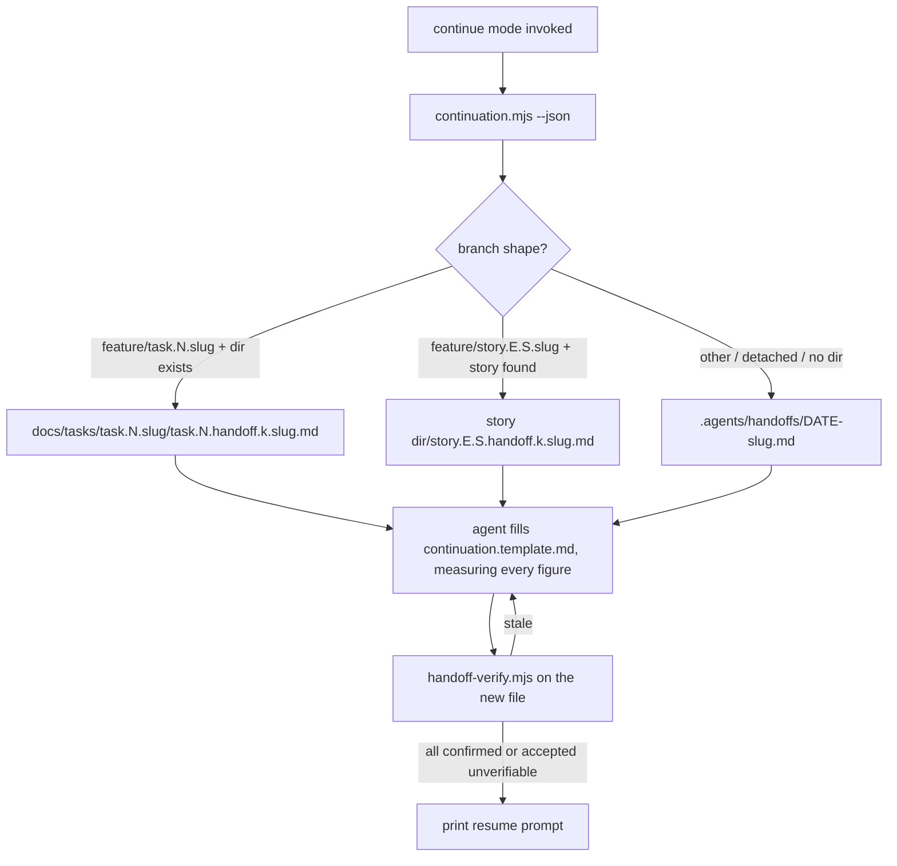

# Technical Task: session-handoff continue mode — a continuation file a fresh context resumes from

**Status:** Accepted

**Review**: ✅ All review recommendations from `task.156.review.1.session-handoff-continue-mode.md` implemented 2026-10-01

**GitHub Issue**: [#490](https://github.com/Gamaroff/agent-skills/issues/490)

---

## 1. Overview

Give `session-handoff` a third mode, `continue`, that hands **one piece of in-flight work** to a
fresh context. It writes a short continuation file next to the work item, covering the goal, the
state (every figure with the command that measured it), the exact next step, the decisions taken,
the approaches ruled out, and the file paths that matter. It then prints a paste-ready prompt that
tells the new session to re-measure the file with the existing verifier before trusting any of it.

**Scope**: the `continue` procedure and template in `session-handoff`, one deterministic helper
script that decides where the file goes and builds the resume prompt, the file-naming rows for the
new artifact, and tests. The automatic trigger that *recommends* running this mode when the context
fills is task.157, which depends on this task.

**Key deliverables**:

1. `continue` mode in `skills/session-handoff/SKILL.md` plus `assets/continuation.template.md`.
2. `skills/session-handoff/scripts/continuation.mjs`, which resolves the co-located path and the verifier path, and emits the resume prompt.
3. `handoff` artifact rows in `docs/standards/file-naming.md` for tasks and stories.

**Expected outcome**: a user or agent who sees the context filling can run one mode, get one file
and one prompt, open a fresh session, paste the prompt, and continue. The new session knows what is
still true (verifier verdicts), what was decided, and what not to try again.

---

## 2. Motivation

### Current Problems

1. **Long sessions degrade and nothing hands the work on.** As the context window fills, output
   quality drops, and auto-compaction then replaces the detail with a lossy summary the agent did
   not choose. No mode exists to move *this task* to a fresh context deliberately, before that
   happens.
2. **`session-handoff` answers a different question.** Its write mode records *project* state for
   whoever picks up the repo next: frontier, branch tip, suite health, standing decisions and
   tolerated drift. It is one file (`.agents/handoff.md`) per repo. It has no place for "I was
   halfway through step 3 of task.147, tried X, rejected it because Y, the next edit is Z".
3. **What compaction loses first is what a restart most needs.** The approaches already ruled out and
   the reason each decision was taken are exactly what a summariser drops. A fresh session without
   them re-explores dead ends. Nothing in the pipeline records them deliberately.
4. **A hand-written "continue from here" note decays silently.** It has the same failure the
   `session-handoff` rationale documents for `.agents/handoff.md` (§ "Why this exists", the
   2026-09-10 T107 incident): a snapshot with no re-measure step reads as current after it has gone
   stale.
5. **The develop pipelines' own resume path does not cover ad-hoc work.** `develop-pipeline-on-precompact.sh`
   writes `develop-pipeline.last-halt.json` only when a `/develop-task` or `/develop-story` lock is
   held. Work done outside those pipelines has no resume artifact at all.

### Benefits of a continue mode

1. **Deliberate handoff instead of lossy compaction.** The agent chooses what the next context gets,
   while its own context is still good enough to choose well.
2. **Verified, not trusted, on arrival.** Continuation files use the same `| Check | Command | Result |`
   and `<!-- cmd: … -->` format as `.agents/handoff.md`, so `handoff-verify.mjs` re-measures them
   with no change to the verifier.
3. **No repeated dead ends.** A mandatory "Ruled out" section carries rejected approaches and why.
4. **One call decides the location.** A script, not prose, derives the co-located path from the
   branch, so the file lands beside the work item every time. A deterministic job does not depend
   on the agent remembering a rule under context pressure.
5. **Usable alone, and the target for task.157.** A user can run it by hand today. task.157's
   trigger then has a concrete action to recommend.

---

## 3. Technical Background

### Current Architecture

`skills/session-handoff/` (task.110) has two modes:

- **Write** (`SKILL.md` § "Write — the fixed section order"): the agent fills
  `assets/handoff.template.md` into `.agents/handoff.md`. It has six fixed sections split by
  half-life, and every figure is a bold token with the command that produced it.
- **Read** (`SKILL.md` § "Read — re-measure before trusting"):
  `scripts/handoff-verify.mjs [path] [--json] [--timeout N]` parses the header table (first
  backticked span in `Command` = command; bold spans in `Result` = figures) and prose lines carrying
  `<!-- cmd: …; expect: … -->`. It skips fenced code blocks and re-runs each command through a
  per-binary read-only whitelist with no shell. It reports `confirmed` / `stale` / `unverifiable`.
  **It already accepts an explicit path**, so it can verify any file in this format, not just
  `.agents/handoff.md`.

Other resume mechanisms, which this task does **not** replace:

- `shared/resources/develop-pipeline-on-precompact.sh` writes
  `.claude/state/develop-pipeline.last-halt.json` (`SNAPSHOT="$(dirname "$LOCK")/develop-pipeline.last-halt.json"`)
  when a develop pipeline lock is held at compaction, and the pipeline's Phase 0b resume detector
  reads it.
- Implementation reports (`task.{n}.implementation.{n}.{name}.md`) record a pipeline run's
  decisions.

File naming (`docs/standards/file-naming.md`) has co-located artifact rows for plan, QA, bug,
review, PR review and implementation reports. It has no row for a handoff.

Branch names follow `feature/task.<id>.<name>` and `feature/story.<epic>.<story>.<name>`
(`skills/create-branch/SKILL.md`).

### Target Architecture

- **`continue` mode** in `SKILL.md`, sitting beside Write and Read. It has its own section order
  (below), its own template, and the same figure discipline as Write. It **reuses Read unchanged**
  to prove the file before handing it over, and the resume prompt makes the new session run Read
  first.
- **`assets/continuation.template.md`**, with sections in this fixed order:

  | Section | Rule |
  | --- | --- |
  | Header: goal + work item | 1–3 sentences. A link to the work item doc when there is one |
  | State table `\| Check \| Command \| Result \|` | branch, HEAD, uncommitted files, the targeted test(s). Same verifier format, and **only commands on its whitelist**. Figure forms, each run through the unchanged verifier at review (review.1): **targeted test** — `node --test --test-name-pattern=…` (the whitelist refuses a positional after `--test`) with a `pass N` figure, never `exit 0`: a pattern that matches no test exits 0 and confirms, while `pass N` reads `stale`. **Uncommitted files** — dirty: `git status --porcelain` with each file name as a bold figure; clean: `git diff --quiet HEAD` with an `exit 0` figure (tracked files only). `git status --porcelain` against a `clean` figure reads `stale` on a clean tree, and an empty Result cell reads `unverifiable: no figure`. **Branch tip** — `git rev-parse --short HEAD`; committing the continuation file afterwards moves HEAD, so that row then reads `stale` (see Important Clarifications) |
  | 1. Next step | **one** concrete action, plus how to tell it is done |
  | 2. Done this session | commits by short SHA, not narrative |
  | 3. Decisions taken | decision, why, where recorded |
  | 4. Ruled out | approach, why rejected. **Mandatory**: write `none` if nothing was ruled out, never omit |
  | 5. Files that matter | paths plus a one-line role. **Never file contents** |
  | 6. Open questions | for the user, or `none` |
  | Pipeline pointer (conditional) | when a develop pipeline lock or `last-halt.json` exists: point at it and at `/develop-task` / `/develop-story` resume. Do not restate pipeline step state |
  | Resume prompt | fenced block (the verifier skips fenced blocks), emitted by the script |

- **`scripts/continuation.mjs`** (pure resolution plus a thin CLI; no writes of its own):
  - `--json` → `{ path, workItem, verifier, resumePrompt, reason }`.
  - **Path**: branch `feature/task.N.slug` → `docs/tasks/task.N.slug/task.N.handoff.{k}.slug.md`.
    Branch `feature/story.E.S.slug` → the story's directory (located by searching the PRD root
    for `story.E.S.*.md`) → `story.E.S.handoff.{k}.slug.md`. The CLI resolves the PRD root as
    `--prd-root <dir>` if given, else `prd.prdShardedLocation` from `skills-config.yaml` at the repo
    root (the key `resolve-paths.sh` reads; a Node script cannot source shell), else `docs/prd`.
    Read the key the way `shared/resources/generate-prd-epic-index.mjs` does (its
    `prd.prdShardedLocation` reader, ~line 75): a small line scan, no YAML dependency, because the
    script ships inside the skill and imports nothing from `shared/resources/`. Anything else (another branch,
    detached HEAD, no work-item dir on disk) → `.agents/handoffs/{YYYY-MM-DD}-{slug}.md`, where
    `slug` comes from `--slug` or the branch name. `{k}` = the highest existing index + 1, parsed
    base 10. A fallback path already taken gets `-2`, `-3`, … before `.md`.
  - **Verifier**: the first that exists of: the sibling of `continuation.mjs` itself
    (`handoff-verify.mjs` in the same `scripts/` directory — the two ship together, so it is
    present in every install, including this source repository, where `.agents/skills` is a
    gitignored symlink a fresh clone lacks), then `<repo>/.agents/skills/session-handoff/scripts/handoff-verify.mjs`,
    `~/.agents/skills/session-handoff/scripts/handoff-verify.mjs` and
    `~/.claude/skills/session-handoff/scripts/handoff-verify.mjs`. A path under the repo root is
    emitted relative, any other absolute. The resolver takes the sibling directory as an injected
    input (`selfDir`) so the order stays testable. None found → `reason: no-verifier`, and the prompt tells
    the reader to verify the state table by hand. It never silently omits the step.
  - **Resume prompt**: fixed text naming the file, the verifier command, and the instruction to
    treat `stale` and `unverifiable` lines as unknown and to start at §1.
- **`docs/standards/file-naming.md`**: rows `task.{n}.handoff.{n}.{name}.md` and
  `story.{epic}.{story}.handoff.{n}.{name}.md`.

```mermaid
flowchart TD
  A[continue mode invoked] --> B[continuation.mjs --json]
  B --> C{branch shape?}
  C -- feature/task.N.slug + dir exists --> D[docs/tasks/task.N.slug/task.N.handoff.k.slug.md]
  C -- feature/story.E.S.slug + story found --> E[story dir/story.E.S.handoff.k.slug.md]
  C -- other / detached / no dir --> F[.agents/handoffs/DATE-slug.md]
  D & E & F --> G[agent fills continuation.template.md, measuring every figure]
  G --> H[handoff-verify.mjs on the new file]
  H -- all confirmed or accepted unverifiable --> I[print resume prompt]
  H -- stale --> G
```

### Important Clarifications

- **This is not a second verifier.** `handoff-verify.mjs` is used as it is. If a continuation
  section needs a figure form the verifier cannot read, change the template, not the verifier.
- **This is not a replacement for Write.** `.agents/handoff.md` stays the project-level file.
  `continue` writes one file per handoff, per work item.
- **It does not commit.** Committing the continuation file is the caller's decision, since a
  mid-task file may belong in the task's next commit. The SKILL states this, and states the
  consequence: committing the file moves HEAD, so the **Branch tip** row then reads `stale` by that
  one commit. A caller who commits re-measures the tip and re-runs Read afterwards (run at review:
  committing the file in a temp repo turned a `confirmed` tip row `stale`).
- **A targeted-test row is slow in a large repo.** `node --test` in pattern mode runs node's own
  discovery, which loads every `*.test.*` file before filtering by name; in this repository that
  can exceed the verifier's 60 s default and read `unverifiable: timeout`. That is an accepted
  verdict (the reader can run the test), not a template defect.
- **Agent-agnostic.** Nothing in this task depends on Claude Code. The Claude-Code-specific trigger
  is task.157.

---

## 4. Scope

### In Scope

✅ **Procedure**: a `## Continue — hand in-flight work to a fresh context` section in
`skills/session-handoff/SKILL.md`, and a `description` update so the skill triggers on "hand off to
a fresh session", "context is getting full", "continue in a new context".
✅ **Template**: `skills/session-handoff/assets/continuation.template.md`.
✅ **Helper**: `skills/session-handoff/scripts/continuation.mjs`, covering path, verifier resolution
and the resume prompt.
✅ **Naming**: two rows in `docs/standards/file-naming.md`.
✅ **User-level install note** in `SKILL.md`: how to make the skill available in every repo
(`~/.agents/skills/` and `~/.claude/skills/`), and why the verifier path is resolved rather than
hard-coded.
✅ **Tests**: `skills/session-handoff/tests/continuation.test.js`.
✅ **Catalog + CHANGELOG**.

### Out of Scope

❌ **The automatic trigger** (status-line reading, `UserPromptSubmit` hook, installer): task.157.
❌ **Changing `handoff-verify.mjs`** or its whitelist. If the template needs it, that is a design
error here.
❌ **Bug-report directories** as a co-location target. Bug work runs through `/develop-bug`, which has
its own resume. Such sessions fall to `.agents/handoffs/`.
❌ **Auto-committing** or auto-opening a new session. Neither is possible from a skill, and both are
the user's call.
❌ **Pruning old continuation files.** They are small, dated and co-located; revisit if they pile up.

---

## 5. Breaking Changes

None. The mode is additive. Write and Read behave exactly as before, and `.agents/handoff.md` is
untouched.

---

## 6. Implementation Plan

> Detailed implementation guide: [task.156.plan.session-handoff-continue-mode.md](task.156.plan.session-handoff-continue-mode.md)

### Phase 1: `continuation.mjs` — path, verifier and prompt resolution

**Risk Level**: Low

**Files**:
- `skills/session-handoff/scripts/continuation.mjs` (new)
- `skills/session-handoff/tests/continuation.test.js` (new)

**Changes**:
- [x] Pure `resolveContinuation({ repoRoot, branch, prdRoot, home, selfDir, today, slug, exists, list, findStory })`, with the filesystem injected so it can be tested without a real repo
- [x] Task, story and fallback path rules as in § 3, with `{k}` = highest existing index + 1 (base 10)
- [x] Verifier resolution order (sibling `selfDir` → repo `.agents` → `~/.agents` → `~/.claude`); `reason: no-verifier` when none is found
- [x] PRD root for the CLI: `--prd-root` → `skills-config.yaml` `prd.prdShardedLocation` → `docs/prd`
- [x] `resumePrompt` built from `path` + `verifier`
- [x] Thin CLI: `--json`, `--slug`, `--repo`, `--prd-root`; exit 0 for `ok` / `no-verifier`, exit 2 for a usage error; emit with `process.exitCode = n; return`, never `process.exit()`, the convention `handoff-verify.mjs` already states in its header, so a piped `--json` is never truncated

**Dependencies**: none

---

### Phase 2: Template and `continue` procedure

**Risk Level**: Low

**Files**:
- `skills/session-handoff/assets/continuation.template.md` (new)
- `skills/session-handoff/SKILL.md`

**Changes**:
- [x] Template with the fixed section order in § 3, "Ruled out" and "Open questions" mandatory (`none` allowed), resume prompt in a fenced block
- [x] `## Continue` section: steps are (1) run `continuation.mjs --json`, (2) if a develop-pipeline lock or `last-halt.json` exists, add the pipeline pointer, (3) measure and fill, (4) run Read on the new file and fix every `stale` row, (5) print the resume prompt verbatim and state that the file is not committed
- [x] Update `description` (trigger phrases) and the mode summary at the top
- [x] User-level install note

**Dependencies**: Phase 1

---

### Phase 3: Naming, catalog, changelog

**Risk Level**: Low

**Files**:
- `docs/standards/file-naming.md`
- `docs/reference/skill-catalog.md` (generated)
- `CHANGELOG.md`

**Changes**:
- [x] Add the task and story `handoff` rows
- [x] `npm run generate-catalog`
- [x] CHANGELOG `[Unreleased]` entry

**Dependencies**: Phase 2

---

## 7. Files Summary

### Files to Modify (Core Implementation)

1. ✅ `skills/session-handoff/SKILL.md` - `continue` mode, description, install note
2. ✅ `skills/session-handoff/scripts/continuation.mjs` - new: path, verifier and prompt resolution
3. ✅ `skills/session-handoff/assets/continuation.template.md` - new: continuation template

### Files to Modify (Tests)

4. ✅ `skills/session-handoff/tests/continuation.test.js` - new. Already inside the `skills/session-handoff/tests/*.test.js` glob in `package.json`, so no glob edit is needed

### Files to Modify (Dependencies)

None.

### Files to Modify (Documentation)

5. ✅ `docs/standards/file-naming.md` - `handoff` artifact rows
6. ✅ `docs/reference/skill-catalog.md` - regenerated
7. ✅ `CHANGELOG.md` - `[Unreleased]` entry

### Files Modified Beyond the Plan (Step 3 — same-class inventory)

Registering `handoff` in `file-naming.md` does not reach the code that hard-codes its own artifact
list, so three lists were updated and one guard added (Decisions Log, implementation report):

8. ✅ `shared/resources/finalise-fix-and-recheck.mjs` (+ bundled `skills/finalise/references/` copy) - `WORK_ITEM_ARTIFACT_RE` excludes `handoff`
9. ✅ `skills/tracker-reconcile/scripts/tracker-reconcile.js` - `workItemDocFor` excludes `handoff`, and `pr-review`, which the guard below found missing
10. ✅ `tests/work-item-artifact-naming.test.js` - its frontmatter-corpus skip list excludes `handoff`; new §6 calls both readers with every segment the standard registers

---

## 8. Testing Strategy

### Unit Tests

**Scope**: `resolveContinuation` with an injected filesystem.

**Actions**:
- [x] `feature/task.147.develop-pipeline-step-mechanics` with the dir present → `docs/tasks/task.147.…/task.147.handoff.1.develop-pipeline-step-mechanics.md`
- [x] Same with `handoff.1` and `handoff.9` already present → `handoff.10` (base-10 parse, not lexical)
- [x] Task branch whose dir is absent → fallback `.agents/handoffs/`
- [x] `feature/story.2.3.slug` with a story found under `prdRoot` → the story's dir; story not found → fallback
- [x] Detached HEAD / `develop` → fallback, slug from `--slug` or the branch
- [x] Verifier resolution: each of the three locations wins when it is the first present; none present → `reason: no-verifier` **and** the prompt contains the manual-verify instruction
- [x] A slug carrying `/`, `..` or spaces is normalised to kebab-case and cannot escape the target dir
- [x] Verifier order: the sibling (`selfDir`) wins over the three install locations when present
- [x] PRD root: `--prd-root` beats `skills-config.yaml`'s `prd.prdShardedLocation`, which beats `docs/prd`

**Command**: `command node --test skills/session-handoff/tests/continuation.test.js`

---

### Integration Tests

**Scope**: the template is verifiable as written, which tests behaviour, not source text.

**Actions**:
- [x] Fill the template into a temp git repo with real figures (`git rev-parse --short HEAD`, `git status --porcelain` count), run `handoff-verify.mjs <file> --json`, and assert that every state row is `confirmed`
- [x] Mutate one figure → that row reads `stale` (proves the file is actually measured, per the mutation-proof rule)
- [x] A targeted-test row whose pattern matches no test reads `stale` (the `pass N` figure form), not `confirmed`
- [x] The CLI's `--json` output parses when piped (not only when redirected to a file)

**Command**: `command node --test skills/session-handoff/tests/*.test.js`

---

### Contract Tests

**Scope**: nothing existing changes.

**Actions**:
- [x] The existing `handoff-verify.test.js` passes unchanged
- [x] `quick_validate.py skills/session-handoff` passes

---

### Performance Tests

Not applicable. The helper does a handful of `stat`/`readdir` calls.

---

### Consumer Tests

**Scope**: installs that copy a skill directory verbatim.

**Actions**:
- [x] `npm run bundle -- --check` reports 0 problems (the new script and asset live inside the skill; nothing new under `shared/resources/`)

---

## 9. Success Criteria

### Functional

- [x] `continuation.mjs --json` on a `feature/task.N.slug` branch whose dir exists returns `reason: "ok"` and a `path` inside that dir named `task.N.handoff.{k}.slug.md` (Phase 1)
- [x] On any branch without a matching work-item dir it returns a path under `.agents/handoffs/` (Phase 1)
- [x] With no verifier installed it returns `reason: "no-verifier"`, and `resumePrompt` contains the manual-verify instruction rather than a verifier command (Phase 1)
- [x] A continuation file filled from the template in a temp repo verifies all-`confirmed` with the **unchanged** `handoff-verify.mjs` (Phase 2)
- [x] `SKILL.md` `continue` procedure runs Read on the new file before printing the prompt, and says the file is not committed (Phase 2)

### Performance

- [x] `continuation.mjs` completes in under 1 s on this repo (measured with `time`, not asserted in CI)
- [x] No change to `handoff-verify.mjs` run time (it is not modified)

### Code Quality

- [x] `command npm test` passes, with the new tests counted in the run
- [x] `npm run bundle -- --check`: 0 problems
- [x] `quick_validate.py skills/session-handoff` passes
- [x] Every new test mutation-proven: reverting the behaviour it covers turns it red

### Migration

- [x] CHANGELOG `[Unreleased]` entry
- [x] `file-naming.md` carries both `handoff` rows
- [x] Skill catalog regenerated
- [x] User-level install note present in `SKILL.md`

---

## 10. Risk Assessment

### High Risk Areas

None identified. The change is additive and touches no existing mode.

### Medium Risk Areas

**1. Continuation files carry unmeasured prose that reads as fact**
- **Risk**: under context pressure an agent fills §2–§4 with confident narrative and no figures, and the next session trusts it.
- **Probability**: Medium
- **Impact**: Major. It is the failure this whole skill exists to prevent.
- **Mitigation**: state-bearing claims go in the table or carry `<!-- cmd: … -->`. The procedure runs Read before handing over. The resume prompt tells the reader that anything unverified is unknown.
- **Rollback**: none needed. Tighten the template.

**2. Wrong co-location when branch and directory disagree**
- **Risk**: a branch named for task N while the dir is renamed or absent writes into the wrong place.
- **Probability**: Low
- **Impact**: Minor
- **Mitigation**: co-locate only when the dir exists; otherwise use the fallback. Tested.
- **Rollback**: move the file.

### Low Risk Areas

**1. Verifier path differs between repo-local and user-level installs**
- **Risk**: the prompt cites a path that does not exist in the new session's cwd.
- **Probability**: Low
- **Impact**: Minor
- **Mitigation**: resolved at write time. A user-level path is absolute.
- **Rollback**: n/a

**2. Skill description growth dilutes auto-activation**
- **Risk**: new trigger phrases make the description long or vague.
- **Probability**: Low
- **Impact**: Minor
- **Mitigation**: keep the description under ~100 words and name the three modes explicitly.
- **Rollback**: revert the description.

---

## 11. Rollback Plan

### Immediate Rollback (< 1 hour)

**Triggers**:
- `npm test` or `bundle:check` red on `develop` after merge
- Write or Read mode behaviour changed

**Steps**:
1. `git revert <merge-sha>`
2. `command npm test`
3. Push the revert

**Verification**: `handoff-verify.test.js` green, and `.agents/handoff.md` verifies as before.

---

### Partial Rollback (1-2 hours)

**When to Use**: the helper misbehaves but the template and procedure are sound.

**Steps**:
1. Revert only `continuation.mjs` and its tests
2. Change the procedure to state the path rules in prose until the helper is fixed

---

### Forward Fix (< 4 hours)

**When to Use**: a path edge case, prompt wording, or a template section order issue.

**Approach**: fix and add the regression case to `continuation.test.js`.

---

### Rollback Triggers

**Critical (Immediate Rollback)**:
- Any change in Write or Read mode behaviour
- `handoff-verify.mjs` modified

**Non-Critical (Forward Fix)**:
- A path edge case, prompt wording, template ordering

---

## QA Testing Results

**QA Status**: PASS
**QA Engineer**: QA Engineer
**Testing Date**: 2026-10-01
**Quality Score**: 100/100
**Gate Decision**: PASS

### QA Report
- **Full Report**: [task.156.qa.2.session-handoff-continue-mode.md](./task.156.qa.2.session-handoff-continue-mode.md)
- **Gate File**: [task.156.gate.2.session-handoff-continue-mode.yml](./task.156.gate.2.session-handoff-continue-mode.yml)

### Test Coverage Summary
- **Tests Executed**: 14 new (13 continuation + 1 artifact-segment guard); 51 in the session-handoff suite
- **Phases Verified**: 3/3
- **Critical Issues**: 0
- **NFR Status**: Security: PASS, Performance: PASS, Reliability: PASS, Maintainability: PASS

### Key Findings
Gate 1's CR-1 is fixed and verified in three install layouts. The cycle-2 refute pass raised five advisory findings (none high-confidence), recorded in the gate's `recommendations.future`.
<!-- change-log-start -->
## Change Log

| Date | Version | Description | Author |
|------|---------|-------------|--------|
| 2026-09-25 | 1.0     | Initial draft | create-task |
| 2026-10-01 | 1.1     | Review passed (8/10) — 5 Important fixes applied: PRD root source, `pass N` test figure, uncommitted-files forms, tip row stales on commit, sibling verifier first | review-task |
| 2026-10-01 |         | Status → ready-for-development | review-task |
| 2026-10-01 |         | Implemented — 3 new files, 7 modified; 14 tests (13 + 1 artifact-segment guard) | develop |
| 2026-10-01 |  | QA gate CONCERNS (90/100) — 1 finding (CR-1) | qa-task |
| 2026-10-01 |  | QA findings fixed — CR-1 (Continue runs from a user-level install), 1 iteration | qa-fix |
| 2026-10-01 |  | QA gate PASS (100/100) — 0 gated findings, 5 advisory | qa-task |
| 2026-10-02 | 1.2 | DoD verified — accepted (PR #548) | finalise |
<!-- change-log-end -->

---

## Definition of Done - PASSED ✅

**Status:** ACCEPTED

### QA Report Summary

**QA Report**: `task.156.qa.2.session-handoff-continue-mode.md`
**Gate File**: `task.156.gate.2.session-handoff-continue-mode.yml`
**Gate Status**: ✅ PASS
**Quality Score**: 100/100 (2 QA cycles; gate 1 CONCERNS 90 → fixed)

All Definition of Done criteria have been verified:

✅ **Success Criteria:** 5/5 functional, plus performance (0.11 s), code quality and migration
✅ **Tests:** 13 continuation tests + the §6 artifact-segment guard; `handoff-verify.test.js` 38/38 unchanged
✅ **PR Review:** PR #548; Step 5c `/review-pr` CONCERNS (advisory medium/medium findings, routed to follow-up)
✅ **Documentation:** SKILL.md Continue section, template, `file-naming.md` rows, catalog, CHANGELOG
✅ **Security Review:** PASS — `isWorkItemDocument` probe engages, 22 executed, 0 reproduced
✅ **Compliance Review:** not applicable (internal tooling)
✅ **CI:** SUCCESS on `8e4ff546` (5 checks)

**Task marked as ACCEPTED on:** 2026-10-02

**Detailed Verification Log:** See `task.156.dod.1.session-handoff-continue-mode.md` for complete verification evidence and timestamps.
---

## Development Record

**Implementation Summary**: `continue` mode added to `session-handoff`: `scripts/continuation.mjs`
(path, verifier and prompt resolution; writes nothing), `assets/continuation.template.md`, the
`## Continue` procedure and user-level install note in `SKILL.md`, a three-mode description, and the
`handoff` naming rows. The three hard-coded artifact lists that pick "the work-item document" now
exclude `handoff`, guarded by a test that calls each reader.

**Approach**: inline from the co-located plan (Step 3 inline path). The verifier stayed fixed; every
figure form in the template was chosen by running it through `handoff-verify.mjs`.

**Testing Results**: `skills/session-handoff/tests/continuation.test.js` 13/13; `tests/work-item-artifact-naming.test.js` §6 1/1;
`handoff-verify.test.js` unchanged and passing. Mutation-proved: a lexical `nextIndex` turns the
index-10 case red; dropping the task-dir check turns the absent-dir case red; removing `handoff` from
finalise's list, or `pr-review` from tracker-reconcile's, turns §6 red. `continuation.mjs` runs in
0.11 s on this repository (`time`).

**QA fix cycle 1 (CR-1)**: Continue step 1 now finds `continuation.mjs` in `.agents/skills`, then
`~/.agents/skills`, then `~/.claude/skills`, and step 4 runs the `verifier` step 1 returned rather than
a hard-coded path. Run under bash and zsh in three layouts: skill in the repository, user-level only
(`HOME` pointed at a `~/.claude/skills` install, verifier emitted absolute), and not installed (exit 1
with the three locations named).

**Completion Date**: 2026-10-01

**Deferred Work**: none. Noted, out of scope: several prose resolvers in the develop pipelines find
"the task file" with `find task.{id}.*.md` minus `.qa.`/`.gate.`/`.bug.`/`.implementation.` only, so
any co-located artifact (`.plan.`, `.dod.`, `.review.`, now `.handoff.`) can sort first — a
pre-existing class, not introduced here.

---

## Progress Tracking

### Phase 1: `continuation.mjs`
- [x] Pure resolver + injected fs
- [x] CLI + stdout drain
- [x] Unit tests

### Phase 2: Template and procedure
- [x] `continuation.template.md`
- [x] `## Continue` section + description + install note
- [x] Integration test through the unchanged verifier

### Phase 3: Naming, catalog, changelog
- [x] `file-naming.md` rows
- [x] Catalog regenerated
- [x] CHANGELOG

---

## References

- **Related Skill**: `skills/session-handoff/` (task.110)
- **Depends on this task**: task.157, the context-pressure trigger
- **Related**: `shared/resources/develop-pipeline-on-precompact.sh` (pipeline-only resume snapshot)
- **Standards**: `docs/standards/file-naming.md`, `docs/standards/plan-file-locations.md`

---

## Notes

### Important Reminders

- `command node`, never bare `node`, in every documented invocation.
- Do not touch `handoff-verify.mjs`. If a section cannot be verified, the template is wrong.
- A continuation file is state for **one** work item. Durable lessons go to `docs/contributing/traps.md`
  or the observation log, not here.

### Known Issues

**Open** (Non-blocking):
- ⚠️ Claude Code auto-compaction's threshold is undocumented, so "run this before compaction" is
  guidance only. task.157 provides the measured trigger.

### Future Improvements

- Prune or archive continuation files once their work item reaches `accepted`.
- Let `/develop-task` resume read a continuation file alongside `last-halt.json`.

---

**Status:** Accepted

**Next Steps**:
1. Implement according to the implementation plan (`/develop-task`)
2. Mark checkboxes as completed
3. Hand off to QA when complete
4. QA will create:
   - QA Report: `task.156.qa.[n].[name].md`
   - Bug Reports (if needed): `task.156.bug.[N].[name].md`
   - Quality Gate: `task.156.gate.[n].[name].yml` (co-located in task directory)
