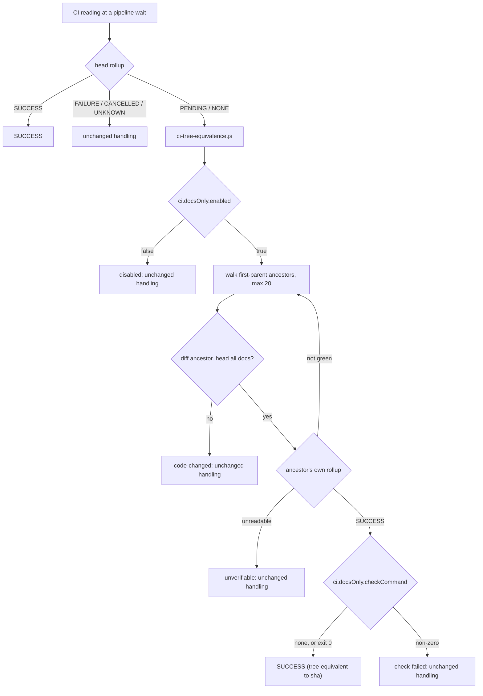

# Technical Task: One docs-only CI rule at every pipeline CI wait

**Status:** Ready for Review

**Review**: ✅ All review recommendations from `task.172.review.1.ci-docs-only-tree-equivalence.md` implemented 2026-10-01

**GitHub Issue**: [#539](https://github.com/Gamaroff/agent-skills/issues/539)

---

## 1. Overview

The develop pipelines wait for a full CI run at three points after the code is final: `/finalise`
reading 1, `/finalise` reading 2, and the merge step of `/develop-next` or `/develop-batch`. The
commits those waits sit on are usually docs only, so the code tree is identical to one CI already
passed. tinker-city story 46.5 (PR #981, 2026-09-30) spent about 2 h 50 min of a 6-hour run on five
34-minute CI runs. Three of them followed markdown-only commits.

This task adds one shared rule, defined once as an engine plus a test, and calls it at every one of
those waits. A reading is satisfied when:

1. the head's rollup is `PENDING` or `NONE`, and
2. a first-parent ancestor of the head has a green rollup of its own, and
3. every file changed between that ancestor and the head matches the docs patterns, and
4. the configured local docs check (if any) passes.

The reading is then recorded as `SUCCESS (tree-equivalent to <sha12>)`, never as plain `SUCCESS`.

**Key deliverables:**

1. `shared/resources/ci-tree-equivalence.js` (pure core + CLI) and its test.
2. `shared/resources/glob-match.js`: the glob matcher moved out of `qa-diminishing-returns.js` so
   the new engine does not pull a 1,000-line QA module into three more skills.
3. Four call sites migrated: `/finalise` Step 6 (reading 1), `/finalise` 6c (reading 2's background
   poll), `/develop-next` Step 3 and `/develop-batch` Step 3.
4. A `ci.docsOnly` block in `skills-config.yaml`, documented in `docs/reference/configuration.md`.

**Expected outcome:** a docs-only commit over a green head no longer costs a full CI wait at any
pipeline step, and the record still says which commit CI actually verified.

Source: the tinker-city hand-off
`~/.claude/projects/-Users-gamaroff-Development-Projects-tinker-city/skill-observations/handoff-2026-09-30-ci-time-develop-pipelines.md`,
change 1. Change 2 is task.173. Change 4 is task.174.

---

## 2. Motivation

### Current Problems

1. **Every docs-only tail commit costs a full CI run.** Story 46.5's last three commits
   (`b8f0c781` 5c review fixes, `9c91813a` the 6a acceptance commit, `e7a7f57a` the Step 8 report)
   changed only markdown. The last code change was `a93df0f7`, first green at `490b3978`. Each still
   waited 2,040 s (the finalise poller's own record, `.claude/state/t465-reading*.txt` in
   tinker-city).
2. **`PENDING` has no docs-only exit anywhere in the pipeline.** `/finalise` Step 6's table maps
   `PENDING` to "Do NOT accept" (`skills/finalise/SKILL.md:885`). The 6c poll's `decided()` accepts
   only `SUCCESS` or `FAILURE` (`skills/finalise/SKILL.md:1436`). `/develop-next` Step 3 requires
   "all must be green" (`skills/develop-next/SKILL.md:182`). `/develop-batch` Step 3 restates the same
   (`skills/develop-batch/SKILL.md:403`).
3. **The rule exists in one consumer, where it cannot fire.** tinker-city `scripts/merge-gate.mjs`
   has `lastGreenAncestor()` and `docsOnlySince()`, read only in its `PENDING` branch. Its
   `qualityGateCommand` (`npm run gate`) runs after `/develop-next` Step 3 has already waited for
   CI, so the rule never gets the chance to fire.
4. **The prose already names the gap and leaves it open.** `skills/finalise/SKILL.md:897` says a
   green on an ancestor is evidence about that commit and not this one. `:1507` calls the Step 8
   report commit "the residue this leaves unverified". Neither gives a rule.

### Benefits of Solution

- About 1 h 40 min saved per item on a 34-minute CI, before any CI-side change (task.174).
- One definition of "docs only". The four sites cannot drift apart.
- The record stays honest: `tree-equivalent to <sha>` names the commit CI verified.
- A consumer whose markdown is executable (this repository) narrows the patterns or adds a local
  check in config, without a skill change.

---

## 3. Technical Background

### Current Architecture

Each current-state name below was grepped on 2026-10-01 and is cited as `path:line` with its
identifier.

- **Reading 1:** `skills/finalise/SKILL.md:780` (`CI_ROLLUP=$(gh pr view "$PR_NUMBER" --json
  statusCheckRollup`), the re-sample loop at `:872` (`# Re-sample undecided states`), and the
  decision table at `:885` (`| PENDING | **Do NOT accept.**`). It is taken on `CI_HEAD_1`, the last
  pushed commit before acceptance.
- **Reading 2:** `skills/finalise/SKILL.md:1379` (`6c. **Second CI reading`). It is a background
  poll written by heredoc to `.claude/state/finalise-ci-poll.sh`. `decided()` is at `:1436`. The
  result line is `"<STATE> <HEAD> <CHECKS> <WAITED>s"` (`:1416`), read back with `read -r` at
  `:1476`.
- **`/develop-next` Step 3:** `skills/develop-next/SKILL.md:182` (`**CI checks** — if the PR has
  them, all must be green.`) and the one-shot rollup at `:195`. Then the local
  `<qualityGateCommand>` runs regardless.
- **`/develop-batch` Step 3:** `skills/develop-batch/SKILL.md:403` restates the same check, and the
  rollup is at `:415`. From the second merge on, the item is rebased on the new base tip first
  (`:373`). A rebased head has no CI run of its own, and its diff to any green ancestor includes
  the item's code, so this rule correctly does not fire there.
- **The rollup reduction is copied three times:** `skills/finalise/SKILL.md:780`,
  `skills/develop-next/SKILL.md:195` and `skills/develop-batch/SKILL.md:415`. Unifying them is out of
  scope (§ 4).
- **Glob matching:** `shared/resources/qa-diminishing-returns.js:121` `globToRegExp`, `:180`
  `normalisePath` and `:194` `matchesAnyGlob` (exported at `:1066`). They are self-contained, with
  no other dependencies.
- **Config reading precedent:** `shared/resources/gh-stage.js:48` requires `./yaml-subset.js`, and
  `:167` reads `skills-config.yaml` itself. The closest key precedent is `qa.testArtifactGlobs` (a
  glob list, default `[]`), documented at `docs/reference/configuration.md` § "The QA loop's
  diminishing-returns exit".
- **Existing guards on the readings:** `evals/shared/tests/ci-once-at-finalise.test.mjs:109–114` and
  `evals/shared/tests/finalise-publish-boundary.test.mjs:161–197` both assert the
  `CI reading 1/2` wording. They must stay green.
- **The consumer's rule (reference, not imported):** tinker-city `scripts/merge-gate.mjs`:
  `docsOnlySince` (`:101`, any `.md`, plus `.yml`/`.yaml` under `docs/`), `lastGreenAncestor`
  (`:392`, the newest `gh run list --status success` run on the branch whose head is an ancestor),
  and `changedSince` (`:427`, where `null` and `[]` are deliberately different).

### Target Architecture



- **Engine `shared/resources/ci-tree-equivalence.js`.** It has a pure core
  (`classifyTreeEquivalence({ headRollup, ancestors, changedByAncestor, patterns, enabled })`) and a
  thin CLI that does the git, `gh` / Bitbucket and `checkCommand` I/O.
  - Exit `0` **only** for `tree-equivalent`. Exit `1` for every other answer (`not-applicable`,
    `disabled`, `code-changed`, `no-green-ancestor`, `unverifiable`, `check-failed`). Exit `2` for
    usage errors. A shell `if` therefore cannot round a "no" up to green. The `--json` payload
    carries `reason`, `greenSha`, `changed[]` and `checkExit`.
  - **`headRollup` gate:** only `PENDING` and `NONE` proceed. `FAILURE`, `CANCELLED`, `UNKNOWN` and
    `SUCCESS` return `not-applicable`. A red head can never be laundered into
    `tree-equivalent`.
  - **The green-ancestor test reads that commit's own checks**, not "any successful workflow run on
    the branch". On GitHub that is `gh api repos/{o}/{r}/commits/{sha}/check-runs` plus `/status`,
    reduced with the Step 6 semantics (decided only at `COMPLETED`; `SKIPPED`/`NEUTRAL` pass; zero
    checks is `NONE`, never green). On Bitbucket it is `/commit/{sha}/statuses`. A `403` there is
    `unverifiable`, never "no CI" (the same trap `skills/finalise/SKILL.md` documents under its
    Bitbucket branch). tinker-city's `gh run list --status success` would accept a light docs-lint
    workflow's green as proof for the whole tree. This task deliberately does not copy that.
  - **Walk:** `git rev-list --first-parent --max-count=20 HEAD^`, in order. For each ancestor,
    compute `git diff --name-only <ancestor> HEAD`. A non-docs path stops the walk with
    `code-changed`, because older ancestors only add to the diff. The first ancestor whose own
    rollup is green wins. A diff that cannot be computed is `unverifiable`, not docs-only (the
    `null`-vs-`[]` rule from tinker-city's `changedSince`).
  - **Docs patterns** come from `ci.docsOnly.patterns`. The default is `["**/*.md", "docs/**"]`,
    the hand-off's set spelled so the matcher reads it as intended (see the measurement below).
  - **Local check:** when `ci.docsOnly.checkCommand` is set, it runs from the repo root after a
    tree-equivalent finding, and a non-zero exit returns `check-failed`. When it is unset, the rule
    still applies (operator decision, 2026-10-01).
- **`shared/resources/glob-match.js`** holds `globToRegExp`, `normalisePath` and `matchesAnyGlob`,
  moved verbatim. `qa-diminishing-returns.js` requires it and keeps exporting `matchesAnyGlob`, so
  its public surface does not change.
- **Call sites.** Each site keeps its own rollup query. On `PENDING`/`NONE` it calls the engine
  with `--head-rollup "$STATE"`. On exit 0 it records `SUCCESS (tree-equivalent to <sha12>)` and
  proceeds as it would on `SUCCESS`. On exit 1 it takes its existing `PENDING`/`NONE` arm unchanged.
  In the 6c poll, `decided()` gains this arm under its existing head-equality condition (2), and the
  result line gains an optional fifth field, `TREE_EQ=<sha12>`, which the later-turn reader prints.

**Measured: the default must be spelled `**/*.md`, not `*.md`** (obs #161, run 2026-10-01):

```
command node -e 'const {matchesAnyGlob:m}=require("./shared/resources/qa-diminishing-returns.js");
  console.log(m("skills/finalise/SKILL.md",["*.md"]), m("skills/finalise/SKILL.md",["**/*.md"]))'
→ false true
```

`*` does not cross `/` in this matcher, so the hand-off's literal `*.md` would match only
repository-root markdown.

**This repository overrides the default.** Here a `SKILL.md` or a `shared/resources/*.md` is
executable prose that tests read. Tests also read `docs/`: for example
`shared/resources/tests/card-preflight-corpus.test.mjs` scans `docs/tasks/`. So this repository's own
`skills-config.yaml` sets `patterns: ["docs/**"]` and `checkCommand: "npm run ci:fast && npm run eval:all"`.
`eval:all` is in the command because it holds `evals/shared/tests/task-registry-drift.test.mjs`, which a
docs-only edit to a task document or the registry can fail, and `ci:fast` does not run it (measured
2026-10-01: `npm run eval:all` takes about 5 s). The
consumer default stays as the operator chose it.

### Same-class mechanism inventory (obs #103)

| Existing mechanism | Relationship |
| --- | --- |
| `/finalise` Step 6 re-sample loop (`:872`) | **Sits beside it.** The re-sample still runs first. The engine is consulted only on what it leaves as `PENDING`/`NONE`. |
| 6c poll `decided()` (`:1436`) | **Extends it** with one arm, under the same head-equality condition. |
| `/finalise` Step 8a's retaken reading 1 (`:2554`) | **Unchanged by design.** The fix head carries code, so the walk returns `code-changed`. |
| `scripts/release-ci-verdict.mjs` (repo-only, `scripts/`) | **Sits beside it.** It reduces a release SHA's workflows and is not shipped to consumers, so the engine cannot require it. The reduction semantics match on purpose. |
| tinker-city `merge-gate.mjs` | **Superseded for the pipeline wait.** The consumer may keep it for its local-steps plan. |

---

## 4. Scope

### In Scope

- ✅ `shared/resources/ci-tree-equivalence.js` and `shared/resources/tests/ci-tree-equivalence.test.mjs`
- ✅ `shared/resources/glob-match.js`, with `qa-diminishing-returns.js` re-pointed at it
- ✅ The four call sites, plus the two notes that name the gap (`skills/finalise/SKILL.md:897`, `:1507`)
- ✅ `ci.docsOnly.{enabled, patterns, checkCommand, checkTimeoutSeconds, settleSeconds}` in `docs/reference/configuration.md` (schema + key reference). The last two were added in QA cycles 2 and 3 (a bounded check; an ancestor settle window)
- ✅ This repository's `skills-config.yaml` override
- ✅ GitHub and Bitbucket ancestor reads
- ✅ `npm run bundle`, CHANGELOG `[Unreleased]`

### Out of Scope

- ❌ Fewer tail commits: that is task.173.
- ❌ The CI-side skip (a consumer's CI not running at all on a docs push): that is task.174.
- ❌ Unifying the three copies of the rollup jq. It is a worthwhile refactor, but a separate one.
  Folding it in would turn a rule change into a rewrite of three gates.
- ❌ `/develop-bug` has no merge step, and it reaches the readings through `/finalise --bug`, so it is
  covered without an edit.
- ❌ Making a rebased `/develop-batch` head skip CI. Its code changed, so it must not.

---

## 5. Breaking Changes

**None to any interface.** Behaviour changes on upgrade, deliberately: a consumer whose tail commit
is docs-only over a green ancestor stops waiting for CI at the four sites. The opt-out is
`ci.docsOnly.enabled: false`. A consumer whose markdown CI can go red sets `checkCommand` or narrows
`patterns`. The CHANGELOG entry says this in its first line.

---

## 6. Implementation Plan

> Detailed implementation guide: [task.172.plan.ci-docs-only-tree-equivalence.md](task.172.plan.ci-docs-only-tree-equivalence.md)

### Phase 1: glob-match primitive (Risk: Low)

- [x] Move `globToRegExp`, `normalisePath` and `matchesAnyGlob` verbatim into `shared/resources/glob-match.js`
- [x] `qa-diminishing-returns.js` requires it, and its export list is unchanged
- [x] `qa-diminishing-returns.test.mjs` and `qa-loop-route.test.mjs` stay green with no edit

### Phase 2: the engine (Risk: Medium)

- [x] Pure `classifyTreeEquivalence` plus the CLI (`--head-rollup`, `--head`, `--pr`, `--json`, `--workspace-root`)
- [x] Config read via `yaml-subset.js`: `ci.docsOnly.enabled` (default `true`), `patterns` (default `["**/*.md","docs/**"]`), `checkCommand` (default unset)
- [x] GitHub and Bitbucket ancestor reads. Any read failure is `unverifiable`
- [x] Exit `0` only for `tree-equivalent`

### Phase 3: migrate the four sites (Risk: Medium)

Depends on Phase 2.

- [x] `/finalise` Step 6: a tree-equivalence arm after the re-sample loop, a `tree-equivalent` row in the decision table, and `CI reading 1: SUCCESS (tree-equivalent to <sha>) @ <head>`
- [x] `/finalise` 6c: the `decided()` arm, the optional `TREE_EQ=` result field, and its later-turn print
- [x] Revise the `:897` and `:1507` notes to point at the rule instead of naming the gap
- [x] `/develop-next` Step 3 and `/develop-batch` Step 3: the arm in "CI checks", with the recorded form in the run report

### Phase 4: config, docs and this repository (Risk: Low)

- [x] `docs/reference/configuration.md`: the schema block and the key-reference rows (five, see § 4), including the rule that `checkCommand` should reproduce every check a workflow path-filtered to the docs patterns runs
- [x] This repository's `skills-config.yaml`: `patterns: ["docs/**"]`, `checkCommand: "npm run ci:fast && npm run eval:all"`, with the reason as a comment
- [x] `npm run bundle`, `npm run generate-catalog` if a description changed, and CHANGELOG

---

## 7. Files Summary

### Files to Add

1. `shared/resources/ci-tree-equivalence.js`: the engine
2. `shared/resources/glob-match.js`: the moved matcher
3. `shared/resources/tests/ci-tree-equivalence.test.mjs`: unit, CLI and wiring tests

### Files to Modify

4. `shared/resources/qa-diminishing-returns.js`: requires `glob-match.js`
5. `skills/finalise/SKILL.md`: Step 6, 6c, and the notes at `:897` and `:1507`
6. `skills/develop-next/SKILL.md`: Step 3 "CI checks"
7. `skills/develop-batch/SKILL.md`: Step 3 "Verify green"
8. `docs/reference/configuration.md`: `ci.docsOnly`
9. `skills-config.yaml`: this repository's override
10. `CHANGELOG.md`: `[Unreleased]`

### Added or modified during QA and the DoD gate (not in the original plan)

- `shared/resources/bb-auth.js` (new): the Bitbucket auth header, moved out of `pr-inline-comment.js` because requiring that file would have pulled about 1,500 lines into three skills; `shared/resources/pr-inline-comment.js` re-exports it
- `shared/resources/tests/_dedent.mjs` (new): a test helper for the extracted prose blocks
- `tests/unbound-default-reads.test.js`, `evals/shared/tests/qa-narrowing-offer-wiring.test.mjs`, `evals/shared/tests/finalise-publish-boundary.test.mjs`: edited to cover the new blocks
- `docs/contributing/traps.md`: lists the engine's test file as load-sensitive (a wall-clock assertion added at the DoD security gate)
- `shared/resources/glob-match.js`: after the move, rewritten as a token-walk matcher (no RegExp), because the RegExp compile was exponential on repeated wildcards (DoD security gate, bug 27)

### Generated (`npm run bundle`, never edited by hand)

11. `skills/{finalise,develop-next,develop-batch}/references/{ci-tree-equivalence.js,glob-match.js,yaml-subset.js}` and every existing bundled copy of `qa-diminishing-returns.js`

### Files to Delete

None.

---

## 8. Testing Strategy

### Unit Tests (`shared/resources/tests/ci-tree-equivalence.test.mjs`)

- **Pure core, table-driven:** every `headRollup` value, where `FAILURE`/`CANCELLED`/`UNKNOWN`/`SUCCESS` give `not-applicable`. Also: `enabled: false`; a code path at the first ancestor; a green ancestor two docs-commits back; a non-green docs ancestor followed by a green one; zero checks treated as not green; an uncomputable diff giving `unverifiable`; the 20-ancestor bound.
- **Patterns:** the default matches `skills/x/SKILL.md`, `docs/a/b.yml` and `README.md`, and does not match `.github/workflows/ci.yml` or `src/a.ts`. The repository override `["docs/**"]` does not match `skills/x/SKILL.md`.
- **CLI against real temporary git repositories** with a fake `gh` on `PATH`: tree-equivalent exits 0; each "no" exits 1; usage exits 2; a `403` Bitbucket fake gives `unverifiable`; a failing `checkCommand` gives `check-failed`.

### Wiring tests

- Each of the four sites invokes the engine with `--head-rollup` inside its `PENDING`/`NONE` arm. A positive marker is asserted at each site, and the population is derived from the files that carry a `statusCheckRollup` read, with a non-vacuity floor of 3 (obs #135).
- The 6c poll heredoc, extracted and run against a fake `gh`, writes `TREE_EQ=` on a docs-only head and does not on a code head.

### Mutation proofs (obs: mutation-prove every fix)

- Let `FAILURE` through the `headRollup` gate: a test goes red.
- Accept a zero-check ancestor as green: a test goes red.
- Make the diff failure return `[]`: a test goes red.

### Regression

- `npm run ci`, including `ci-once-at-finalise.test.mjs`, `finalise-publish-boundary.test.mjs` and the QA-route suites (Phase 1).

---

## 9. Success Criteria

### Functional

- [ ] A head whose rollup is `PENDING`, two markdown commits over a green ancestor, yields `SUCCESS (tree-equivalent to <sha12>)` at all four sites (Phase 2 walk, Phase 3 arms)
- [ ] A head whose rollup is `FAILURE` is never tree-equivalent, whatever its diff (Phase 2 `headRollup` gate)
- [ ] A code path anywhere in the delta returns `code-changed`, and the site waits exactly as before
- [ ] A Bitbucket `403` returns `unverifiable` and the site waits as before
- [ ] `ci.docsOnly.enabled: false` restores today's behaviour byte for byte at every site

### Performance

- [ ] A docs-only reading resolves in under 60 s on a fake-`gh` fixture (no 30 s poll sleep before the first engine call, except 6c's existing `WAITED > 0` rule)
- [ ] The engine makes at most `1 + docs-only-commits-on-top` ancestor reads

### Code Quality

- [ ] Every test written for a defect found by QA, the PR review or the DoD security gate is mutation-proved red on revert (the QA reports' `mutation-proven:` lines record each). _Narrowed on 2026-10-01 after `/finalise` run 1, by the operator, from "every new test": the 51 tests written with the first implementation carry 14 proofs, and a per-test ledger for the rest was judged not worth its cost._
- [ ] `npm run ci` green; `npm run validate -- skills/finalise/`, `skills/develop-next/`, `skills/develop-batch/` pass
- [ ] `npm run bundle:check` clean, with no `UNREACHED` copy

### Migration

- [ ] CHANGELOG `[Unreleased]` names the behaviour change and the opt-out
- [ ] `configuration.md` documents all five keys (`enabled`, `patterns`, `checkCommand`, `checkTimeoutSeconds`, `settleSeconds`) with their defaults and the `**/*.md` spelling note

---

## 10. Risk Assessment

### High Risk Areas

1. **A docs-only commit that turns CI red is let through.** This repository's doc-link checker and
   corpus tests are both examples.
   - Probability: Medium. Impact: High (a red merge).
   - Mitigation: `checkCommand`. This repository sets `npm run ci:fast && npm run eval:all`. `/develop-next` Step 3 still
     runs `<qualityGateCommand>` locally regardless. The record says `tree-equivalent`, so a later red
     is traceable to its cause.
   - Residual, accepted and documented: `.github/workflows/docs-link-check.yml` runs only on pushes that
     touch `docs/**/*.md`, `README.md`, `AGENTS.md` or `CONTRIBUTING.md`, and checks external URLs with
     `markdown-link-check`. A green ancestor that touched none of those never ran it, and no local
     `checkCommand` reproduces URL reachability. A docs-only commit can therefore turn that one workflow
     red after the pipeline recorded `tree-equivalent`. `configuration.md` states the rule for a consumer:
     `checkCommand` should reproduce every check that a workflow path-filtered to the docs patterns runs.
   - Rollback: `ci.docsOnly.enabled: false`.

### Medium Risk Areas

2. **The ancestor read accepts a partial rollup as green.** Mitigation: zero checks counts as `NONE`;
   decided only at `COMPLETED`; a test for each.
3. **The 6c poll format change breaks the later-turn reader.** `read -r` with four names binds the
   rest of the line to the last one: measured, `WAITED` becomes `60s TREE_EQ=…`. Mitigation: the
   reader at `:1476` gains a fifth name in the same edit, and a wiring test runs the heredoc and the
   reader together.
4. **Bundle closure growth.** Three skills gain the engine plus `glob-match.js` and `yaml-subset.js`.
   Mitigation: moving the matcher out keeps `qa-diminishing-returns.js` out of the closure. Check the
   bundler's `closure M (±K)` line.

### Low Risk Areas

5. **`/develop-batch` rebased heads.** Their code changed, so the rule correctly does not fire.
   Documented in Step 3.
6. **The default set includes a consumer's executable markdown.** It is the operator's chosen default
   and documented with the override.

---

## 11. Rollback Plan

### Immediate Rollback (< 1 hour)

- **Triggers:** a merge or acceptance recorded `tree-equivalent` whose next real CI run is red for a
  reason the docs delta introduced.
- **Steps:** set `ci.docsOnly.enabled: false` in the affected consumer, which restores today's
  behaviour with no release. To withdraw it everywhere, revert the Phase 3 commit and re-release.
- **Validation:** the next pipeline run records plain `SUCCESS` readings after a full wait.

### Partial Rollback (1–2 hours)

- Revert one call site's arm (for example only 6c) and keep the others. Each arm is a separate hunk.

### Forward Fix

- A wrong pattern default or a missed ancestor shape is fixed forward in the engine and its table.

### Rollback Triggers

- **Critical:** any `tree-equivalent` recorded over a `FAILURE` head, or over a code delta.
- **Non-critical:** a docs-only head that still waits (a false "no"). Fix it forward.

---

## QA Testing Results

**QA Status**: PASS
**QA Engineer**: QA Engineer
**Testing Date**: 2026-10-01
**Quality Score**: 95/100
**Gate Decision**: PASS

### QA Report
- **Full Report**: [task.172.qa.8.ci-docs-only-tree-equivalence.md](./task.172.qa.8.ci-docs-only-tree-equivalence.md)
- **Gate File**: [task.172.gate.8.ci-docs-only-tree-equivalence.yml](./task.172.gate.8.ci-docs-only-tree-equivalence.yml)

### Test Coverage Summary
- **Tests Executed**: 97 engine tests (plus the fast gate on the fix commit: 4,910 of 4,911)
- **Phases Verified**: 4/4
- **Critical Issues**: 0 HIGH, 0 MEDIUM, 1 LOW
- **NFR Status**: Security: PASS, Performance: PASS, Reliability: PASS, Maintainability: PASS

### Key Findings
The four security findings from `/finalise` run 1 are fixed and mutation-proven. No HIGH or MEDIUM finding is open. One reproduced LOW remains, carried by the cosmetic-residue exit: a check detached into its own session no longer receives an interrupt sent to the engine's process group.

### Deferred Work

- **Carried from gate 8 by the Cosmetic-residue exit (route 2b, cycle 8)**: CR8-1. One LOW finding (a check detached into its own session no longer receives an interrupt sent to the engine's process group), moved to the gate's `recommendations.future` by id. Also recorded there, not gating: the rename/copy and unreadable-`git status` branches of the dirty-tree rule have no test.
- **Carried from gate 7 by the Cosmetic-residue exit (route 2b, cycle 7)**: CR7-1. One LOW finding (a quoted `ci` key or uniformly indented top-level keys are refused with exit 2; fails closed), moved to the gate's `recommendations.future` by id.
- Recorded in gate 7's `recommendations.future`, not attributable to cycle 6: a `ci` block nested under another key, or with its `docsOnly` children dedented to column 0, reads as the defaults (valid YAML with a different meaning, identical in the cycle 5 engine); the second comment-stripping rule beside `yaml-subset.js`'s; the CANCELLED nearer ancestor that the 6c poll re-asks.
- If a further gate finds another configuration-reading defect: replace the `ci` block reader with a dedicated strict one rather than a further spelling of the completeness check.

## Definition of Done - Gaps Identified

**Status:** IN PROGRESS (not accepted)

### QA Gate Status

**QA Report**: `task.172.qa.7.ci-docs-only-tree-equivalence.md`
**Gate File**: `task.172.gate.7.ci-docs-only-tree-equivalence.yml`
**Gate Status**: ✅ PASS (95/100), through the Cosmetic-residue exit; the Step 5c PR review read ⚠️ CONCERNS (no high finding)

### Missing Criteria:

1. **Acceptance Criteria:**
   - [ ] CodeQuality-1, "every new test is mutation-proved red on revert", is evidenced per fix, not per test (93 tests, no per-test ledger)

2. **Security Review:**
   - [ ] **MEDIUM** the `checkCommand` timeout kills only `sh -c`, so a check's child processes keep running (`shared/resources/ci-tree-equivalence.js:890`)
   - [ ] **MEDIUM** the glob matcher is exponential on repeated `*a` / `**/` patterns taken from the head commit's config (`shared/resources/glob-match.js:54`)
   - [ ] LOW `checkCommand` can run against a dirty working tree (`shared/resources/ci-tree-equivalence.js:855`)
   - [ ] LOW `isDocsPath` accepts `docs/../src/a.js` (`shared/resources/ci-tree-equivalence.js:126`)

### Next Steps:

- [ ] Fix the two MEDIUM security findings and the two LOW ones, each with a test that goes red on revert
- [ ] Record a per-test mutation proof, or narrow CodeQuality-1 to "every fix-driven test" (a work-item edit)
- [ ] Update "three keys" to five (Files Summary, Phase 4, Success Criteria) and list the files the Files Summary omits
- [ ] Re-run `/qa-task` over the fixes, then `/finalise`

**Estimated Effort:** Medium (3-5 hours)

**Gap Report Generated:** 2026-10-01
**Detailed Verification Log:** See `task.172.dod.1.ci-docs-only-tree-equivalence.md` for the evidence and citations.

<!-- change-log-start -->

## Change Log

| Date       | Version | Description   | Author      |
| ---------- | ------- | ------------- | ----------- |
| 2026-10-01 | 1.0     | Initial draft | create-task |
| 2026-10-01 | 1.1     | Review passed (9/10) — repository `checkCommand` widened to `ci:fast && eval:all`; path-filtered-workflow residual recorded | review-task |
| 2026-10-01 |         | Status → ready-for-development | review-task |
| 2026-10-01 |         | Implemented — 4 new + 10 modified files (and generated bundle copies), 51 new tests; yaml-subset forced a block-list config spelling | develop |
| 2026-10-01 |  | QA gate FAIL (60/100) — 3 findings | qa-task |
| 2026-10-01 |  | QA findings fixed — 3 findings (2 HIGH, 1 MEDIUM) plus 2 advisory, 1 iteration | qa-fix |
| 2026-10-01 |  | QA gate FAIL (50/100) — 8 findings | qa-task |
| 2026-10-01 |  | QA findings fixed — 8 findings (2 HIGH, 6 MEDIUM) plus 1 advisory, 1 iteration | qa-fix |
| 2026-10-01 |  | QA gate CONCERNS (65/100) — 8 findings | qa-task |
| 2026-10-01 |  | QA findings fixed — 8 findings (7 MEDIUM, 1 LOW) plus 3 advisory, 1 iteration | qa-fix |
| 2026-10-01 |  | QA gate CONCERNS (75/100) — 2 findings | qa-task |
| 2026-10-01 |  | QA findings fixed — 2 findings (2 MEDIUM) plus 1 advisory, 1 iteration | qa-fix |
| 2026-10-01 |  | QA gate CONCERNS (70/100) — 3 findings | qa-task |
| 2026-10-01 |  | QA gate CONCERNS (75/100) — 2 findings | qa-task |
| 2026-10-01 |  | QA findings fixed — 2 findings (2 MEDIUM) plus 3 advisory, 1 iteration | qa-fix |
| 2026-10-01 |  | QA gate PASS (95/100) — 1 finding | qa-task |
| 2026-10-01 |  | DoD incomplete — 5 gaps identified | finalise |
| 2026-10-01 |  | Scope amendments recorded after finalise run 1 (five config keys, files added during QA and the DoD gate); CodeQuality-1 narrowed by the operator from every new test to every fix-driven test | develop |
| 2026-10-01 |  | QA gate PASS (95/100) — 1 finding | qa-task |

<!-- change-log-end -->

---

## Progress Tracking

- [x] Phase 1: glob-match primitive
- [x] Phase 2: the engine
- [x] Phase 3: migrate the four sites
- [x] Phase 4: config, docs and this repository

---

## References

- Hand-off: `~/.claude/projects/-Users-gamaroff-Development-Projects-tinker-city/skill-observations/handoff-2026-09-30-ci-time-develop-pipelines.md` (change 1)
- tinker-city PR #981 (story 46.5), with CI readings 1 and 2 on its canonical summary comment
- tinker-city `scripts/merge-gate.mjs`: `lastGreenAncestor()`, `docsOnlySince()`, `changedSince()`
- tinker-city task.127 (#982): the CI-side skip, and the reason task.174 exists
- task.173: fewer tail commits (independent of this task)

---

## Notes

### Important Reminders

- QA artifacts land in this directory: `task.172.qa.{N}.ci-docs-only-tree-equivalence.md`,
  `task.172.gate.{N}.ci-docs-only-tree-equivalence.yml`, bug reports `task.172.bug.{N}.{name}.md`.
- This task's own `/finalise` run is the first to exercise the rule in this repository, under the
  `docs/**` + `npm run ci:fast && npm run eval:all` override. Record what it did in the implementation report.
