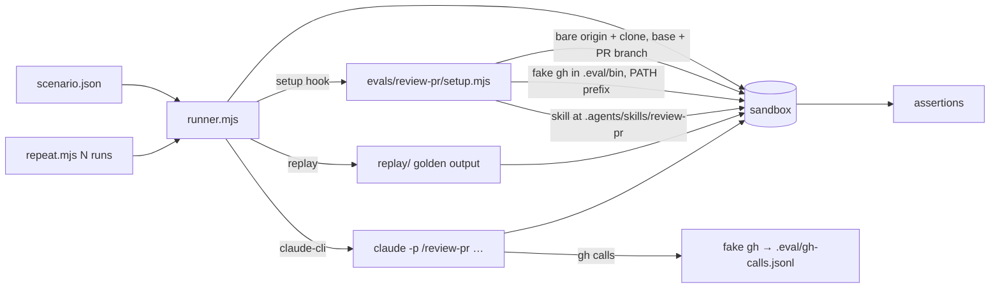

# Technical Task: review-pr eval suite

**Status:** Planned

**GitHub Issue**: [#573](https://github.com/Gamaroff/agent-skills/issues/573)

---

## 1. Overview

`/review-pr` has 247 unit tests (`command node --test skills/review-pr/tests/*.test.js`, 2026-10-05)
and no eval. The unit tests prove its shell snippets and parser behave; nothing runs the skill end to
end and checks what it writes. This task adds an eval suite under `evals/review-pr/` with four
scenarios, extends the shared harness just enough to run a skill that needs a git remote and `gh`,
and replaces the prose rule for the report number with a script.

**Scope:** one task in four phases. Phase 1 makes the report number deterministic. Phase 2 extends
the shared harness (a per-scenario setup hook, a fake `gh`, driver flags, a repeat runner, one
assertion). Phase 3 builds the four scenarios. Phase 4 wires scripts, docs and CHANGELOG.

**Key deliverables:**

- `skills/review-pr/scripts/next-report-number.sh` — prints the next `.pr-review.{n}.` for a work-item directory, and Step 7 calls it.
- `evals/review-pr/` — four scenarios, a shared `setup.mjs`, a fake `gh`, a README.
- `npm run eval:review-pr` (replay, in `eval:all`) and `npm run eval:review-pr:cli` (live, N runs, pass rate).

**Expected outcome:** CI proves the scenario plumbing on every push; a developer can run
`eval:review-pr:cli` and get a per-scenario pass rate for the real skill, with no network, no real
PR and no outward-facing call.

---

## 2. Motivation

### Current Problems

- **No end-to-end evidence.** Every `/review-pr` guarantee that matters to a user — the verdict, the
  report's name and place, writing nothing when unanchored, never posting without asking — is held by
  prose plus source-text tests. Memory `feedback_assert_behaviour_not_source_text` records why that is
  weak: on task.84, grepping the source caught 0 of 27 defects.
- **The report number is agent-derived.** `skills/review-pr/SKILL.md:633`
  (*`{n}` starts at 1 and increments on re-review*) does not say max+1 or count+1, and no code
  computes it. The only test, `skills/review-pr/tests/review-pr.test.js:538`
  (*the report uses the .pr-review.{n}. artifact kind*), greps for the string. A directory holding
  `.1.` and `.3.` lets count+1 overwrite `.3.` (obs #272).
- **The harness cannot run this skill live.** A live driver starts from an empty tmpdir
  (`evals/shared/runner.mjs:235`, `makeSandbox`), with no git repo, no `origin`, and the real `gh` on
  `PATH`. `/review-pr` needs all three: `git fetch origin` (`SKILL.md:515`), `gh pr view`
  (`SKILL.md:390`), and `gh pr diff` (`SKILL.md:531`).
- **Live runs vary.** One live run is one sample. A verdict scenario needs a pass rate, and the runner
  runs a scenario once (`runner.mjs:305`).

### Benefits of Solution

- The skill's four user-visible guarantees are checked by running it, not by reading it.
- A hermetic sandbox: no network, no real PR, and every `gh` write call is refused and logged, so
  "never posts without asking" becomes an assertion.
- The setup hook, fake `gh` and repeat runner are shared, so the next skill that needs a remote
  (`review-code`, `create-pr`) reuses them.
- The numbering defect closes with a test that holds it.

---

## 3. Technical Background

### Current Architecture

**Eval harness** (`evals/shared/`):

- `runner.mjs` reads `scenario.json` and `env.json`, makes an empty sandbox (`runner.mjs:235`), builds
  `driverEnv` from `env.json` plus `SCENARIO_DIR` (`runner.mjs:240`), runs the driver once
  (`runner.mjs:305`), then runs assertions. There is no pre-driver setup step. `env.json` values are
  static, so a scenario cannot put `$SANDBOX/.eval/bin` on `PATH`.
- `drivers/replay.mjs:44` copies `scenarios/<name>/replay/**` into the sandbox. No agent runs.
- `drivers/claude-cli.mjs` installs the skill at `.claude/skills/<skill>` (`claude-cli.mjs:48`), runs
  `claude -p <prompt> --add-dir <sandbox>` (`claude-cli.mjs:74`) with **no permission flag**, and
  times out at 5 minutes (`claude-cli.mjs:85`).
- `lib/git-sandbox.mjs:30` always creates its own tmpdir, so it cannot build a repo inside the
  runner's sandbox.
- Assertions (`assertions.mjs`) include `fileExists`, `fileAbsent`, `fileMatches`,
  `fileDoesNotMatch`. None asserts "no file matching a pattern under a directory".
- `package.json:48` `eval:all` loops six scenario globs; `.github/workflows/test.yml:56` runs it on
  every push and PR (no `paths:` filter, `test.yml:3-6`).
- `.gitignore:62-64` re-includes `evals/**/replay/**` only.

**`/review-pr`:**

- Step 2 lists prior reports with `find "$D" -maxdepth 1 -name '*.pr-review.*.md'` (`SKILL.md:486`).
- Step 7 states the `{n}` rule in prose (`SKILL.md:633`) and writes no file when no work item resolves
  (`SKILL.md:635`).
- Step 8 posts only with `--comment`, or after asking (`SKILL.md:52`, *ask before posting*); the write calls are
  `gh api -X PATCH` and `gh pr comment` (`SKILL.md:768`, `SKILL.md:773`). It never calls
  `gh pr review --approve` (`SKILL.md:622`).
- The skill's snippets address their own files as `.agents/skills/review-pr/…` (for example
  `SKILL.md:724`, `doc-links.js`).

No existing helper computes an artifact's next `{n}`: `grep -rln "nextArtifactNumber\|artifact-number"
shared/resources skills/*/scripts` returns nothing. `finalise` describes `.dod.{n}.` the same way, in
prose.

### Target Architecture

- **Setup hook.** `scenario.json` may name `"setup": "<path relative to the scenario>"`. Before the
  driver runs, the runner imports it and awaits `setup({ sandbox, scenarioDir, repoRoot })`. The hook
  returns `{ env }`, which the runner merges into `driverEnv`; a `PATH` value is **prefixed** to the
  existing `PATH`. Scenarios without `setup` behave exactly as today.
- **Fake `gh`.** `evals/shared/lib/fake-gh.mjs` plus a `gh` launcher written into `.eval/bin/`. It
  serves `pr view`, `pr diff`, `pr list`, `repo view` and `issue view` from the scenario's
  `gh-fixtures.json`, logs every call as one JSON line to `.eval/gh-calls.jsonl`, and refuses every
  write (`pr comment`, `pr review`, `pr edit`, `pr merge`, `api` with `-X`/`--method` other than GET,
  `issue comment`) with exit 1 and a `"refused": true` log line.
- **git-sandbox** gains an optional `dir` argument: when given, it initialises the repo there instead
  of in a new tmpdir. Existing callers are unchanged.
- **claude-cli driver** reads `scenario.cliArgs` (array, appended to the `claude` arguments) and
  `EVAL_TIMEOUT_MS` (default stays 5 minutes). The `review-pr` scenarios pass a scoped
  `--allowedTools` list; no other scenario changes.
- **New assertion** `noFileMatching(dir, regex)` — passes when no file under `dir` (recursive) has a
  basename matching `regex`.
- **Repeat runner** `evals/shared/repeat.mjs <scenario-dir> --runs N --min-pass K` runs the runner N
  times and exits 0 when at least K passed, printing `passed P/N`.
- **Report number.** `next-report-number.sh <dir>` prints the numeric maximum of the `{n}` in
  `*.pr-review.{n}.*.md` directly under `<dir>`, plus 1, or `1` when there is none. Base 10, so
  `.09.` reads as 9 and `.10.` beats `.9.`. Step 7 calls it instead of the prose rule.

---

## 4. Scope

### In Scope

✅ `next-report-number.sh`, its tests (bash and zsh), and the Step 7 call (obs #272).
✅ Runner setup hook and `liveAssertions`, `fake-gh.mjs`, `git-sandbox` `dir` option, `cliArgs` / `EVAL_TIMEOUT_MS` in the
   claude-cli driver, `noFileMatching`, `repeat.mjs` — each with tests in `evals/shared/tests/`.
✅ Scenarios 01–04 under `evals/review-pr/scenarios/`, a shared `setup.mjs`, replay golden output,
   and a README.
✅ `eval:review-pr`, `eval:review-pr:cli`, the `eval:all` entry, the `npm test` glob for
   `evals/review-pr/unit/*.test.mjs`, `.gitignore` re-inclusion for any `fixture/` tree, CHANGELOG.

### Out of Scope

❌ Scenarios 5–7 (scope creep, trail gap, pre-existing defect / obs #271) — the follow-up task. They
   reuse everything this task builds.
❌ Bitbucket and Jira paths. The fake `gh` covers GitHub only; a fake Bitbucket API is its own job.
❌ The `claude-sdk` driver (still a stub) and live runs in CI. Live is opt-in and costs model calls.
❌ Changing `finalise`'s `.dod.{n}.` rule. The new script is review-pr's; sharing it is a later call.
❌ `--comment` / `--inline` posting paths — this task asserts they are **not** taken.

---

## 5. Breaking Changes

None — API stable. Every harness change is additive and opt-in by a new `scenario.json` field.
Existing scenarios do not set `setup` or `cliArgs`, so they run exactly as before; the full
`eval:all` run is the check. `/review-pr` keeps its report filename format; only the way `{n}` is
derived changes, and it agrees with the prose rule on every contiguous directory in the tree today.

---

## 6. Implementation Plan

> Detailed implementation guide: [task.185.plan.review-pr-eval-suite.md](task.185.plan.review-pr-eval-suite.md)

### Phase 1: deterministic report number (obs #272)

**Risk:** Low · **Files:** `skills/review-pr/scripts/next-report-number.sh`, `skills/review-pr/SKILL.md`
(Step 7), `skills/review-pr/tests/review-pr.test.js` · **Depends on:** none

- [ ] Add `next-report-number.sh <dir>`: numeric max + 1 over `*.pr-review.{n}.*.md` at depth 1; `1` when none; exit 2 on a missing or non-directory argument.
- [ ] Step 7 runs it and uses its output as `{n}`; the prose names the rule (highest + 1, never count + 1) and why (a gap).
- [ ] Tests under bash and zsh: empty dir → 1; `.1.` → 2; `.1.`+`.3.` → 4; `.9.`+`.10.` → 11; `.09.` → 10; a `.review.` file and another work item's sibling dir are ignored.
- [ ] Measure against the tree: for every tracked work-item dir with reports, the script returns the existing max + 1 (`git ls-files | grep '\.pr-review\.'`).

### Phase 2: harness extensions

**Risk:** Medium (shared runner) · **Files:** `evals/shared/runner.mjs`, `evals/shared/lib/fake-gh.mjs`,
`evals/shared/lib/git-sandbox.mjs`, `evals/shared/drivers/claude-cli.mjs`, `evals/shared/assertions.mjs`,
`evals/shared/repeat.mjs`, `evals/shared/tests/*` · **Depends on:** none

- [ ] Runner: optional `setup` hook before the driver; merge returned `env`, prefix `PATH`; a hook that throws fails the scenario (exit 1) and still removes the sandbox.
- [ ] `fake-gh.mjs`: read commands from `gh-fixtures.json`, log every call, refuse writes; unknown read command → exit 1 with `"unhandled": true` logged (so a gap shows as a failure, not a guess).
- [ ] `git-sandbox`: optional `dir`.
- [ ] claude-cli: `scenario.cliArgs` appended; `EVAL_TIMEOUT_MS` honoured. The runner passes `cliArgs` on the context.
- [ ] `noFileMatching` assertion, registered in the runner's switch.
- [ ] `liveAssertions`: run only when the driver is not `replay`, so a live run can assert the fake `gh` was called.
- [ ] `repeat.mjs`: `--runs`, `--min-pass`; reports `passed P/N`; exit 0 iff P ≥ K.
- [ ] Tests for each, in `evals/shared/tests/`.

### Phase 3: the four scenarios

**Risk:** Medium (live verdicts vary) · **Files:** `evals/review-pr/**` · **Depends on:** Phases 1 and 2

- [ ] `setup.mjs`: bare `origin.git` + working clone with `develop` and `feature/task.901.widget-age-gate`; the work item at `docs/tasks/task.901.widget-age-gate/` with a complete trail; the skill copied to `.agents/skills/review-pr` (and `.claude/skills/review-pr` for discovery); fake `gh` installed; per-scenario variations from `scenario.json` `fixture`.
- [ ] **01-happy** — PR delivers every criterion, trail complete. Assert report `task.901.pr-review.1.widget-age-gate.md` exists in the task dir, `**Verdict:**` reads APPROVE, the Machine-Readable Findings block is present, no refused call in `gh-calls.jsonl`.
- [ ] **02-renumber-gap** — the dir already holds `.pr-review.1.` and `.pr-review.3.` (with a sentinel line). Assert `.pr-review.4.` is written and `.3.` still holds its sentinel.
- [ ] **03-unanchored** — the PR branch is `chore/tidy` and no document names the PR. Assert `noFileMatching(docs, \.pr-review\.)`, and no refused call.
- [ ] **04-planted-bug** — the diff implements "18 and over is an adult" as `age > 18` with no test at 18. Assert the verdict is **not** APPROVE and a `CR-` finding cites the changed file.
- [ ] Replay golden output for each, so `eval:review-pr` passes in CI with no model.
- [ ] Live verification: `eval:review-pr:cli` at N=5 — record P/N per scenario in the implementation report.

### Phase 4: wiring and docs

**Risk:** Low · **Depends on:** Phases 1–3

- [ ] `package.json`: `eval:review-pr` (replay loop), `eval:review-pr:cli` (repeat runner, `DRIVER=claude-cli`), `evals/review-pr/scenarios/*/` added to `eval:all`, `evals/review-pr/unit/*.test.mjs` added to `npm test` if any unit test lands there.
- [ ] `.gitignore`: re-include `evals/**/fixture/**` beside the `replay` negation, if a fixture tree is committed.
- [ ] `evals/review-pr/README.md`, `evals/shared/README.md` (setup hook, fake `gh`, repeat runner), `docs/contributing/evals/README.md` layer table.
- [ ] CHANGELOG `[Unreleased]`.

---

## 7. Files Summary

**Core implementation**

1. ✅ `skills/review-pr/scripts/next-report-number.sh` — new
2. ✅ `skills/review-pr/SKILL.md` — Step 7 calls the script
3. ✅ `evals/shared/runner.mjs` — setup hook, `cliArgs` on context, `noFileMatching` case
4. ✅ `evals/shared/lib/fake-gh.mjs` — new
5. ✅ `evals/shared/lib/git-sandbox.mjs` — `dir` option
6. ✅ `evals/shared/drivers/claude-cli.mjs` — `cliArgs`, `EVAL_TIMEOUT_MS`
7. ✅ `evals/shared/assertions.mjs` — `noFileMatching`
8. ✅ `evals/shared/repeat.mjs` — new
9. ✅ `evals/review-pr/setup.mjs`, `evals/review-pr/scenarios/0{1..4}-*/{scenario.json,gh-fixtures.json,replay/**}` — new

**Tests**

10. ✅ `skills/review-pr/tests/review-pr.test.js` — the script, under bash and zsh
11. ✅ `evals/shared/tests/{runner-setup,fake-gh,repeat,assertions,git-sandbox,drivers}.test.mjs` — new or extended

**Config / docs**

12. ✅ `package.json`, `.gitignore`
13. ✅ `evals/review-pr/README.md`, `evals/shared/README.md`, `docs/contributing/evals/README.md`
14. ✅ `CHANGELOG.md`

---

## 8. Testing Strategy

**Unit (hermetic, in `npm test`):**

- `next-report-number.sh` table above, under bash and zsh, using the `SHELLS` idiom already in
  `review-pr.test.js:29-33`.
- `fake-gh`: each read command returns its fixture; each write command exits 1 and logs
  `"refused": true`; an unhandled command exits 1 and logs `"unhandled": true`.
- Runner: a scenario with a `setup` that writes a file and returns `{ env: { PATH, FOO } }` — the
  driver sees `FOO` and the prefixed `PATH`; a throwing setup exits 1 and leaves no sandbox.
- `repeat.mjs`: with a stub scenario that passes on alternate runs, `--runs 4 --min-pass 2` exits 0
  and `--min-pass 3` exits 1.
- `noFileMatching`: nested match fails; no match passes; missing dir passes.

**Replay evals (CI, `eval:all`):** all four scenarios. They prove setup, fixtures and assertions fit
together; they do not judge the skill.

**Live evals (opt-in):** `eval:review-pr:cli`, N=5. This is the only layer that judges the skill.

**Mutation proof (memory `feedback_mutation_prove_every_fix`):** revert Step 7 to the prose rule and
confirm scenario 02 fails live; make the fake `gh` accept `pr comment` and confirm the no-refused-call
assertion still catches a posting run; make `next-report-number.sh` return count + 1 and confirm the
gap test goes red.

**Regression:** full `npm test` and `npm run eval:all` — every existing scenario unchanged.

---

## 9. Success Criteria

### Functional

- [ ] `next-report-number.sh` returns `4` for a directory holding `.pr-review.1.` and `.pr-review.3.` (Phase 1 states the max + 1 branch), under bash and zsh.
- [ ] `npm run eval:review-pr` passes 4/4 scenarios in replay mode.
- [ ] `npm run eval:review-pr:cli` with N=5: scenarios 02 and 03 pass 5/5; scenarios 01 and 04 pass ≥ 4/5. Recorded in the implementation report with the command.
- [ ] No live run logs a refused or unhandled `gh` call.

### Performance

- [ ] A live scenario finishes inside the default `EVAL_TIMEOUT_MS`, or the scenario sets a higher one and the README says why.
- [ ] `eval:all` wall time grows by under 10 s for the four replay scenarios (measured before and after).

### Code Quality

- [ ] `npm test` passes, including the new tests.
- [ ] `python skills/create-skill/scripts/quick_validate.py skills/review-pr` passes.
- [ ] `npm run lint:shell` passes on `next-report-number.sh`.
- [ ] `npm run bundle:check` passes.

### Migration

- [ ] CHANGELOG `[Unreleased]` entry.
- [ ] `evals/shared/README.md` documents the setup hook, fake `gh` and repeat runner.
- [ ] Existing scenarios run unchanged (no `setup`, no `cliArgs`).

---

## 10. Risk Assessment

### HIGH RISK

None.

### MEDIUM RISK

1. **Live runs need tool permissions.** `claude -p` with no permission flag (`claude-cli.mjs:74`)
   cannot run `Bash`, and `/review-pr` is mostly Bash. *Mitigation:* scenario-scoped `cliArgs` with an
   explicit `--allowedTools` list, verified first in Phase 3 before any assertion is tuned. Bypassing
   all permissions is not the default.
2. **The real `gh` is still reachable by absolute path.** The fake only wins through `PATH`.
   *Mitigation:* the skill calls bare `gh`, and a `liveAssertions` entry requires a `pr view` line in
   `gh-calls.jsonl`, so a run that bypassed the fake fails. No `GH_TOKEN` is set in the sandbox env.
3. **Verdict scenarios are noisy.** *Mitigation:* pass rate, not single runs; the planted bug is
   unambiguous (boundary off by one, stated in the criterion, no test).
4. **Runner change touches every scenario.** *Mitigation:* the hook is opt-in; full `eval:all` before
   and after.

### LOW RISK

1. **Replay passes say little about the skill.** Stated in the README so nobody reads a green replay
   as a verdict on the skill.
2. **Two lenses may exceed 5 minutes.** `EVAL_TIMEOUT_MS` per scenario.

---

## 11. Rollback Plan

### Immediate Rollback (< 1 hour)

- **Triggers:** an existing scenario in `eval:all` fails, or `npm test` goes red on a shared-harness test.
- **Steps:** revert the merge commit; CI re-runs `eval:all`.
- **Validation:** `npm test` and `npm run eval:all` green on the revert.

### Partial Rollback

- Remove the `evals/review-pr/scenarios/*/` entry from `eval:all` and keep the harness and the script
  if only the review-pr scenarios misbehave in CI.

### Forward Fix

- A noisy live scenario: tighten the fixture or lower `--min-pass` with a stated reason, never delete
  the assertion.

---

## Change Log

<!-- change-log-start -->
| Date       | Version | Description                                                     | Author      |
| ---------- | ------- | --------------------------------------------------------------- | ----------- |
| 2026-10-05 | 1.0     | Initial draft — review-pr eval suite, scenarios 1–4, obs #272 fix | create-task |
<!-- change-log-end -->

---

## Progress Tracking

- [ ] Phase 1: deterministic report number (obs #272)
- [ ] Phase 2: harness extensions
- [ ] Phase 3: the four scenarios
- [ ] Phase 4: wiring and docs

---

## References

- `skills/review-pr/SKILL.md` — Steps 2, 4, 7, 8
- `evals/shared/README.md`, `docs/contributing/evals/README.md`
- Observation #272: review-pr report `{n}` is agent-derived prose, not computed or behaviour-tested
- Observation #271: review-pr verdict counts pre-existing findings — scenario 7, follow-up task
- task.66 (`/review-pr`), task.77 (Step 5c), task.85 (machine-readable findings)

---

## Notes

### Important Reminders

- QA artifacts land in this directory: `task.185.qa.{N}.review-pr-eval-suite.md`,
  `task.185.gate.{N}.review-pr-eval-suite.yml`, bug reports `task.185.bug.{N}.{name}.md`.
- Scenarios 5–7 are the follow-up task; file it when this one merges, so it can reuse the harness as
  built rather than as planned.
- The fixture work item is `task.901` so it can never collide with a real task number in this repo.
