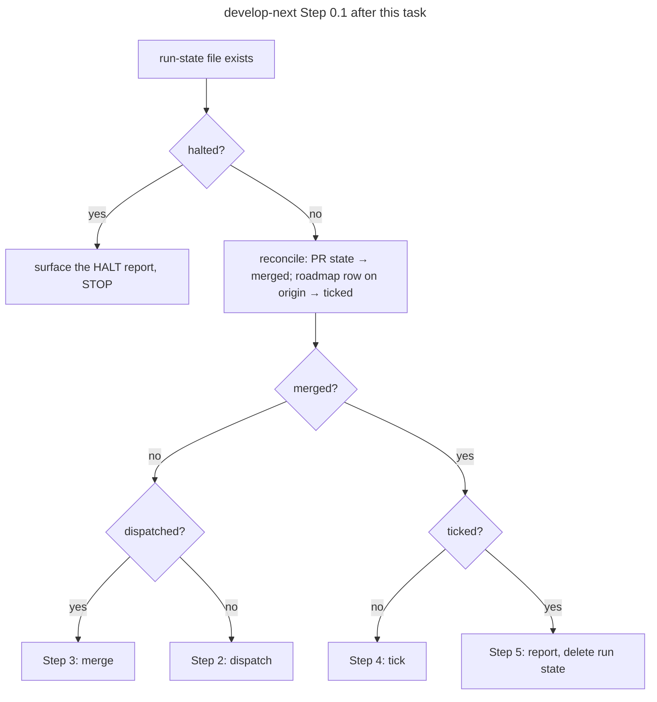

# Technical Task: Resume from evidence, not flags

**Status:** Planned
**GitHub Issue**: [#587](https://github.com/Gamaroff/agent-skills/issues/587)

---

## 1. Overview

`/develop-next` and `/develop-batch` keep crash-safety flags in a run-state file and route a resume
on those flags alone. Three observed failures show the flags drifting from the facts they summarise:
a merged-and-ticked item resumed into Step 3 as if its PR were open (obs #180), a merge that landed
was read as failed because `gh pr merge`'s exit code also covers its local follow-ups (obs #197), and
a pipeline that HALTed resumed into Step 3 instead of surfacing its HALT (obs #286). This task makes
both orchestrators judge a merge by the PR's state, record a HALT as a fact, and reconcile `merged`
and `ticked` against the PR and the roadmap before routing.

**Scope**: `skills/develop-next/SKILL.md` (run state, Step 0.1, Step 1's already-done guard, Step 2,
Step 3's GitHub merge arm) and `skills/develop-batch/SKILL.md` (Step 0.1, Step 3's merge); the merge
guard test and both skill-shape tests; a CHANGELOG entry.

**Key deliverables**:

1. One merge-verdict rule for every merge site: after `gh pr merge`, read `gh pr view --json state`.
   `MERGED` means merged, whatever the command's exit code.
2. develop-next's run state gains `halted`, `haltKind` and `prNumber`, matching develop-batch's
   item fields. Step 0.1 surfaces a recorded HALT instead of routing to Step 3.
3. A reconciliation block at the head of Step 0.1 in both skills, which advances `merged` and `ticked`
   from the PR state and the roadmap row before any routing.

---

## 2. Motivation

### Current Problems

1. **Stale flags route a finished item back into Step 3** (obs #180). On 2026-09-25 the T145 run
   state read `dispatched: true, merged: false, ticked: false`, while PR #485 was `MERGED` and the
   tick commit `1ce3a77b` was on `origin/develop`. Step 0.1 sent it to Step 3, whose merge assumes an
   open PR. The already-done guard that would catch it lives only in Step 1, which a resume skips.
2. **A merge that landed reads as failed** (obs #197). On 2026-09-26 `gh pr merge 493 --merge
   --delete-branch` exited 1 on an SSH error after the server-side merge had landed (`458bcec0`).
   The GitHub arm treats the exit status as the verdict; the next resume would retry a merge that
   already happened. The Bitbucket arm already re-queries `.state`.
3. **A HALT is not recorded, so a resume cannot see it** (obs #286, carrier for #195). Step 2 says
   to leave the run-state file in place after a pipeline HALT, but writes nothing that says a HALT
   happened. A resume with `dispatched: true, merged: false` goes to Step 3, where the item shows up
   only as "not accepted", and the pipeline's own escalation block is never surfaced.

### Benefits

- A resume acts on what is true on the platform, so a non-idempotent step (a merge, a Change Log row)
  never runs twice.
- A network error after a server-side merge no longer HALTs a run that succeeded.
- The operator sees the original HALT report on resume, not a misleading "finalise did not accept".
- develop-next and develop-batch share one run-state vocabulary for halts.

---

## 3. Technical Background

### Current Architecture

Line numbers are from `develop` at `0b6003fe`, paired with the text they point at.

- **develop-next run state** (`skills/develop-next/SKILL.md:37`, `## Run state (crash safety +
  single-flight)`): `item`, `source`, `command`, `commandArg`, `dispatched`, `merged`, `ticked`,
  `startedAt`. No `halted`, no `prNumber`.
- **develop-next Step 0.1** (`:60`, `1. **Run-state check.**`): `merged: true, ticked: false` →
  Step 4; `dispatched: true, merged: false` → Step 3; otherwise → Step 2. Nothing is queried first.
- **develop-next Step 1 already-done guard** (`:108`, `**Already-done guard:**`): if the document is
  `accepted` and its PR is merged, skip to Step 4. It queries
  `gh pr list --state merged --head "<branch>"` (or Bitbucket's equivalent). It runs only on a fresh
  selection.
- **develop-next Step 2** (`:122`): on a pipeline HALT, "Leave the run-state file in place so the
  next invocation resumes here". No field records the HALT.
- **develop-next Step 3 GitHub merge arm** (`:313`, `gh pr merge "$PR_ID" --"$mergeStrategy"
  --delete-branch`, and `:318`, the dirty-tree arm `|| { echo "HALT: gh pr merge failed …"; exit 1;
  }`): the exit status is the verdict. The Bitbucket arm (`:303`) checks `.state = "MERGED"` from the
  response, and its parsing note (`:330`) says "Never retry a merge on a parse error — re-query …
  `.state` first".
- **develop-next Step 4 roadmap arm** (`:392`, `### \`item.source\` = \`roadmap\``) ticks the row
  `[x]` and **adds a Change Log row**. Running it twice adds two rows. The registry arms answer
  `already` through `registry-tick.js` (`:447`, `Then log \`already\` and mark \`ticked: true\``).
- **develop-batch** already records halts per item: `"halted": false`, `"haltKind": null` and
  `"prNumber": null` in the item schema (`skills/develop-batch/SKILL.md:96-113`), set by Step 2's
  report table (`:328`, `| **HALT** — its own gate failed … | \`halted: true\` + \`haltKind\` + the
  report verbatim`). Its Step 0.1 (`:138`, `1. **Run-state check.**`) routes on flags with no
  query, and its Step 3 merge (`:492`, `gh pr merge <PR#> --<mergeStrategy> --delete-branch`) has the
  same exit-code verdict.
- **The pipeline's own halt snapshot** is `.claude/state/develop-pipeline.last-halt.json`, written by
  a terminal HALT (`shared/resources/advance-pipeline-lock.sh:61`).
- **Tests.** `shared/resources/tests/merge-delete-branch-guard.test.mjs` lifts every
  `gh pr merge … --delete-branch` block from shipped sources (floor 2: develop-next and develop-batch)
  and runs it against a `gh` stub that records argv, under bash and zsh. Its cases include "a refused
  merge on a dirty tree halts and deletes nothing" and "a merged PR whose branch is already gone
  still exits 0". `evals/develop-next/protocol/skill-shape.test.mjs` and
  `evals/develop-batch/protocol/skill-shape.test.mjs` hold the SKILL.md shape (for example
  "run-state file makes merge→tick crash-safe").

### Target Architecture

- **One merge verdict.** Each GitHub merge block runs `gh pr merge` without making its exit status
  the block's status. It then binds `STATE=$(gh pr view "$PR_ID" --json state -q .state)`. `MERGED`
  → continue: on the dirty-tree arm, delete the remote branch as today; on the clean arm, a failed
  local follow-up is a warning, and Step 4's re-sync repairs the checkout. Anything else → HALT with
  the merge output. The rule is stated once in develop-next Step 3, beside the Bitbucket parsing
  note it generalises, and cited from develop-batch.
- **A recorded HALT.** develop-next's run state gains `halted`, `haltKind` and `prNumber` with
  develop-batch's meanings. Step 2 sets `halted: true` and `haltKind` (`pipeline-halt`) and points
  at the implementation report. Step 0.1 checks `halted` **first**: it surfaces the report's
  escalation block (or `develop-pipeline.last-halt.json` when the report has none) and STOPs. A
  `halted` run never routes to Step 3.
- **Reconciliation before routing.** A new first item in Step 0.1 of both skills, before the
  existing routing:
  1. `merged: false` with a PR found → query its state. `MERGED` → set `merged: true`. The PR comes
     from `prNumber` when recorded, else from the already-done guard's branch query, which moves
     into one block cited from both Step 1 and Step 0.1.
  2. `merged: true, ticked: false`, `source: roadmap` → read the item's row on `origin/<baseBranch>`.
     Already ticked → set `ticked: true`. Registry sources need nothing: their arm answers `already`.
  3. Route on the reconciled flags. A fully reconciled file goes to Step 5.

### Important Clarifications

- develop-batch already has `halted`/`haltKind`. This task adds no field to it; it adds the
  reconciliation block and the merge verdict.
- The pipeline's own lock and Phase 0b resume are unchanged. Step 0.2 (the pipeline-lock check)
  still re-enters a pipeline that is mid-flight.

---

## 4. Scope

### In Scope

✅ develop-next: run-state fields, Step 0.1 halt branch and reconciliation, Step 1 guard block
shared with Step 0.1, Step 2 halt write, Step 3 GitHub merge verdict.
✅ develop-batch: Step 0.1 reconciliation, Step 3 merge verdict (citing develop-next's rule).
✅ Tests: `merge-delete-branch-guard.test.mjs` cases and both `skill-shape.test.mjs` files.
✅ CHANGELOG `[Unreleased]` entry.

### Out of Scope

❌ The Bitbucket merge arm. It already re-queries `.state`; this task only states the shared rule
beside it.
❌ The pipelines' own resume contract (`develop-pipeline-resume-contract.md`) and lock scripts.
❌ A migration of existing run-state files. A file without `halted` reads as `halted: false`, as a
develop-batch v1 file without `resource` resumes today.

---

## 5. Breaking Changes

None. New run-state fields are additive and default to `false`/`null`. An existing
`develop-next.state.json` resumes as before, with reconciliation added in front.

---

## 6. Implementation Plan

> Detailed implementation guide: [task.188.plan.resume-from-evidence-not-flags.md](task.188.plan.resume-from-evidence-not-flags.md)

### Phase 1: Merge verdict from the PR's state (obs #197)

**Risk**: Medium (a merge site). **Files**: `skills/develop-next/SKILL.md`,
`skills/develop-batch/SKILL.md`, `shared/resources/tests/merge-delete-branch-guard.test.mjs`.

- [ ] develop-next Step 3 GitHub arm: bind `STATE` from `gh pr view --json state` after the merge in
  both branches of the clean/dirty `if`; `MERGED` continues, anything else HALTs with real
  `exit 1`.
- [ ] State the rule once beside the Bitbucket parsing note; develop-batch Step 3 cites it and
  applies the same block shape.
- [ ] Extend the guard test's `gh` stub to answer `pr view --json state`, and add, per site and
  shell: "merge exits 1 but the PR is MERGED → block exits 0 (and the dirty arm deletes the remote
  branch)"; "merge exits 1 and the PR is OPEN → block exits 1, deletes nothing". The existing
  "refused merge" case keeps passing with the stub answering `OPEN`.

### Phase 2: A recorded HALT (obs #286)

**Risk**: Low. **Files**: `skills/develop-next/SKILL.md`,
`evals/develop-next/protocol/skill-shape.test.mjs`. **Depends on**: none.

- [ ] Run-state schema: add `prNumber`, `halted`, `haltKind`; say a missing field reads as
  `false`/`null`.
- [ ] Step 2: on a pipeline HALT, write `halted: true`, `haltKind: "pipeline-halt"` before stopping.
  Record `prNumber` when the pipeline reports one.
- [ ] Step 0.1: check `halted` first; surface the implementation report's escalation block (fallback
  `.claude/state/develop-pipeline.last-halt.json`); STOP. Say how an operator clears it (fix, then
  set `halted: false` or delete the file).
- [ ] skill-shape test: the halt branch precedes the routing sentence in Step 0.1, and Step 2 names
  `halted: true`.

### Phase 3: Reconcile flags before routing (obs #180)

**Risk**: Medium. **Files**: `skills/develop-next/SKILL.md`, `skills/develop-batch/SKILL.md`, both
skill-shape tests. **Depends on**: Phase 2 (`prNumber`).

- [ ] Move the already-done guard's PR query into one named block cited by Step 1 and Step 0.1.
- [ ] Step 0.1 reconciliation in develop-next: PR state → `merged`; roadmap row on
  `origin/<baseBranch>` → `ticked` (roadmap source only); then route; fully reconciled → Step 5.
- [ ] develop-batch Step 0.1: the same reconciliation per non-terminal item with a `prNumber`.
- [ ] skill-shape tests: reconciliation precedes routing in both skills; the routing sentence names
  Step 5 for a reconciled file.

### Phase 4: Changelog

**Risk**: Low. **Files**: `CHANGELOG.md`.

- [ ] `[Unreleased]` › Fixed entry citing obs #180, #197 and #286 (#195).

---

## 7. Files Summary

### Files to Modify (Core Implementation)

1. ✅ `skills/develop-next/SKILL.md` — run state, Steps 0.1, 1, 2, 3.
2. ✅ `skills/develop-batch/SKILL.md` — Steps 0.1, 3.

### Files to Modify (Tests)

3. ✅ `shared/resources/tests/merge-delete-branch-guard.test.mjs` — stub answers `pr view --json
   state`; two new cases per site and shell.
4. ✅ `evals/develop-next/protocol/skill-shape.test.mjs` — halt branch, reconciliation order.
5. ✅ `evals/develop-batch/protocol/skill-shape.test.mjs` — reconciliation order.

### Files to Modify (Documentation)

6. ✅ `CHANGELOG.md` — `[Unreleased]` › Fixed.

### Files to Delete

None.

---

## 8. Testing Strategy

### Unit Tests

- **Command**: `command node --test shared/resources/tests/merge-delete-branch-guard.test.mjs
  evals/develop-next/protocol/skill-shape.test.mjs evals/develop-batch/protocol/skill-shape.test.mjs`
- **Merge verdict**: the guard test runs each lifted merge block under bash and zsh against a stub
  whose `gh pr merge` exit code and `gh pr view` state are set per case: (exit 1, `MERGED`) → block
  exits 0; (exit 1, `OPEN`) → block exits 1, no remote delete; (exit 0, `MERGED`) → unchanged
  behaviour. **Control case**: (exit 0, `OPEN`), a merge command that claims success on a PR that
  did not merge, must HALT. It shows the block reads the state, not a reworded exit check.
- **Shape**: the two skill-shape tests assert ordering inside Step 0.1 (halt branch, then
  reconciliation, then routing).

### Integration Tests

- `npm test`, `npm run bundle:check`.
- Step 0.1's reconciliation is prose an agent executes. Its fenced blocks (PR-state query, roadmap
  row check) are extractable. Phase 3 runs the roadmap-row check against a fixture roadmap with the
  row ticked and unticked, using the `merge-delete-branch-guard.test.mjs` harness pattern (lift the
  block, run it in a temp repo).

### Mutation proofs

- Revert the GitHub arm to `|| exit 1` on the merge → the (exit 1, `MERGED`) case goes red.
- Drop the `STATE` check → the (exit 0, `OPEN`) control goes red.
- Move the halt branch after routing → the develop-next shape test goes red.

### Performance Tests

Not applicable: one extra `gh pr view` call per merge and per resume.

---

## 9. Success Criteria

### Functional

- [ ] A lifted merge block whose `gh pr merge` exits 1 while the PR reads `MERGED` exits 0, under
  bash and zsh, at every merge site — held by `merge-delete-branch-guard.test.mjs` (Phase 1).
- [ ] A lifted merge block whose PR reads anything but `MERGED` exits 1 and deletes no remote branch,
  including when `gh pr merge` exits 0 — held by the same test (Phase 1).
- [ ] develop-next's run state documents `halted`, `haltKind` and `prNumber`; Step 2 writes
  `halted: true` on a pipeline HALT; Step 0.1 checks `halted` before any routing — held by
  `evals/develop-next/protocol/skill-shape.test.mjs` (Phase 2).
- [ ] Both skills' Step 0.1 reconciles `merged` from the PR state, and develop-next reconciles
  `ticked` from the roadmap row, before routing — held by both skill-shape tests (Phase 3).
- [ ] The roadmap-row check, lifted and run against a fixture, reports ticked for an `[x]` row and
  not-ticked for a `[ ]` row — held by a new case in the guard test file (Phase 3).

### Performance

- [ ] Not applicable: one `gh pr view` per merge and per resume; no test asserts timing.

### Code Quality

- [ ] `npm test` passes; `npm run bundle:check` clean; `prettier --check .` clean.
- [ ] `python skills/create-skill/scripts/quick_validate.py skills/develop-next` and
  `skills/develop-batch` pass.

### Migration

- [ ] CHANGELOG `[Unreleased]` › Fixed entry names the merge verdict, the recorded halt and the
  reconciliation.
- [ ] The run-state section says a file without the new fields resumes unchanged — held by the
  develop-next shape test.

---

## 10. Risk Assessment

### High Risk Areas

None.

### Medium Risk Areas

1. **A merge site's control flow changes**
   - **Risk**: a block that no longer HALTs on a real failure, or deletes a branch of an unmerged
     PR (the task.147 QA-1 defect).
   - **Probability**: Medium. **Impact**: High (an unmerged PR's branch deleted).
   - **Mitigation**: the delete runs only inside the `MERGED` branch; the guard test's "deletes
     nothing" assertion covers the `OPEN` cases under both shells; the (exit 0, `OPEN`) control
     case.
   - **Rollback**: revert Phase 1 alone; Phases 2–3 do not depend on it.
2. **Reconciliation marks `ticked` on a row that is not this item's**
   - **Risk**: a roadmap row matched by a loose pattern.
   - **Mitigation**: match the row by the item id the selector recorded (`item`), anchored, as Step 4
     rewrites it; fixture cases for ticked and unticked rows.

### Low Risk Areas

1. **Operator friction**: a `halted` run now STOPs every resume until cleared. Step 0.1 says how to
   clear it.

---

## 11. Rollback Plan

### Immediate Rollback (< 1 hour)

- **Triggers**: a develop-next or develop-batch run merges or deletes something it should not; the
  guard test red on `develop`.
- **Steps**: `git revert` the merge commit; `npm run bundle`; `npm test`.
- **Validation**: guard and skill-shape tests green; a `--dry-run` of develop-next reports normally.

### Partial Rollback (1-2 hours)

- Phase 1 (merge verdict) and Phases 2–3 (resume) revert independently.

### Forward Fix (< 4 hours)

- A reconciliation that misreads a row: tighten the row match; the fixture gains the shape.

### Rollback Triggers

- **Critical**: a remote branch of an unmerged PR deleted; a merge retried on a merged PR.
- **Non-critical**: a resume that STOPs on a stale `halted` flag → forward-fix the clearing note.

---

<!-- change-log-start -->
## Change Log

| Date | Version | Description | Author |
|------|---------|-------------|--------|
| 2026-10-07 | 1.0 | Initial draft — cut from observations #180, #197, #286 | create-task |
<!-- change-log-end -->

---

## Progress Tracking

### Phase 1: Merge verdict from the PR's state

- [ ] Not started

### Phase 2: A recorded HALT

- [ ] Not started

### Phase 3: Reconcile flags before routing

- [ ] Not started

### Phase 4: Changelog

- [ ] Not started

---

## References

- Observation #180 — develop-next resume trusts stale run-state flags over the PR and tick they summarise
- Observation #197 — develop-next GitHub merge arm reads gh pr merge's exit code as the verdict; a post-merge network failure reads as not merged
- Observation #286 — develop-next resume has no recorded halt: a HALTed pipeline routes to Step 3 (carrier for #195)
- `shared/resources/tests/merge-delete-branch-guard.test.mjs` (task.147) — the merge-site harness this task extends

---

## Notes

### Important Reminders

- QA artifacts land beside this document: `task.188.qa.{n}.resume-from-evidence-not-flags.md`,
  `task.188.gate.{n}.resume-from-evidence-not-flags.yml`, and bug reports as
  `task.188.bug.{N}.{name}.md`.
- Never chain the merge to the next commit: Step 4's re-sync stays a block of its own (obs #142).

### Future Improvements

- A Bitbucket stub for the guard test, so the Bitbucket arm's `.state` rule is executed, not only
  stated.
