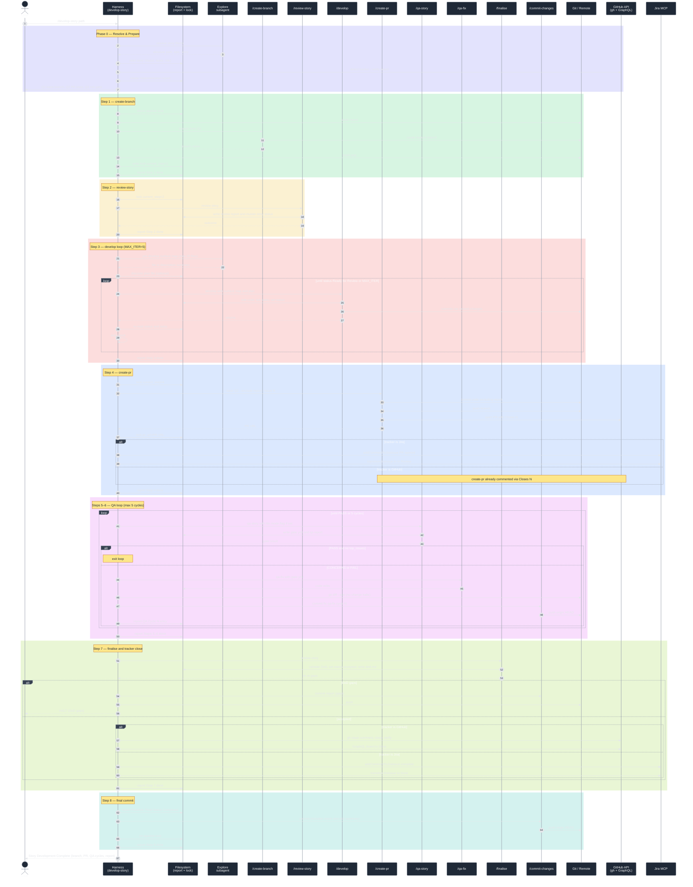

# `develop-story` — Harness & Sub-Skill Interaction

Deep-dive review of `skills/develop-story/SKILL.md` plus the eight `develop-pipeline-step-*.md` protocol files in `shared/resources/` that define its 8-step pipeline.

---

## Technical Summary

`develop-story` is a thin **orchestrator** (~240 lines of SKILL.md). Almost all real logic lives in `develop-pipeline-*.md` files under `shared/resources/`, loaded on-demand per step (progressive disclosure). It coordinates 8 sub-skills sequentially and maintains a co-located **implementation report** as the single source of truth for state and audit trail.

### External touchpoints

| Surface | Operations |
|---|---|
| **Filesystem** | story file (read/append `[x]`), implementation report (`story.{e}.{s}.implementation.{N}.*.md`), review report, plan file, gate file (`.yml`), QA report, DoD summary, lock file `.claude/state/develop-pipeline.lock` |
| **Git** | branch create, stash/pop, commits via `/commit-changes` only, `git push origin HEAD` after every QA cycle + final |
| **GitHub** | `gh issue comment/close/view`, GraphQL project-board mutation (Todo→In Progress→Done), PR creation via `/create-pr` |
| **Jira** (Atlassian MCP) | `getJiraIssue`, `addCommentToJiraIssue`, `getTransitionsForJiraIssue`, `transitionJiraIssue` (In Progress → In Review → Done) |
| **Subagents** | `Explore` for file resolution (Phase 0a) and pre-develop codebase surface map (Phase 3) |

### State changes

- **Files created**: feature branch, implementation report, lock file, review report, gate `.yml`, QA report, DoD summary file, PR
- **Files mutated**: story file (status frontmatter, `[x]` task ticks), implementation report (Pipeline Progress table, Decisions Log, Issues Log, QA Iteration History), lock file (`current_step`, `pr_url`)
- **Tracker fields**: GitHub issue state (open→closed) + project board status; Jira `status` transitions + comments
- **Git refs**: feature branch HEAD, remote branch (push after every QA cycle), PR HEAD

### Efficiency / bottlenecks

1. **QA loop dominates wall-clock.** Up to 5 cycles of `/qa-story` + `/qa-fix` + commit + push. Each `/qa-story` may itself spawn parallel agents (suppressed in `lite` mode).
2. **Iterative develop loop** (`MAX_ITER=5` with stall detection). Cheap when the loop short-circuits on `Ready for Review`; pathological when status oscillates.
3. **Context bloat risk** — mitigated by mandatory "Context Management Rule" (drop intermediate file contents between steps) and the Explore subagent that returns ≤20-file summaries instead of full reads.
4. **Tracker calls are best-effort, non-blocking** — failures log a warning and continue, so a flaky Jira/GitHub never wedges the pipeline. Tradeoff: silent drift between local state and tracker possible.
5. **Single-path lock** (`.claude/state/develop-pipeline.lock`) prevents concurrent pipelines per repo; collision check is the very first action of Step 1.
6. **PreCompact hook** (optional) gives graceful pause before context compaction by writing report entry, committing, pushing, and posting a PR comment — all best-effort. Without it, post-compaction recovery still works via the implementation report's Pipeline Progress table + per-step artifact verification.
7. **Implementation report exclusion** (`--exclude` pathspec to `/create-pr`) is deterministic — no race with auto-staging.
8. **Push-per-cycle** keeps PR current but is wasteful on slow remotes; no batching toggle exists.

### Notable design choices

- All commits go through `/commit-changes` (never raw `git commit`) → consistent Conventional Commits.
- Gate files are read-only to dev skills; only QA skills mutate them.
- Step banners + lock `current_step` updates create checkpoints that survive context compression.
- Resume verifies each ✅ step's *artifact* on disk — does not trust the report alone.

---

## Sequence Diagram

> **Note**: Mermaid treats `;` as a statement separator inside messages — do not use semicolons in arrow labels or notes.

---

## Data Objects Passed

| From → To | Object |
|---|---|
| User → Harness | story path / `#N` / Jira key |
| Harness → Explore | resolution query / surface-map query |
| Explore → Harness | absolute path; file→1-line summary list |
| Harness → `/create-branch` | story path, base branch (Q1) |
| Harness → `/review-story` | story path |
| Harness → `/develop` | story path, surface map, plan file, iteration hint |
| `/develop` → Harness | (returns; harness re-reads story for status/[x]) |
| Harness → `/create-pr` | `--base`, `--exclude {report}`, `--issue N` (GitHub only) |
| `/create-pr` → Harness | PR URL |
| Harness → `/qa-story` | story path, lite-mode flag |
| `/qa-story` → Harness | gate file path, gate result |
| Harness → `/qa-fix` | gate file path |
| Harness → `/finalise` | story path |
| `/finalise` → Harness | accepted | DoD gaps |
| Harness → `/commit-changes` | suggested message, optional `--exclude` |
| Harness ↔ Lock file | `{skill, report_path, branch, pr_url, tracker, tracker_issue, current_step, started_at}` |
| Harness → Tracker | issue state + comments + transitions |

## Final Success State

- `status: accepted` in story frontmatter
- All 8 rows in implementation-report Pipeline Progress = ✅
- PR open with all code + report + DoD summary committed and pushed
- Tracker issue closed/Done with completion comment + board moved
- Lock file removed → repo free for next pipeline run
